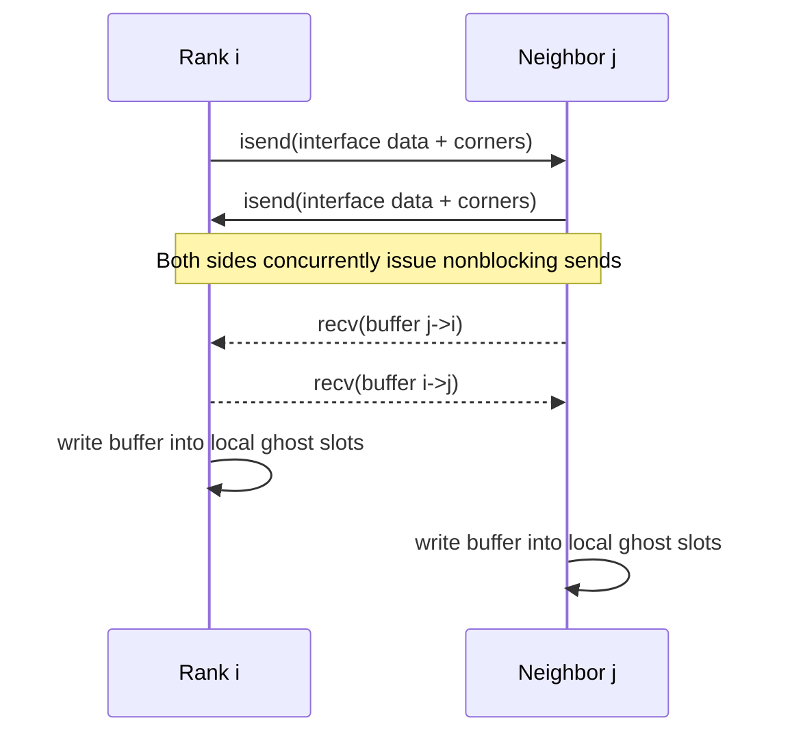

# MPI: build, run, and behavior

This page explains how to enable MPI when building Samurai, how programs behave at runtime, and what to expect for mesh partitioning, I/O, and timers. The focus is on user-facing usage; internal details are omitted.

## Prerequisites

- A working MPI implementation (e.g., MPICH, OpenMPI).
- Boost with the `mpi` and `serialization` components.
- A parallel-enabled HDF5 (required when MPI is ON).

Refer to `conda/mpi-environment.yml` for a concrete dependency set (includes `libboost-mpi`).

## Building with MPI

There are two common scenarios.

- Build the Samurai project (this repository):
  - Configure with MPI enabled and ensure your HDF5 is parallel-capable.
  - Example:

```bash
cmake -S . -B build -DCMAKE_BUILD_TYPE=Release -DWITH_MPI=ON
cmake --build build -j
```

- Use Samurai as a package in an external project:
  - Set the MPI toggle before finding the package so the target propagates the MPI interface and definitions.

```cmake
set(SAMURAI_WITH_MPI ON)
find_package(samurai CONFIG REQUIRED)

add_executable(app main.cpp)
target_link_libraries(app PRIVATE samurai::samurai CLI11::CLI11)
```

Notes

- When MPI is enabled, Samurai requires a parallel HDF5. CMake will error if a serial HDF5 is detected.
- The `SAMURAI_WITH_MPI` compile definition is added automatically by the build toggles above.

## Program startup and CLI

Initialize and finalize your application through Samurai:

```cpp
int main(int argc, char* argv[]) {
  auto& app = samurai::initialize("Description", argc, argv);
  // add CLI11 options on app
  SAMURAI_PARSE(argc, argv);
  // ... your simulation ...
  samurai::finalize();
}
```

Behavior when MPI is enabled

- `initialize` calls `MPI_Init` and starts a "total runtime" timer.
- By default, stdout is redirected to `/dev/null` on non-root ranks. Use `--dont-redirect-output` to disable redirection.
- `finalize` prints timers (if `--timers`) and calls `MPI_Finalize`.

Run with your MPI launcher (example):

```bash
mpirun -np 4 ./your_app --timers
mpirun -np 4 ./your_app --dont-redirect-output   # show output from all ranks
```

## Mesh partitioning and MPI-aware behavior

- Multiresolution meshes constructed from a box domain are partitioned automatically across ranks at construction time.
  - In 1D, partitioning is by contiguous cell ranges.
  - In 2D/3D, partitioning is by groups of intervals.
- The global `domain()` is the union of all rank-local subdomains. Rank neighborhoods are discovered automatically for halo/neighbor exchanges.
- Periodicity flags influence neighbor detection across periodic boundaries.
- DomainBuilder-based meshes are not supported with MPI at this time.

What you write in user code does not change: construct the mesh as usual from a box and proceed with fields, operators, and time loops. Partitioning and data exchanges are handled internally.

### Under the hood: domain decomposition and neighbors

- Partitioning (sketch)

```mermaid
graph LR
  A[Global domain (cells/intervals)] --> B1[1D split by contiguous cell ranges]
  A --> B2[2D/3D split by contiguous interval bands]
  B1 --> C1[Rank 0 subdomain]
  B1 --> C2[Rank 1 subdomain]
  B2 --> C3[Rank k subdomain]
  B2 --> C4[Rank k+1 subdomain]
```

- Neighbor discovery (concept)

```mermaid
graph TD
  S[subdomain (expanded by 1 layer)] -->|intersect on all ranks| I{touching?}
  I -->|yes| N[add neighbor rank]
  I -->|no| X[ignore]
  P[periodic dims] -->|shifted intersections| N
```

- Implementation highlights (citations)

```1023:1059:include/samurai/mesh.hpp
#ifdef SAMURAI_WITH_MPI
    mpi::communicator world;

    std::vector<lca_type> neighbours(static_cast<std::size_t>(world.size()));
    mpi::all_gather(world, m_subdomain, neighbours);
    std::set<int> set_neighbours;
    for (std::size_t i = 0; i < neighbours.size(); ++i)
    {
        if (i != static_cast<std::size_t>(world.rank()))
        {
            auto set = intersection(nestedExpand(m_subdomain, 1), neighbours[i]);
            if (!set.empty()) { set_neighbours.insert(static_cast<int>(i)); }
            for (std::size_t d = 0; d < dim; ++d)
            {
                if (m_periodic[d])
                {
                    auto shift = get_periodic_shift(m_domain, m_subdomain.level(), d);
                    if (!intersection(nestedExpand(m_subdomain, 1), translate(neighbours[i], -shift)).empty())
                        set_neighbours.insert(static_cast<int>(i));
                    if (!intersection(nestedExpand(m_subdomain, 1), translate(neighbours[i], shift)).empty())
                        set_neighbours.insert(static_cast<int>(i));
                }
            }
        }
    }
    m_mpi_neighbourhood.clear();
    for (const auto& neighbour : set_neighbours) { m_mpi_neighbourhood.emplace_back(neighbour); }
#endif
```

```1066:1121:include/samurai/mesh.hpp
#ifdef SAMURAI_WITH_MPI
    mpi::communicator world;
    auto rank = world.rank();
    auto size = world.size();
    std::size_t subdomain_start = 0, subdomain_end = 0;
    lcl_type subdomain_cells(start_level, m_domain.origin_point(), m_domain.scaling_factor());
    if (dim == 1)
    {
        std::size_t n_cells               = m_domain.nb_cells();
        std::size_t n_cells_per_subdomain = n_cells / static_cast<std::size_t>(size);
        subdomain_start                   = n_cells_per_subdomain * static_cast<std::size_t>(rank);
        subdomain_end                     = n_cells_per_subdomain * (static_cast<std::size_t>(rank) + 1);
        if (rank == size - 1) { subdomain_end = n_cells; }
        for_each_meshinterval(m_domain, [&](auto mi) {
            for (auto i = mi.i.start; i < mi.i.end; ++i)
            {
                if (static_cast<std::size_t>(i) >= subdomain_start && static_cast<std::size_t>(i) < subdomain_end)
                    { subdomain_cells[mi.index].add_point(i); }
            }
        });
    }
    else if (dim >= 2)
    {
        auto subdomain_nb_intervals = m_domain.nb_intervals() / static_cast<std::size_t>(size);
        subdomain_start             = static_cast<std::size_t>(rank) * subdomain_nb_intervals;
        subdomain_end               = (static_cast<std::size_t>(rank) + 1) * subdomain_nb_intervals;
        if (rank == size - 1) { subdomain_end = m_domain.nb_intervals(); }
        std::size_t k = 0;
        for_each_meshinterval(m_domain, [&](auto mi) {
            if (k >= subdomain_start && k < subdomain_end) { subdomain_cells[mi.index].add_interval(mi.i); }
            ++k;
        });
    }
    this->m_cells[mesh_id_t::cells][start_level] = subdomain_cells;
#endif
```

- Exchanging neighbor mesh metadata

```842:861:include/samurai/mesh.hpp
// send/recv the meshes of the neighbouring subdomains
mpi::communicator world;
std::vector<mpi::request> req;
boost::mpi::packed_oarchive::buffer_type buffer;
boost::mpi::packed_oarchive oa(world, buffer);
oa << derived_cast();
std::transform(m_mpi_neighbourhood.cbegin(), m_mpi_neighbourhood.cend(), std::back_inserter(req),
    [&](const auto& n){ return world.isend(n.rank, n.rank, buffer); });
for (auto& n : m_mpi_neighbourhood) { world.recv(n.rank, world.rank(), n.mesh); }
mpi::wait_all(req.begin(), req.end());
```

## I/O with MPI

Saving for visualization (XDMF/HDF5)

- Use the standard `save(path, filename, mesh, fields...)` API.
- In MPI runs, a single HDF5 file is produced; per-rank datasets are written under rank-specific groups. The XDMF is generated once by rank 0.

Restart snapshots

- Use `dump(path, filename, mesh, fields...)` to write a compact restart file and `load(...)` to restore.
- The restart file stores the number of processes used to create it. On load, the current number of ranks must match; otherwise, loading fails.

See details and examples on the I/O page.

## Ghost updates across ranks (MPI halos)

For stencil-based computations and multiresolution prediction/projection, halo/ghost values must be valid. Samurai provides high-level helpers that perform all necessary boundary condition applications, periodic wrap-arounds, and inter-rank exchanges.

- High-level entry point
  - `update_ghost_mr(fields...)`: updates ghost layers for one or more fields on a multiresolution mesh. This is the function to call before using low-level stencil operators in your time loop.
  - Many FV operators from `samurai/schemes/fv.hpp` manage ghost updates internally when they are applied; explicit calls are then usually unnecessary.

- What happens during `update_ghost_mr` (flow)

```mermaid
flowchart TD
  A[update_outer_ghosts(max_level,...)] --> B{for level = max..1}
  B -->|each level| C[update_ghost_periodic(level,...)]
  C --> D[update_ghost_subdomains(level,...)]
  D --> E[project to level-1 (coarse)]
  E --> F[update_outer_ghosts(level-1,...)]
  F --> G[bottom-level periodic+subdomain]
  G --> H{ascend levels}
  H --> I[predict finer ghosts]
  I --> J[periodic + subdomain exchange]
```

- Inter-rank halo exchange (citations)

```655:717:include/samurai/algorithm/update.hpp
// Along rank interfaces and outer subdomain corners
std::vector<std::vector<value_t>> to_send(mesh.mpi_neighbourhood().size());
for (auto& neighbour : mesh.mpi_neighbourhood())
{
    auto out_interface = intersection(mesh[mesh_id_t::reference][level], neighbour.mesh[mesh_id_t::reference][level], mesh.subdomain()).on(level);
    out_interface([&](const auto& i, const auto& index) {
        std::copy(field(level, i, index).begin(), field(level, i, index).end(), std::back_inserter(to_send[i_neigh]));
    });
    auto subdomain_corners = outer_subdomain_corner<true>(level, field, neighbour);
    // ... append corner data also ...
    req.push_back(world.isend(neighbour.rank, neighbour.rank, to_send[i_neigh++]));
}
for (auto& neighbour : mesh.mpi_neighbourhood())
{
    std::vector<value_t> to_recv; world.recv(neighbour.rank, world.rank(), to_recv);
    auto in_interface = intersection(neighbour.mesh[mesh_id_t::reference][level], mesh[mesh_id_t::reference][level], neighbour.mesh.subdomain()).on(level);
    // ... copy from to_recv into local field(level, i, index) ...
}
mpi::wait_all(req.begin(), req.end());
```

- Periodic wrap-around (citations)

```983:1008:include/samurai/algorithm/update.hpp
// Build stripes near periodic boundaries and copy with shift
auto set1 = intersection(translate(intersection(mesh_ref[level], lca_min_p), shift), intersection(mesh_ref[level], lca_max_p));
set1([&](const auto& i, const auto& index){ field(level, i, index) = field(level, i - shift_interval, index - shift_index); });
auto set2 = intersection(translate(intersection(mesh_ref[level], lca_max_m), -shift), intersection(mesh_ref[level], lca_min_m));
set2([&](const auto& i, const auto& index){ field(level, i, index) = field(level, i + shift_interval, index + shift_index); });
```

- Periodic wrap-around across ranks (citations)

```1029:1072:include/samurai/algorithm/update.hpp
// For each neighbor: extract the overlapped periodic stripes and send packed data
req.push_back(world.isend(mpi_neighbor.rank, mpi_neighbor.rank, field_data_out[neighbor_id]));
// Receive from neighbor and write into local periodic stripes
world.recv(mpi_neighbor.rank, world.rank(), field_data_in);
// ... iterate target stripes and copy from field_data_in iterator ...
mpi::wait_all(req.begin(), req.end());
```

- Ghost width and schemes
  - The ghost width comes from the mesh configuration (`ghost_width`). High-order schemes (e.g., WENO5) require at least 3 ghost layers. Ensure your mesh configuration matches the numerical scheme requirements.

Best practices in user code

- If you use low-level stencil helpers (e.g., `upwind(a, u)`), call `update_ghost_mr(u, ...)` before evaluating stencils each time the field or mesh changed.
- If you rely on FV scheme builders (`make_*` operators) applied as expressions, ghosts are automatically handled during operator application.
- Do not manually exchange halo data; Samurai’s helpers manage both periodic and inter-rank paths consistently.

## Communication patterns (summary)

- SPMD ranks on `MPI_COMM_WORLD` via Boost.MPI.
- Asynchronous sends (`isend`) paired with blocking receives (`recv`) on per-neighbor channels; send tags use the neighbor rank id.
- Data layout: contiguous vectors of field values per interval, multiplied by component count; corners are appended after interfaces.
- Tag (adaptation) exchange uses bitwise-OR semantics and two passes for periodic wrap-around to ensure symmetric propagation.

Sequence (per ghost update step)



Why this works

- Ownership model: each cell’s authoritative value lives on its owning rank (inside its subdomain). Ghosts are always written from neighbors’ owned values.
- Deterministic interfaces: the intersection sets define exactly where copies occur, avoiding double-writes; corners are handled explicitly.
- Periodicity is closed consistently by explicit stripe copy and matching inter-rank transfers when stripes span ranks.
- Multilevel consistency is guaranteed by the project-then-predict sequence around inter-rank and periodic updates.

## Timers

- The `--timers` option prints aggregated timing information at the end of the run.
- In MPI runs, Samurai gathers per-rank measurements and reports min/max/average across ranks (printed by rank 0).

## Demos and examples

- Finite volume demos (e.g., advection, Burgers, Gray–Scott) can be executed under MPI. Some demos append the MPI size to filenames for clarity.
- PETSc-based demos in this repository check that the run is uniprocessor; they are intended for single-rank execution with the current PETSc integration.

Invocation examples

```bash
# 2D advection (multiresolution), 4 ranks
mpirun -np 4 ./build/demos/FiniteVolume/finite-volume-advection-2d \
  --min-level 4 --max-level 10 --cfl 0.5 --path out --filename advec2d

# Burgers (2D vector), 2 ranks, show timings
mpirun -np 2 ./build/demos/FiniteVolume/finite-volume-burgers \
  --timers --nfiles 10 --path out --filename burgers2d
```

## Current limitations

- DomainBuilder meshes are not available under MPI.
- The PETSc integration in Samurai builds sequential PETSc objects; demos using PETSc enforce a single process at runtime.

## Mesh adaptation under MPI (refine/coarsen)

When you adapt the mesh, Samurai synchronizes refinement/coarsening intent at rank boundaries and rebuilds fields consistently:

- Tag synchronization
  - Rank-local refine/keep/coarsen tags are exchanged with neighbors so the decision is consistent across subdomain interfaces.
  - Periodic boundaries are handled similarly via wrap-around tag exchanges.
- Coarsening consistency
  - At boundaries, Samurai prevents multiple ranks from keeping conflicting coarse cells by clearing duplicates so that only one coarse parent is retained when all children are marked coarsen.
- Field transfer after adaptation
  - After building the new mesh, values are copied where cells persist, projected when coarsening, and predicted when refining, so fields remain consistent without user intervention.

User guidance

- Use the provided adaptation drivers (as in the demos). After adaptation, either the FV operator application or an explicit `update_ghost_mr(...)` will revalidate halos as needed.
- Avoid home-grown halo fixes at adaptation boundaries; Samurai already aligns tags and fields across ranks and periodic edges.
