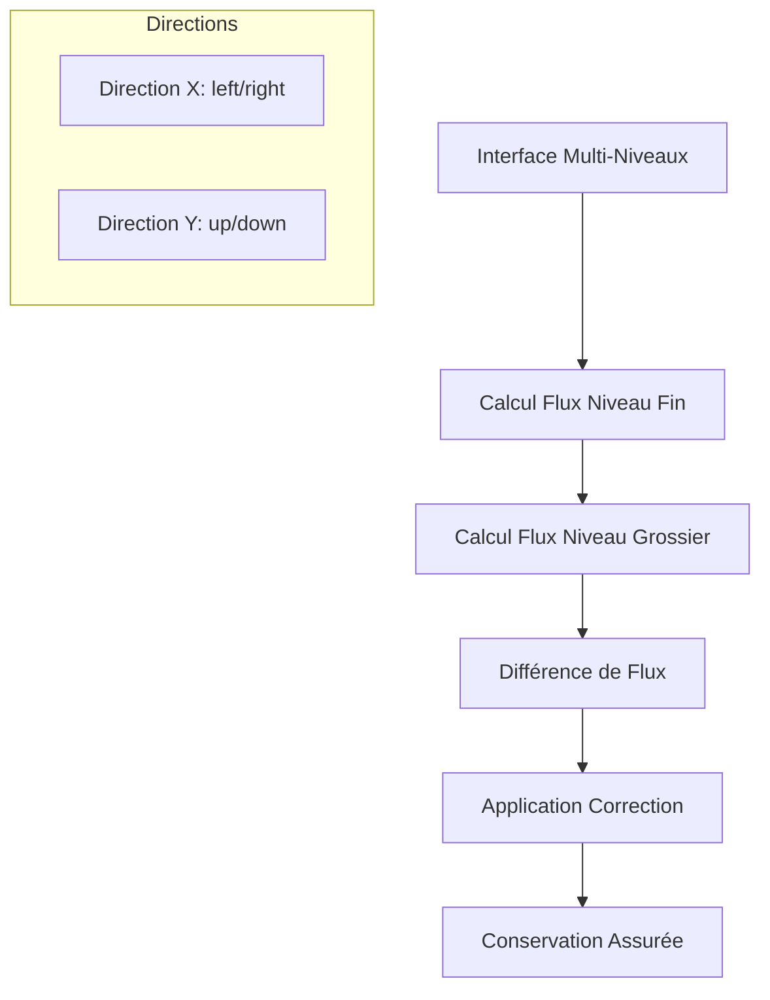
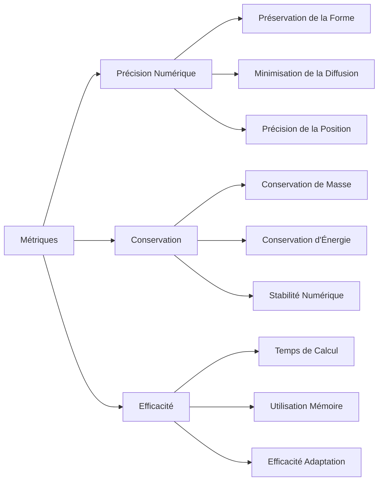
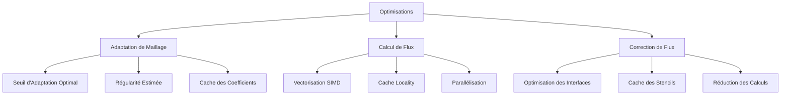

# Cas Test : Advection 2D - Samurai

## Vue d'ensemble

Le cas test d'advection 2D dans Samurai est un benchmark fondamental pour valider les schémas numériques d'advection sur des maillages adaptatifs multirésolution. Il résout l'équation d'advection 2D avec un disque initial qui se déplace selon un vecteur vitesse constant, utilisant le schéma upwind avec correction de flux aux interfaces multi-niveaux.

## Équation Modélisée

### Formulation Mathématique

L'équation d'advection 2D s'écrit :

```
∂u/∂t + a₁ ∂u/∂x + a₂ ∂u/∂y = 0
```

où :
- `u(x,y,t)` est la variable d'état scalaire
- `a = (a₁, a₂)` est le vecteur vitesse constant
- `(x,y) ∈ [0,1] × [0,1]` est le domaine spatial

### Solution Analytique

Pour une condition initiale `u₀(x,y)`, la solution exacte est :

```
u(x,y,t) = u₀(x - a₁t, y - a₂t)
```

La solution se déplace à vitesse constante `a` sans déformation.

## Configuration du Problème

### Paramètres de Simulation

```cpp
// Paramètres de simulation
constexpr std::size_t dim = 2;
xt::xtensor_fixed<double, xt::xshape<dim>> min_corner = {0., 0.};
xt::xtensor_fixed<double, xt::xshape<dim>> max_corner = {1., 1.};
std::array<double, dim> a = {1, 1};  // Vitesse diagonale
double Tf = 0.1;                     // Temps final
double cfl = 0.5;                    // Nombre de Courant
double t = 0.;                       // Temps initial
std::string restart_file;            // Fichier de redémarrage
```

### Configuration du Maillage

```cpp
// Paramètres multirésolution
std::size_t min_level = 4;           // Niveau minimum de raffinement
std::size_t max_level = 10;          // Niveau maximum de raffinement
double mr_epsilon = 2.e-4;           // Seuil d'adaptation multirésolution
double mr_regularity = 1.;           // Régularité estimée pour l'adaptation
bool correction = false;             // Activation de la correction de flux

// Configuration du domaine
const samurai::Box<double, dim> box(min_corner, max_corner);
samurai::MRMesh<Config> mesh;
```

### Configuration de Sortie

```cpp
// Paramètres de sortie
fs::path path = fs::current_path();
std::string filename = "FV_advection_2d";
std::size_t nfiles = 1;  // Nombre de fichiers de sortie
```

## Condition Initiale

### Définition Mathématique

La condition initiale est un disque centré :

```
u₀(x,y) = 1  si (x - 0.3)² + (y - 0.3)² ≤ 0.2²
u₀(x,y) = 0  sinon
```

### Implémentation

```cpp
template <class Field>
void init(Field& u)
{
    auto& mesh = u.mesh();
    u.resize();

    samurai::for_each_cell(mesh, [&](auto& cell)
    {
        auto center = cell.center();
        const double radius = 0.2;
        const double x_center = 0.3;
        const double y_center = 0.3;
        
        if (((center[0] - x_center) * (center[0] - x_center) + 
             (center[1] - y_center) * (center[1] - y_center)) <= radius * radius)
        {
            u[cell] = 1;
        }
        else
        {
            u[cell] = 0;
        }
    });
}
```

### Visualisation de la Condition Initiale

```mermaid
graph LR
    A[Condition Initiale] --> B[Disque Centré]
    B --> C[Centre (0.3, 0.3)]
    C --> D[Rayon 0.2]
    D --> E[Valeur 1.0 à l'intérieur]
    E --> F[Valeur 0.0 à l'extérieur]
    
    subgraph "Domaine"
        G[Domaine [0,1] × [0,1]]
        H[Disque en position (0.3, 0.3)]
    end
```

## Vecteur Vitesse

### Configuration

```cpp
// Vecteur vitesse de l'advection
std::array<double, dim> a = {1, 1};  // Vitesse diagonale
```

### Interprétation Physique

- **`a = (1, 1)`** : Vitesse diagonale vers le haut-droite
- **Norme** : `|a| = √2 ≈ 1.414`
- **Direction** : 45° par rapport aux axes x et y
- **Trajectoire** : Le disque se déplace en diagonale vers le coin supérieur-droit

## Schéma Numérique Upwind

### Principe du Schéma Upwind

Le schéma upwind est un schéma d'ordre 1 qui utilise la valeur en amont pour calculer les flux :

```cpp
// Schéma upwind explicite
unp1 = u - dt * samurai::upwind(a, u);
```

### Formulation Mathématique

Pour le schéma upwind 2D :

```
uᵢⱼⁿ⁺¹ = uᵢⱼⁿ - (Δt/Δx) × (Fᵢ₊₁/₂,ⱼ - Fᵢ₋₁/₂,ⱼ) - (Δt/Δy) × (Fᵢ,ⱼ₊₁/₂ - Fᵢ,ⱼ₋₁/₂)
```

où les flux sont calculés selon la direction du vent :

```
Fᵢ₊₁/₂,ⱼ = a₁⁺ uᵢ,ⱼ + a₁⁻ uᵢ₊₁,ⱼ
Fᵢ,ⱼ₊₁/₂ = a₂⁺ uᵢ,ⱼ + a₂⁻ uᵢ,ⱼ₊₁
```

avec `a⁺ = max(a, 0)` et `a⁻ = min(a, 0)`.

### Avantages du Schéma Upwind

- **Stabilité** : Conditionnellement stable sous condition CFL
- **Monotonie** : Préserve la monotonie de la solution
- **Robustesse** : Pas d'oscillations aux discontinuités
- **Simplicité** : Implémentation directe et efficace

## Correction de Flux Multi-Niveaux

### Problématique

Sur un maillage adaptatif, les interfaces entre niveaux de raffinement différents peuvent introduire des erreurs de conservation. La correction de flux permet de maintenir la conservation exacte.

### Principe de la Correction



### Implémentation

```cpp
template <class Field>
void flux_correction(double dt, const std::array<double, 2>& a, 
                     const Field& u, Field& unp1)
{
    using mesh_t = typename Field::mesh_t;
    using mesh_id_t = typename mesh_t::mesh_id_t;
    using interval_t = typename mesh_t::interval_t;
    constexpr std::size_t dim = Field::dim;

    auto mesh = u.mesh();

    for (std::size_t level = mesh.min_level(); level < mesh.max_level(); ++level)
    {
        // Direction X - Correction droite
        xt::xtensor_fixed<int, xt::xshape<dim>> stencil = {-1, 0};
        auto subset_right = samurai::intersection(
            samurai::translate(mesh[mesh_id_t::cells][level + 1], stencil),
            mesh[mesh_id_t::cells][level]).on(level);

        subset_right([&](const auto& i, const auto& index)
        {
            auto j = index[0];
            const double dx = mesh.cell_length(level);

            unp1(level, i, j) = unp1(level, i, j) + dt/dx * 
                (samurai::upwind_op<dim, interval_t>(level, i, j).right_flux(a, u)
                 - 0.5 * samurai::upwind_op<dim, interval_t>(level + 1, 2*i+1, 2*j).right_flux(a, u)
                 - 0.5 * samurai::upwind_op<dim, interval_t>(level + 1, 2*i+1, 2*j+1).right_flux(a, u));
        });

        // Direction X - Correction gauche
        stencil = {1, 0};
        auto subset_left = samurai::intersection(
            samurai::translate(mesh[mesh_id_t::cells][level + 1], stencil),
            mesh[mesh_id_t::cells][level]).on(level);

        subset_left([&](const auto& i, const auto& index)
        {
            auto j = index[0];
            const double dx = mesh.cell_length(level);

            unp1(level, i, j) = unp1(level, i, j) - dt/dx * 
                (samurai::upwind_op<dim, interval_t>(level, i, j).left_flux(a, u)
                 - 0.5 * samurai::upwind_op<dim, interval_t>(level + 1, 2*i, 2*j).left_flux(a, u)
                 - 0.5 * samurai::upwind_op<dim, interval_t>(level + 1, 2*i, 2*j+1).left_flux(a, u));
        });

        // Direction Y - Corrections similaires
        // ...
    }
}
```

### Formulation Mathématique

La correction de flux s'écrit :

```
Correction = (Δt/Δx) × [Flux_grossier - 0.5 × (Flux_fin₁ + Flux_fin₂)]
```

où :
- `Flux_grossier` : Flux calculé sur le niveau grossier
- `Flux_fin₁, Flux_fin₂` : Flux calculés sur les deux cellules fines correspondantes

## Conditions aux Limites Dirichlet

### Configuration

```cpp
// Conditions aux limites Dirichlet homogènes
samurai::make_bc<samurai::Dirichlet<1>>(u, 0.);
```

### Implémentation

Les conditions Dirichlet imposent `u = 0` sur les bords du domaine :
- **Bord gauche** : `u(0,y,t) = 0`
- **Bord droit** : `u(1,y,t) = 0`
- **Bord bas** : `u(x,0,t) = 0`
- **Bord haut** : `u(x,1,t) = 0`

### Impact sur la Solution

- **Réflexions** : La solution se reflète sur les bords
- **Interactions** : Le disque interagit avec les bords du domaine
- **Comportement** : Différent de la solution analytique en domaine infini

## Calcul du Pas de Temps

### Condition CFL

```cpp
// Calcul du pas de temps selon la condition CFL
double dt = cfl * mesh.cell_length(max_level);
```

### Formulation Mathématique

La condition CFL pour l'advection 2D s'écrit :

```
Δt ≤ CFL × min(Δx, Δy) / (|a₁| + |a₂|)
```

Avec les paramètres par défaut :
- `CFL = 0.5`
- `a = (1, 1)`
- `|a₁| + |a₂| = 2`
- `dt = 0.5 × Δx / 2 = 0.25 × Δx`

## Adaptation de Maillage Multirésolution

### Principe de l'Adaptation

```cpp
// Création de l'adaptateur multirésolution
auto MRadaptation = samurai::make_MRAdapt(u);

// Adaptation initiale
MRadaptation(mr_epsilon, mr_regularity);
```

### Paramètres d'Adaptation

```cpp
double mr_epsilon = 2.e-4;    // Seuil d'adaptation
double mr_regularity = 1.;    // Régularité estimée
```

### Workflow d'Adaptation


## Boucle Temporelle

### Structure Générale

```cpp
while (t != Tf)
{
    // Adaptation du maillage
    MRadaptation(mr_epsilon, mr_regularity);

    // Mise à jour du temps
    t += dt;
    if (t > Tf)
    {
        dt += Tf - t;
        t = Tf;
    }

    // Mise à jour des cellules fantômes
    samurai::update_ghost_mr(u);
    
    // Redimensionnement du champ de sortie
    unp1.resize();
    
    // Application du schéma upwind
    unp1 = u - dt * samurai::upwind(a, u);
    
    // Correction de flux (optionnelle)
    if (correction)
    {
        flux_correction(dt, a, u, unp1);
    }

    // Échange des champs
    std::swap(u.array(), unp1.array());

    // Sauvegarde périodique
    if (t >= static_cast<double>(nsave + 1) * dt_save || t == Tf)
    {
        save(path, filename, u, suffix);
    }
}
```

### Gestion des Cellules Fantômes

```cpp
// Mise à jour des cellules fantômes avant calcul
samurai::update_ghost_mr(u);
```

## Sauvegarde et Visualisation

### Fonction de Sauvegarde

```cpp
template <class Field>
void save(const fs::path& path, const std::string& filename, 
          const Field& u, const std::string& suffix = "")
{
    auto mesh = u.mesh();
    auto level_ = samurai::make_scalar_field<std::size_t>("level", mesh);

    if (!fs::exists(path))
    {
        fs::create_directory(path);
    }

    // Sauvegarde du niveau de raffinement
    samurai::for_each_cell(mesh, [&](const auto& cell)
    {
        level_[cell] = cell.level;
    });

#ifdef SAMURAI_WITH_MPI
    mpi::communicator world;
    samurai::save(path, fmt::format("{}_size_{}{}", filename, world.size(), suffix), mesh, u, level_);
#else
    samurai::save(path, fmt::format("{}{}", filename, suffix), mesh, u, level_);
    samurai::dump(path, fmt::format("{}_restart{}", filename, suffix), mesh, u);
#endif
}
```

### Formats de Sortie

- **HDF5** : Format principal pour la visualisation
- **Restart** : Fichier de redémarrage pour continuer la simulation
- **Niveaux** : Information sur le niveau de raffinement de chaque cellule

## Exemples d'Exécution

### Compilation

```bash
# Compilation du cas test
mkdir build && cd build
cmake ..
make advection_2d
```

### Exécution avec Paramètres Par Défaut

```bash
# Exécution avec paramètres par défaut
./advection_2d

# Exécution avec paramètres personnalisés
./advection_2d --min-level 4 --max-level 8 --mr-eps 1e-4 --Tf 0.1 --cfl 0.5
```

### Paramètres de Ligne de Commande

```bash
# Paramètres de simulation
--min-corner 0 0              # Coin inférieur gauche
--max-corner 1 1              # Coin supérieur droit
--velocity 1 1                # Vecteur vitesse
--cfl 0.5                     # Nombre CFL
--Ti 0                        # Temps initial
--Tf 0.1                      # Temps final

# Paramètres multirésolution
--min-level 4                 # Niveau minimum
--max-level 10                # Niveau maximum
--mr-eps 2e-4                 # Seuil d'adaptation
--mr-reg 1.0                  # Régularité estimée
--with-correction             # Activation correction flux

# Paramètres de sortie
--path ./results              # Dossier de sortie
--filename FV_advection_2d    # Préfixe des fichiers
--nfiles 10                   # Nombre de fichiers
```

## Analyse des Résultats

### Métriques de Performance



### Validation Numérique

**Tests de Conservation :**
```cpp
// Calcul de la masse totale
double mass_initial = compute_total_mass(u_initial);
double mass_final = compute_total_mass(u_final);
double conservation_error = std::abs(mass_final - mass_initial);
```

**Tests de Position :**
```cpp
// Calcul du centre de masse
auto center_initial = compute_center_of_mass(u_initial);
auto center_final = compute_center_of_mass(u_final);
auto expected_center = center_initial + a * Tf;
double position_error = norm(center_final - expected_center);
```

## Cas d'Usage Avancés

### Étude de Convergence

```bash
# Étude de convergence en espace
for level in 4 5 6 7 8; do
    ./advection_2d --min-level $level --max-level $level --Tf 0.1
done
```

### Étude de Stabilité

```bash
# Étude de stabilité CFL
for cfl in 0.1 0.3 0.5 0.7 0.9; do
    ./advection_2d --cfl $cfl --Tf 0.1
done
```

### Comparaison avec Correction de Flux

```bash
# Sans correction de flux
./advection_2d --Tf 0.1

# Avec correction de flux
./advection_2d --Tf 0.1 --with-correction
```

### Étude de Vecteurs Vitesse

```bash
# Vitesse diagonale
./advection_2d --velocity 1 1 --Tf 0.1

# Vitesse horizontale
./advection_2d --velocity 1 0 --Tf 0.1

# Vitesse verticale
./advection_2d --velocity 0 1 --Tf 0.1
```

## Optimisations et Performance

### Optimisations Compile-Time

```cpp
// Utilisation de constantes compile-time
constexpr std::size_t dim = 2;
using Config = samurai::MRConfig<dim>;

// Spécialisation des templates
using mesh_t = typename Config::mesh_t;
using field_t = samurai::Field<double, 1, mesh_t>;
```

### Optimisations Runtime



### Monitoring de Performance

```cpp
// Monitoring du temps de calcul
auto start_time = std::chrono::high_resolution_clock::now();

// ... calcul ...

auto end_time = std::chrono::high_resolution_clock::now();
auto duration = std::chrono::duration_cast<std::chrono::milliseconds>(end_time - start_time);
std::cout << "Computation time: " << duration.count() << " ms" << std::endl;
```

## Comparaison avec la Solution Analytique

### Solution Analytique

Pour un disque initial de rayon `r` centré en `(x₀, y₀)`, la solution analytique est :

```
u(x,y,t) = 1  si (x - x₀ - a₁t)² + (y - y₀ - a₂t)² ≤ r²
u(x,y,t) = 0  sinon
```

### Calcul d'Erreur

```cpp
// Calcul de l'erreur L2 par rapport à la solution analytique
double error = samurai::L2_error(u, [&](const auto& coords, double t)
{
    double x = coords(0);
    double y = coords(1);
    double x_center = 0.3 + a[0] * t;
    double y_center = 0.3 + a[1] * t;
    double radius = 0.2;
    
    if (((x - x_center) * (x - x_center) + 
         (y - y_center) * (y - y_center)) <= radius * radius)
    {
        return 1.0;
    }
    else
    {
        return 0.0;
    }
});
```

## Conclusion

Le cas test d'advection 2D dans Samurai fournit :

- **Validation complète** des schémas upwind sur maillages adaptatifs
- **Test de robustesse** de la correction de flux multi-niveaux
- **Benchmark de performance** pour l'adaptation multirésolution
- **Référence numérique** pour les problèmes d'advection

Ce cas test constitue une base solide pour valider et optimiser les méthodes numériques de Samurai sur des problèmes d'advection, avec une attention particulière portée à la conservation, la précision et l'efficacité des schémas implémentés sur des maillages adaptatifs. 