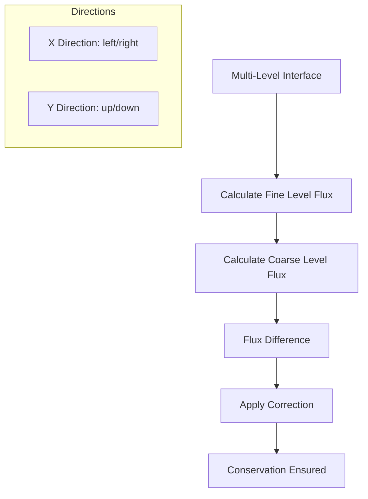
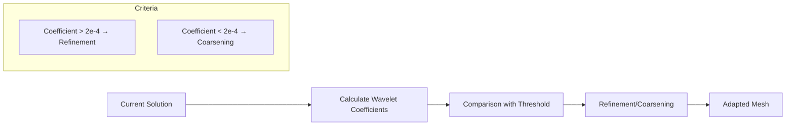
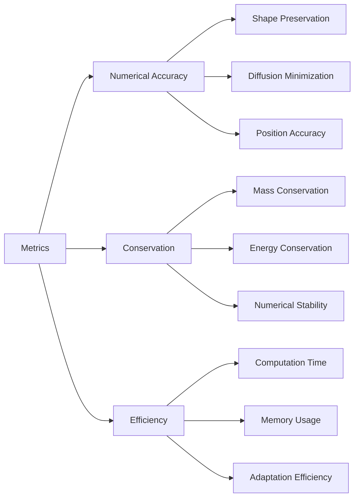
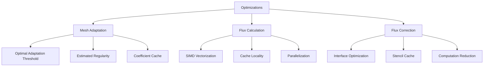

# Test Case: 2D Advection - Samurai

## Overview

The 2D advection test case in Samurai is a fundamental benchmark for validating numerical advection schemes on multiresolution adaptive meshes. It solves the 2D advection equation with an initial disk that moves according to a constant velocity vector, using the upwind scheme with flux correction at multi-level interfaces.

## Modeled Equation

### Mathematical Formulation

The 2D advection equation is written as:

```
∂u/∂t + a₁ ∂u/∂x + a₂ ∂u/∂y = 0
```

where:
- `u(x,y,t)` is the scalar state variable
- `a = (a₁, a₂)` is the constant velocity vector
- `(x,y) ∈ [0,1] × [0,1]` is the spatial domain

### Analytical Solution

For an initial condition `u₀(x,y)`, the exact solution is:

```
u(x,y,t) = u₀(x - a₁t, y - a₂t)
```

The solution moves at constant velocity `a` without deformation.

## Problem Configuration

### Simulation Parameters

```cpp
// Simulation parameters
constexpr std::size_t dim = 2;
xt::xtensor_fixed<double, xt::xshape<dim>> min_corner = {0., 0.};
xt::xtensor_fixed<double, xt::xshape<dim>> max_corner = {1., 1.};
std::array<double, dim> a = {1, 1};  // Diagonal velocity
double Tf = 0.1;                     // Final time
double cfl = 0.5;                    // Courant number
double t = 0.;                       // Initial time
std::string restart_file;            // Restart file
```

### Mesh Configuration

```cpp
// Multiresolution parameters
std::size_t min_level = 4;           // Minimum refinement level
std::size_t max_level = 10;          // Maximum refinement level
double mr_epsilon = 2.e-4;           // Multiresolution adaptation threshold
double mr_regularity = 1.;           // Estimated regularity for adaptation
bool correction = false;             // Flux correction activation

// Domain configuration
const samurai::Box<double, dim> box(min_corner, max_corner);
samurai::MRMesh<Config> mesh;
```

### Output Configuration

```cpp
// Output parameters
fs::path path = fs::current_path();
std::string filename = "FV_advection_2d";
std::size_t nfiles = 1;  // Number of output files
```

## Initial Condition

### Mathematical Definition

The initial condition is a centered disk:

```
u₀(x,y) = 1  if (x - 0.3)² + (y - 0.3)² ≤ 0.2²
u₀(x,y) = 0  otherwise
```

### Implementation

```cpp
template <class Field>
void init(Field& u)
{
    auto& mesh = u.mesh();
    u.resize();

    samurai::for_each_cell(mesh, [&](auto& cell)
    {
        auto center = cell.center();
        const double radius = 0.2;
        const double x_center = 0.3;
        const double y_center = 0.3;
        
        if (((center[0] - x_center) * (center[0] - x_center) + 
             (center[1] - y_center) * (center[1] - y_center)) <= radius * radius)
        {
            u[cell] = 1;
        }
        else
        {
            u[cell] = 0;
        }
    });
}
```

### Initial Condition Visualization

```mermaid
graph LR
    A[Initial Condition] --> B[Centered Disk]
    B --> C[Center (0.3, 0.3)]
    C --> D[Radius 0.2]
    D --> E[Value 1.0 inside]
    E --> F[Value 0.0 outside]
    
    subgraph "Domain"
        G[Domain [0,1] × [0,1]]
        H[Disk at position (0.3, 0.3)]
    end
```

## Velocity Vector

### Configuration

```cpp
// Advection velocity vector
std::array<double, dim> a = {1, 1};  // Diagonal velocity
```

### Physical Interpretation

- **`a = (1, 1)`** : Diagonal velocity toward top-right
- **Norm** : `|a| = √2 ≈ 1.414`
- **Direction** : 45° with respect to x and y axes
- **Trajectory** : The disk moves diagonally toward the upper-right corner

## Upwind Numerical Scheme

### Upwind Scheme Principle

The upwind scheme is a 1st-order scheme that uses the upstream value to calculate fluxes:

```cpp
// Explicit upwind scheme
unp1 = u - dt * samurai::upwind(a, u);
```

### Mathematical Formulation

For the 2D upwind scheme:

```
uᵢⱼⁿ⁺¹ = uᵢⱼⁿ - (Δt/Δx) × (Fᵢ₊₁/₂,ⱼ - Fᵢ₋₁/₂,ⱼ) - (Δt/Δy) × (Fᵢ,ⱼ₊₁/₂ - Fᵢ,ⱼ₋₁/₂)
```

where fluxes are calculated according to wind direction:

```
Fᵢ₊₁/₂,ⱼ = a₁⁺ uᵢ,ⱼ + a₁⁻ uᵢ₊₁,ⱼ
Fᵢ,ⱼ₊₁/₂ = a₂⁺ uᵢ,ⱼ + a₂⁻ uᵢ,ⱼ₊₁
```

with `a⁺ = max(a, 0)` and `a⁻ = min(a, 0)`.

### Upwind Scheme Advantages

- **Stability** : Conditionally stable under CFL condition
- **Monotonicity** : Preserves solution monotonicity
- **Robustness** : No oscillations at discontinuities
- **Simplicity** : Direct and efficient implementation

## Multi-Level Flux Correction

### Problem

On an adaptive mesh, interfaces between different refinement levels can introduce conservation errors. Flux correction allows maintaining exact conservation.

### Correction Principle



### Implementation

```cpp
template <class Field>
void flux_correction(double dt, const std::array<double, 2>& a, 
                     const Field& u, Field& unp1)
{
    using mesh_t = typename Field::mesh_t;
    using mesh_id_t = typename mesh_t::mesh_id_t;
    using interval_t = typename mesh_t::interval_t;
    constexpr std::size_t dim = Field::dim;

    auto mesh = u.mesh();

    for (std::size_t level = mesh.min_level(); level < mesh.max_level(); ++level)
    {
        // Direction X - Correction droite
        xt::xtensor_fixed<int, xt::xshape<dim>> stencil = {-1, 0};
        auto subset_right = samurai::intersection(
            samurai::translate(mesh[mesh_id_t::cells][level + 1], stencil),
            mesh[mesh_id_t::cells][level]).on(level);

        subset_right([&](const auto& i, const auto& index)
        {
            auto j = index[0];
            const double dx = mesh.cell_length(level);

            unp1(level, i, j) = unp1(level, i, j) + dt/dx * 
                (samurai::upwind_op<dim, interval_t>(level, i, j).right_flux(a, u)
                 - 0.5 * samurai::upwind_op<dim, interval_t>(level + 1, 2*i+1, 2*j).right_flux(a, u)
                 - 0.5 * samurai::upwind_op<dim, interval_t>(level + 1, 2*i+1, 2*j+1).right_flux(a, u));
        });

        // Direction X - Correction gauche
        stencil = {1, 0};
        auto subset_left = samurai::intersection(
            samurai::translate(mesh[mesh_id_t::cells][level + 1], stencil),
            mesh[mesh_id_t::cells][level]).on(level);

        subset_left([&](const auto& i, const auto& index)
        {
            auto j = index[0];
            const double dx = mesh.cell_length(level);

            unp1(level, i, j) = unp1(level, i, j) - dt/dx * 
                (samurai::upwind_op<dim, interval_t>(level, i, j).left_flux(a, u)
                 - 0.5 * samurai::upwind_op<dim, interval_t>(level + 1, 2*i, 2*j).left_flux(a, u)
                 - 0.5 * samurai::upwind_op<dim, interval_t>(level + 1, 2*i, 2*j+1).left_flux(a, u));
        });

        // Direction Y - Corrections similaires
        // ...
    }
}
```

### Mathematical Formulation

The flux correction is written as:

```
Correction = (Δt/Δx) × [Flux_coarse - 0.5 × (Flux_fine₁ + Flux_fine₂)]
```

where:
- `Flux_coarse` : Flux calculated on the coarse level
- `Flux_fine₁, Flux_fine₂` : Flux calculated on the two corresponding fine cells

## Dirichlet Boundary Conditions

### Configuration

```cpp
// Homogeneous Dirichlet boundary conditions
samurai::make_bc<samurai::Dirichlet<1>>(u, 0.);
```

### Implementation

Dirichlet boundary conditions impose `u = 0` on the domain boundaries:
- **Left Boundary** : `u(0,y,t) = 0`
- **Right Boundary** : `u(1,y,t) = 0`
- **Bottom Boundary** : `u(x,0,t) = 0`
- **Top Boundary** : `u(x,1,t) = 0`

### Impact on Solution

- **Reflections** : The solution reflects on boundaries
- **Interactions** : The disk interacts with domain boundaries
- **Behavior** : Different from analytical solution in infinite domain

## Time Step Calculation

### CFL Condition

```cpp
// Time step calculation based on CFL condition
double dt = cfl * mesh.cell_length(max_level);
```

### Mathematical Formulation

The CFL condition for 2D advection is written as:

```
Δt ≤ CFL × min(Δx, Δy) / (|a₁| + |a₂|)
```

With default parameters:
- `CFL = 0.5`
- `a = (1, 1)`
- `|a₁| + |a₂| = 2`
- `dt = 0.5 × Δx / 2 = 0.25 × Δx`

## Multiresolution Mesh Adaptation

### Adaptation Principle

```cpp
// Create multiresolution adapter
auto MRadaptation = samurai::make_MRAdapt(u);

// Initial adaptation
MRadaptation(mr_epsilon, mr_regularity);
```

### Adaptation Parameters

```cpp
double mr_epsilon = 2.e-4;    // Adaptation threshold
double mr_regularity = 1.;    // Estimated regularity
```

### Adaptation Workflow



## Time Loop

### General Structure

```cpp
while (t != Tf)
{
    // Mesh adaptation
    MRadaptation(mr_epsilon, mr_regularity);

    // Update time
    t += dt;
    if (t > Tf)
    {
        dt += Tf - t;
        t = Tf;
    }

    // Update ghost cells
    samurai::update_ghost_mr(u);
    
    // Resize output field
    unp1.resize();
    
    // Apply upwind scheme
    unp1 = u - dt * samurai::upwind(a, u);
    
    // Flux correction (optional)
    if (correction)
    {
        flux_correction(dt, a, u, unp1);
    }

    // Swap fields
    std::swap(u.array(), unp1.array());

    // Periodic save
    if (t >= static_cast<double>(nsave + 1) * dt_save || t == Tf)
    {
        save(path, filename, u, suffix);
    }
}
```

### Ghost Cell Management

```cpp
// Update ghost cells before computation
samurai::update_ghost_mr(u);
```

## Save and Visualization

### Save Function

```cpp
template <class Field>
void save(const fs::path& path, const std::string& filename, 
          const Field& u, const std::string& suffix = "")
{
    auto mesh = u.mesh();
    auto level_ = samurai::make_scalar_field<std::size_t>("level", mesh);

    if (!fs::exists(path))
    {
        fs::create_directory(path);
    }

    // Save refinement level
    samurai::for_each_cell(mesh, [&](const auto& cell)
    {
        level_[cell] = cell.level;
    });

#ifdef SAMURAI_WITH_MPI
    mpi::communicator world;
    samurai::save(path, fmt::format("{}_size_{}{}", filename, world.size(), suffix), mesh, u, level_);
#else
    samurai::save(path, fmt::format("{}{}", filename, suffix), mesh, u, level_);
    samurai::dump(path, fmt::format("{}_restart{}", filename, suffix), mesh, u);
#endif
}
```

### Output Formats

- **HDF5** : Primary format for visualization
- **Restart** : Restart file to continue simulation
- **Levels** : Information on refinement level of each cell

## Execution Examples

### Compilation

```bash
# Compile test case
mkdir build && cd build
cmake ..
make advection_2d
```

### Execution with Default Parameters

```bash
# Execution with default parameters
./advection_2d

# Execution with custom parameters
./advection_2d --min-level 4 --max-level 8 --mr-eps 1e-4 --Tf 0.1 --cfl 0.5
```

### Command Line Parameters

```bash
# Simulation parameters
--min-corner 0 0              # Bottom-left corner
--max-corner 1 1              # Top-right corner
--velocity 1 1                # Velocity vector
--cfl 0.5                     # CFL number
--Ti 0                        # Initial time
--Tf 0.1                      # Final time

# Multiresolution parameters
--min-level 4                 # Minimum level
--max-level 10                # Maximum level
--mr-eps 2e-4                 # Adaptation threshold
--mr-reg 1.0                  # Estimated regularity
--with-correction             # Enable flux correction

# Output parameters
--path ./results              # Output directory
--filename FV_advection_2d    # File prefix
--nfiles 10                   # Number of files
```

## Result Analysis

### Performance Metrics



### Numerical Validation

**Conservation Tests:**
```cpp
// Calculate total mass
double mass_initial = compute_total_mass(u_initial);
double mass_final = compute_total_mass(u_final);
double conservation_error = std::abs(mass_final - mass_initial);
```

**Position Tests:**
```cpp
// Calculate center of mass
auto center_initial = compute_center_of_mass(u_initial);
auto center_final = compute_center_of_mass(u_final);
auto expected_center = center_initial + a * Tf;
double position_error = norm(center_final - expected_center);
```

## Advanced Use Cases

### Convergence Study

```bash
# Spatial convergence study
for level in 4 5 6 7 8; do
    ./advection_2d --min-level $level --max-level $level --Tf 0.1
done
```

### Stability Study

```bash
# CFL stability study
for cfl in 0.1 0.3 0.5 0.7 0.9; do
    ./advection_2d --cfl $cfl --Tf 0.1
done
```

### Flux Correction Comparison

```bash
# Without flux correction
./advection_2d --Tf 0.1

# With flux correction
./advection_2d --Tf 0.1 --with-correction
```

### Velocity Vector Study

```bash
# Diagonal velocity
./advection_2d --velocity 1 1 --Tf 0.1

# Horizontal velocity
./advection_2d --velocity 1 0 --Tf 0.1

# Vertical velocity
./advection_2d --velocity 0 1 --Tf 0.1
```

## Optimizations and Performance

### Compile-Time Optimizations

```cpp
// Use compile-time constants
constexpr std::size_t dim = 2;
using Config = samurai::MRConfig<dim>;

// Template specialization
using mesh_t = typename Config::mesh_t;
using field_t = samurai::Field<double, 1, mesh_t>;
```

### Runtime Optimizations



### Performance Monitoring

```cpp
// Monitor computation time
auto start_time = std::chrono::high_resolution_clock::now();

// ... computation ...

auto end_time = std::chrono::high_resolution_clock::now();
auto duration = std::chrono::duration_cast<std::chrono::milliseconds>(end_time - start_time);
std::cout << "Computation time: " << duration.count() << " ms" << std::endl;
```

## Comparison with Analytical Solution

### Analytical Solution

For an initial disk of radius `r` centered at `(x₀, y₀)`, the analytical solution is:

```
u(x,y,t) = 1  if (x - x₀ - a₁t)² + (y - y₀ - a₂t)² ≤ r²
u(x,y,t) = 0  otherwise
```

### Error Calculation

```cpp
// Calculate L2 error with respect to analytical solution
double error = samurai::L2_error(u, [&](const auto& coords, double t)
{
    double x = coords(0);
    double y = coords(1);
    double x_center = 0.3 + a[0] * t;
    double y_center = 0.3 + a[1] * t;
    double radius = 0.2;
    
    if (((x - x_center) * (x - x_center) + 
         (y - y_center) * (y - y_center)) <= radius * radius)
    {
        return 1.0;
    }
    else
    {
        return 0.0;
    }
});
```

## Conclusion

The 2D advection test case in Samurai provides:

- **Complete validation** of upwind schemes on adaptive meshes
- **Robustness test** of multi-level flux correction
- **Performance benchmark** for multiresolution adaptation
- **Numerical reference** for advection problems

This test case constitutes a solid foundation for validating and optimizing Samurai's numerical methods on advection problems, with particular attention to conservation, accuracy, and efficiency of implemented schemes on adaptive meshes. 