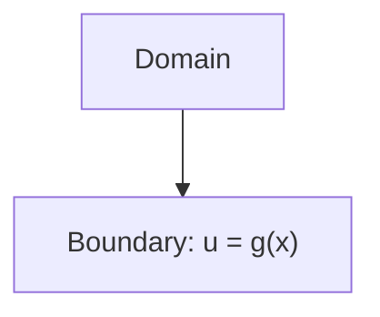
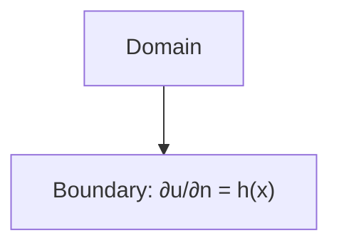
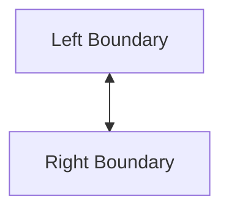

# Boundary Conditions Management

## Introduction

Boundary conditions (BCs) are essential for the correctness and stability of numerical simulations. Samurai provides a flexible system for defining and applying various types of BCs on fields.

## Supported Types of Boundary Conditions

- **Dirichlet**: Prescribed value on the boundary.
- **Neumann**: Prescribed flux or derivative on the boundary.
- **Periodic**: Opposite boundaries are connected.
- **Custom**: User-defined conditions through the base BC class.

## Visual Schematics

### Dirichlet



### Neumann



### Periodic



## Application to Fields

### Dirichlet Boundary Conditions

```cpp
// Apply Dirichlet BC with constant value
samurai::make_bc<samurai::Dirichlet<1>>(field, 0.0);

// Apply Dirichlet BC with function
samurai::make_bc<samurai::Dirichlet<1>>(field, 
    [](const auto&, const auto&, const auto& coord) {
        return coord[0] * coord[0];  // u = x²
    });

// Apply Dirichlet BC on specific direction
const xt::xtensor_fixed<int, xt::xshape<1>> left{-1};
samurai::make_bc<samurai::Dirichlet<1>>(field, 1.0)->on(left);
```

### Neumann Boundary Conditions

```cpp
// Apply Neumann BC with constant value
samurai::make_bc<samurai::Neumann<1>>(field, 0.0);

// Apply Neumann BC with function
samurai::make_bc<samurai::Neumann<1>>(field,
    [](const auto&, const auto&, const auto& coord) {
        return coord[0];  // ∂u/∂n = x
    });
```

### Periodic Boundary Conditions

```cpp
// Create mesh with periodic boundary conditions
std::array<bool, dim> periodic = {true, false};  // Periodic in x-direction
samurai::MRMesh<Config> mesh(box, min_level, max_level, periodic);

// Check if direction is periodic
if (mesh.is_periodic(0)) {
    // Periodic in x-direction
}
```

## Use in Numerical Schemes

- BCs are enforced during stencil application and matrix assembly.
- Ghost cells or layers are used to impose BCs.
- Periodic conditions are handled automatically by the mesh system.

## Advanced: Custom Boundary Conditions

Users can define custom BCs by inheriting from the base `samurai::Bc<Field>` class:

```cpp
template <class Field>
struct CustomBC : public samurai::Bc<Field>
{
    INIT_BC(CustomBC, 2)  // stencil_size = 2

    stencil_t get_stencil(constant_stencil_size_t) const override
    {
        return line_stencil<dim, 0>(0, 1);
    }

    apply_function_t get_apply_function(constant_stencil_size_t, const direction_t&) const override
    {
        return [](Field& f, const stencil_cells_t& cells, const value_t& value)
        {
            // Custom implementation
            f[cells[1]] = custom_formula(f[cells[0]], value);
        };
    }
};
```

## Time-Dependent Boundary Conditions

Time-dependent BCs can be updated at each time step by using lambda functions that capture the current time:

```cpp
double t = 0.0;
auto bc = samurai::make_bc<samurai::Dirichlet<1>>(field,
    [&t](const auto&, const auto&, const auto& coord) {
        return std::sin(t) * coord[0];  // Time-dependent BC
    });

// Update time and reapply BC
t += dt;
// BC will be automatically updated with new time value
```

## Conclusion

Proper management of boundary conditions is crucial for accurate and stable simulations in Samurai. The system provides a flexible framework for implementing various types of boundary conditions while maintaining consistency with the numerical schemes. 