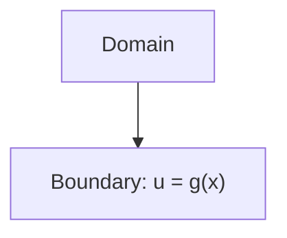
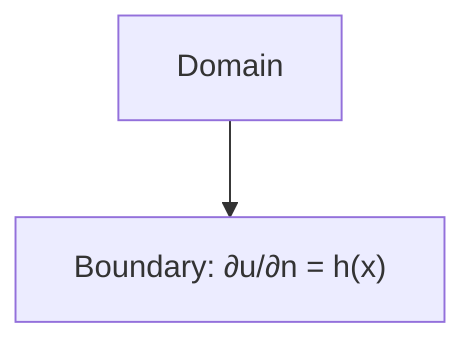
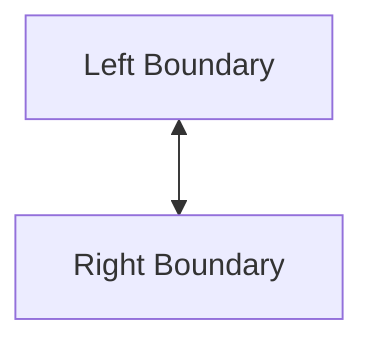

# Boundary Conditions Management

## Introduction

Boundary conditions (BCs) are essential for the correctness and stability of numerical simulations. Samurai provides a flexible system for defining and applying various types of BCs on fields.

## Supported Types of Boundary Conditions

- **Dirichlet**: Prescribed value on the boundary.
- **Neumann**: Prescribed flux or derivative on the boundary.
- **Periodic**: Opposite boundaries are connected.
- **Custom/Robin**: User-defined or mixed conditions.

## Visual Schematics

### Dirichlet



### Neumann



### Periodic



## Application to Fields

```cpp
// Apply Dirichlet BC
auto bc = samurai::make_dirichlet_bc(field, [](auto x) { return 0.0; });
field.apply_bc(bc);

// Apply Neumann BC
auto bc = samurai::make_neumann_bc(field, [](auto x) { return 1.0; });
field.apply_bc(bc);

// Periodic BC
field.set_periodic({true, false});
```

## Use in Numerical Schemes

- BCs are enforced during stencil application and matrix assembly.
- Ghost cells or layers are used to impose BCs.

## Advanced: Custom and Time-Dependent BCs

- Users can define custom BCs via lambda functions or functors.
- Time-dependent BCs can be updated at each time step.

## Conclusion

Proper management of boundary conditions is crucial for accurate and stable simulations in Samurai. 