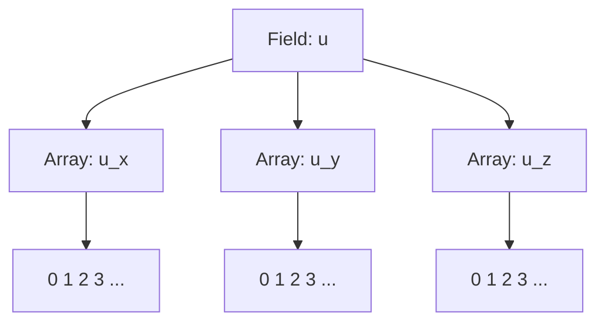
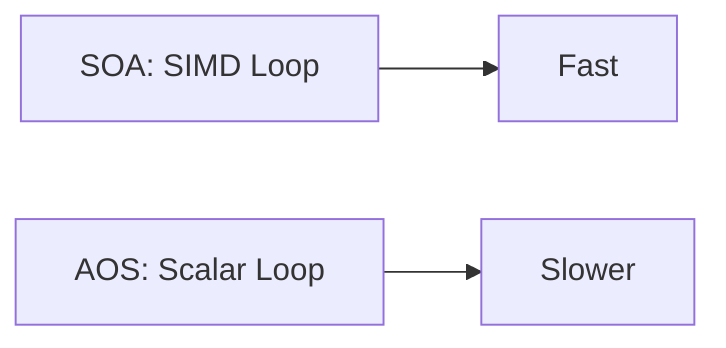

# Field Memory Layout and Memory Management

## Introduction

Efficient memory management and data layout are crucial for high-performance numerical simulations. Samurai provides flexible field storage layouts, mainly Structure of Arrays (SOA) and Array of Structures (AOS), to optimize memory access patterns and computational efficiency.

## Field Layouts: SOA vs AOS

### Definitions

- **SOA (Structure of Arrays):** Each field component is stored in a separate contiguous array.
- **AOS (Array of Structures):** All components of a field are stored together in a single structure, and these structures are stored in an array.

### Visual Schematics

#### SOA Layout



#### AOS Layout

```mermaid
graph TD
    A[Field: u] --> B[Array of Structs]
    B --> C1[Struct 0: (u_x, u_y, u_z)]
    B --> C2[Struct 1: (u_x, u_y, u_z)]
    B --> C3[Struct 2: (u_x, u_y, u_z)]
```

### Code Example

```cpp
// SOA example
auto velocity_soa = samurai::make_vector_field<double, 3, true>("velocity", mesh);

// AOS example (default)
auto velocity_aos = samurai::make_vector_field<double, 3>("velocity", mesh); // SOA == false par défaut
```

### Performance Considerations

- **SOA:**
  - Pros: Better cache utilization for vectorized operations, SIMD-friendly, efficient for operations on single components.
  - Cons: Less efficient for operations involving all components of a single cell.
- **AOS:**
  - Pros: Efficient for operations on all components of a cell (e.g., dot products).
  - Cons: Poorer cache locality for component-wise operations.

#### Benchmark Schematic



### Memory Allocation and Management

- Les données d’un `Field` sont stockées dans un tableau contigu dont la taille est égale au nombre total de mailles du maillage (`mesh.nb_cells()`).
- Ce tableau est (re)dimensionné automatiquement via `Field::resize()` lorsque le maillage est raffiné ou coarsené.
- La mémoire est libérée automatiquement lors de la destruction de l’objet `Field`.
- Le stockage s’appuie sur des conteneurs performants : xtensor par défaut, ou Eigen si la macro `SAMURAI_FIELD_CONTAINER_EIGEN3` est définie.

### Example: Memory Usage Monitoring

```cpp
// Monitor mesh memory usage
auto mesh_memory = samurai::memory_usage(mesh, true);
std::cout << "Mesh memory usage: " << mesh_memory << " bytes" << std::endl;
```

## Implementation Details

### Storage Containers

Samurai supports two storage backends:

- **Eigen**: When `SAMURAI_FIELD_CONTAINER_EIGEN3` is defined
- **xtensor**: Default backend for field storage

### Layout Configuration

The layout type is configured through the `layout_type` enum:

```cpp
enum class layout_type
{
    row_major = 0x00,
    column_major = 0x01
};
```

> La disposition par défaut est `layout_type::row_major`, sauf si la macro de compilation `SAMURAI_CONTAINER_LAYOUT_COL_MAJOR` est définie.

## Conclusion

Choosing the right field layout is essential for performance. SOA is generally preferred for large-scale, vectorized computations, while AOS can be useful for cell-centric operations. 