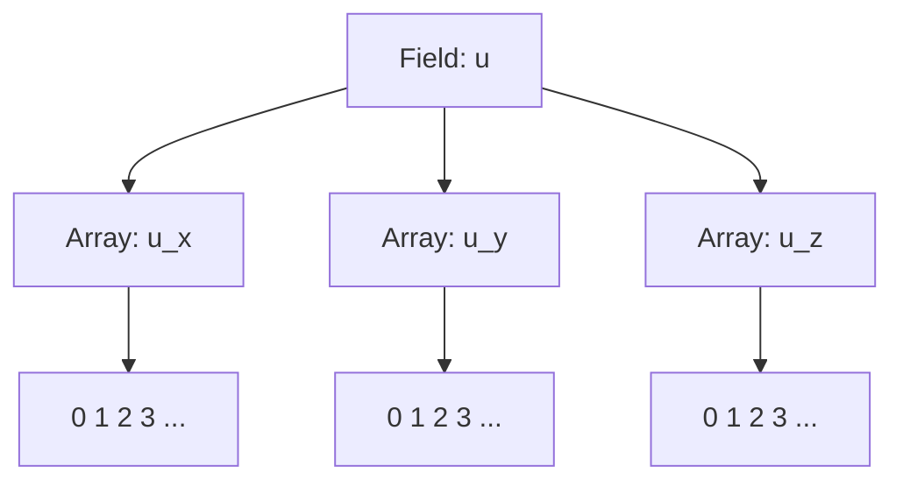
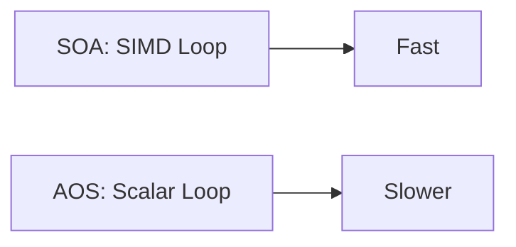

# Field Memory Layout and Memory Management

## Introduction

Efficient memory management and data layout are crucial for high-performance numerical simulations. Samurai provides flexible field storage layouts, mainly Structure of Arrays (SOA) and Array of Structures (AOS), to optimize memory access patterns and computational efficiency.

## Field Layouts: SOA vs AOS

### Definitions

- **SOA (Structure of Arrays):** Each field component is stored in a separate contiguous array.
- **AOS (Array of Structures):** All components of a field are stored together in a single structure, and these structures are stored in an array.

### Visual Schematics

#### SOA Layout



#### AOS Layout

```mermaid
graph TD
    A[Field: u] --> B[Array of Structs]
    B --> C1[Struct 0: (u_x, u_y, u_z)]
    B --> C2[Struct 1: (u_x, u_y, u_z)]
    B --> C3[Struct 2: (u_x, u_y, u_z)]
```

### Code Example

```cpp
// SOA example
samurai::Field<double, 3, samurai::layout::soa> velocity("velocity", mesh);

// AOS example
samurai::Field<double, 3, samurai::layout::aos> velocity("velocity", mesh);
```

### Performance Considerations

- **SOA:**
  - Pros: Better cache utilization for vectorized operations, SIMD-friendly, efficient for operations on single components.
  - Cons: Less efficient for operations involving all components of a single cell.
- **AOS:**
  - Pros: Efficient for operations on all components of a cell (e.g., dot products).
  - Cons: Poorer cache locality for component-wise operations.

#### Benchmark Schematic



### Memory Allocation and Management

- Fields are allocated per mesh level and per cell interval.
- Memory is released when mesh levels are coarsened or fields are destroyed.
- Samurai uses custom allocators for alignment and performance.

### Example: Memory Usage Monitoring

```cpp
std::cout << "Field memory usage: " << field.memory_usage() << " bytes" << std::endl;
```

## Advanced: Hybrid Layouts and Custom Allocators

- Samurai allows hybrid layouts for advanced use-cases.
- Custom allocators can be plugged for GPU or NUMA architectures.

## Conclusion

Choosing the right field layout is essential for performance. SOA is generally preferred for large-scale, vectorized computations, while AOS can be useful for cell-centric operations. 