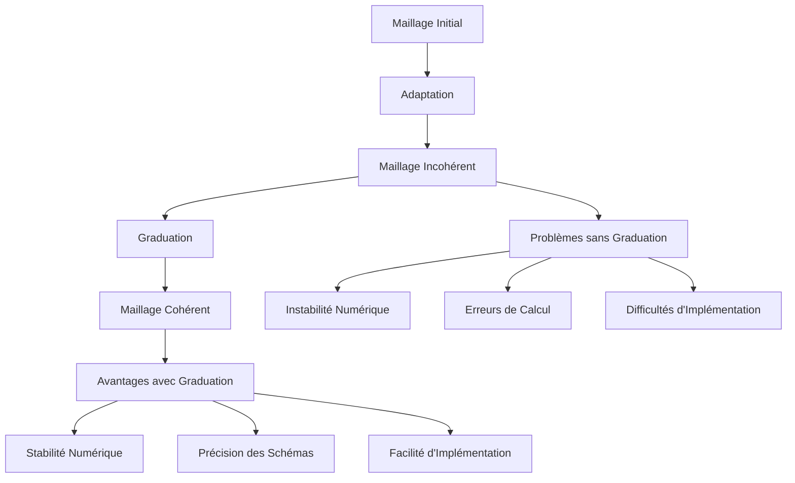
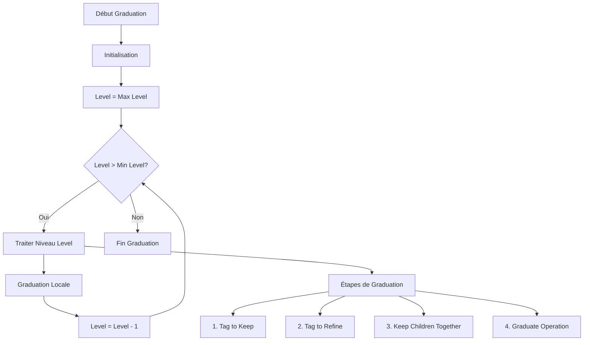
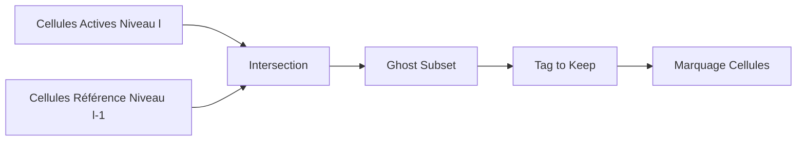
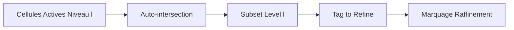
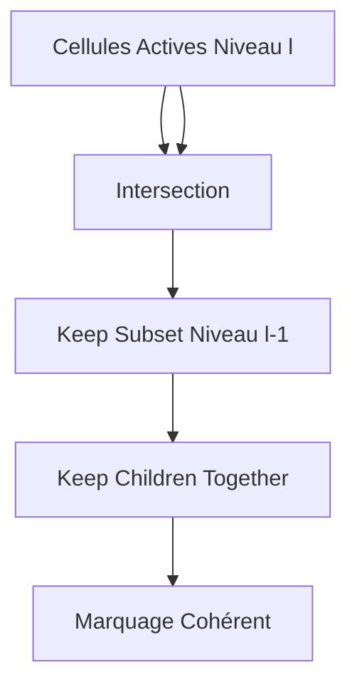
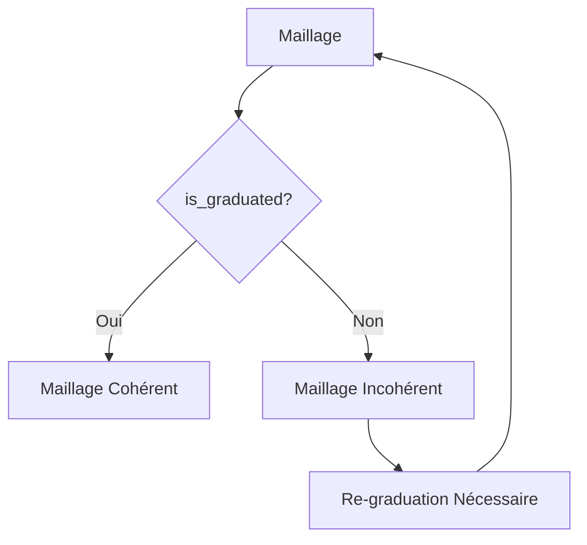
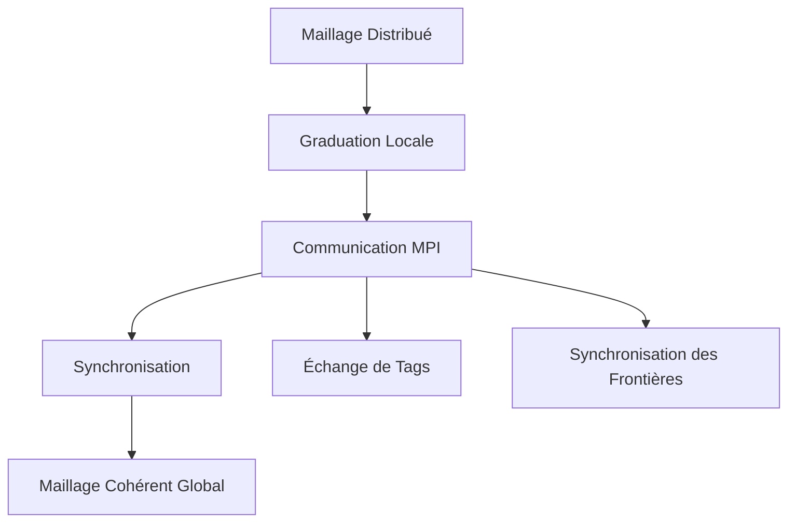

# Algorithme de Graduation

## Introduction

L'algorithme de graduation est un composant crucial de Samurai qui garantit la cohérence et la qualité du maillage adaptatif. Il assure que le maillage respecte la condition de **2:1 balance**, c'est-à-dire qu'aucune cellule ne peut avoir plus d'un niveau de raffinement de différence avec ses cellules voisines.

## Principe Fondamental

### Pourquoi la Graduation ?



### Condition 2:1 Balance

La condition de 2:1 balance stipule que :

```
Pour toute cellule C de niveau l, ses cellules voisines directes 
ne peuvent avoir qu'un niveau l-1, l, ou l+1.
```

**Exemple Visuel :**

```
Niveau l+1:  [F][F] [F][F]     F = Fine cells
Niveau l:    [C][C][C][C]      C = Coarse cells
Niveau l-1:  [G][G][G][G]      G = Very coarse cells

✅ VALIDE: Différence maximale de 1 niveau
❌ INVALIDE: Différence de 2 niveaux ou plus
```

## Architecture de l'Algorithme

### Structure Générale



### Composants Principaux

#### 1. Graduate Operator

```cpp
template <std::size_t dim, class TInterval>
class graduate_op : public field_operator_base<dim, TInterval>
{
public:
    template <std::size_t d, class T, class Stencil>
    inline void operator()(Dim<d>, T& tag, const Stencil& s) const
    {
        // Logique de graduation
    }
};
```

#### 2. Cell Flags

```cpp
enum class CellFlag : int
{
    keep = 1,      // Garder la cellule
    refine = 2,    // Raffiner la cellule
    coarsen = 4,   // Coarser la cellule
    // ...
};
```

## Étapes Détaillées de l'Algorithme

### Étape 1: Tag to Keep

**Objectif :** Marquer les cellules qui doivent être conservées pour maintenir la connectivité.



**Code :**
```cpp
auto ghost_subset = intersection(
    mesh[mesh_id_t::cells][level], 
    mesh[mesh_id_t::reference][level - 1]
).on(level - 1);

ghost_subset.apply_op(tag_to_keep<0>(tag));
```

**Schéma Visuel :**
```
Niveau l:   [A][A][A][A]  A = Active cells
Niveau l-1: [R][R][R][R]  R = Reference cells

Intersection: [G][G][G][G]  G = Ghost cells to keep
```

### Étape 2: Tag to Refine

**Objectif :** Marquer les cellules qui doivent être raffinées pour respecter la condition 2:1.



**Code :**
```cpp
auto subset_2 = intersection(
    mesh[mesh_id_t::cells][level], 
    mesh[mesh_id_t::cells][level]
);

subset_2.apply_op(tag_to_keep<ghost_width>(tag, CellFlag::refine));
```

**Schéma Visuel :**
```
Avant:      [K][R][K][R]  K = Keep, R = Refine
Après:      [K][R][K][R]  Marquage maintenu
```

### Étape 3: Keep Children Together

**Objectif :** S'assurer que les cellules enfants d'une même cellule parente sont traitées ensemble.



**Code :**
```cpp
auto keep_subset = intersection(
    mesh[mesh_id_t::cells][level], 
    mesh[mesh_id_t::cells][level]
).on(level - 1);

keep_subset.apply_op(keep_children_together(tag));
```

**Schéma Visuel :**
```
Niveau l:   [C1][C2][C3][C4]  Ci = Children
Niveau l-1: [P1][P2]          Pi = Parents

Relation: P1 → [C1,C2], P2 → [C3,C4]
Cohérence: Si C1 est gardé, C2 doit aussi être gardé
```

### Étape 4: Graduate Operation

**Objectif :** Appliquer l'opération de graduation proprement dite en utilisant un stencil.


**Code :**
```cpp
for (std::size_t i = 0; i < stencil.shape()[0]; ++i) {
    auto s = xt::view(stencil, i);
    auto subset = intersection(
        translate(mesh[mesh_id_t::cells][level], s), 
        mesh[mesh_id_t::cells][level - 1]
    ).on(level);
    subset.apply_op(graduate(tag, s));
}
```

## Cas d'Usage Détaillés

### Cas 1: Raffinement Simple

```mermaid
graph TD
    A[État Initial] --> B[Adaptation]
    B --> C[Incohérence Détectée]
    C --> D[Graduation]
    D --> E[État Final Cohérent]
    
    A --> A1[Level l: [K][K][K][K]]
    A --> A2[Level l-1: [K][K]]
    
    C --> C1[Level l: [K][R][K][K]]
    C --> C2[Level l-1: [K][K]]
    
    E --> E1[Level l: [K][R][K][K]]
    E --> E2[Level l-1: [R][K]]
```

**Explication :**
- Une cellule fine est marquée pour raffinement (R)
- La cellule parente correspondante doit aussi être marquée (R)
- Cela garantit la cohérence du maillage

### Cas 2: Coarsening avec Contraintes

```mermaid
graph TD
    A[État Initial] --> B[Adaptation]
    B --> C[Incohérence Détectée]
    C --> D[Graduation]
    D --> E[État Final Cohérent]
    
    A --> A1[Level l: [K][K][K][K]]
    A --> A2[Level l-1: [K][K]]
    
    C --> C1[Level l: [K][K][C][C]]
    C --> C2[Level l-1: [K][K]]
    
    E --> E1[Level l: [K][K][C][C]]
    E --> E2[Level l-1: [K][C]]
```

**Explication :**
- Deux cellules fines sont marquées pour coarsening (C)
- La cellule parente correspondante doit aussi être marquée (C)
- Cela évite les cellules orphelines

## Implémentation Technique

### Stencil de Graduation

```cpp
// Stencil en étoile pour la graduation
template <std::size_t dim>
auto star_stencil()
{
    // Génère un stencil en étoile pour la dimension donnée
    // Exemple 2D: [0,0], [-1,0], [1,0], [0,-1], [0,1]
}
```

**Schéma du Stencil 2D :**
```
     [0,1]
[-1,0] [0,0] [1,0]
     [0,-1]
```

### Opérateur de Graduation

```cpp
template <std::size_t dim, class TInterval>
class graduate_op : public field_operator_base<dim, TInterval>
{
public:
    template <std::size_t d, class T, class Stencil>
    inline void operator()(Dim<d>, T& tag, const Stencil& s) const
    {
        // Traitement des éléments pairs et impairs
        if (auto i_even = i.even_elements(); i_even.is_valid()) {
            tag_func(i_even);
        }
        if (auto i_odd = i.odd_elements(); i_odd.is_valid()) {
            tag_func(i_odd);
        }
    }
};
```

### Fonction Tag Function

```cpp
auto tag_func = [&](auto& i_f) {
    // Marquer les cellules pour raffinement
    auto mask = tag(level, i_f - s[0], index - view(s, xt::range(1, _))) 
                & static_cast<int>(CellFlag::refine);
    auto i_c = i_f >> 1;  // Division par 2 pour niveau parent
    
    apply_on_masked(tag(level - 1, i_c, index >> 1),
                   mask,
                   [](auto& e) { e |= static_cast<int>(CellFlag::refine); });
    
    // Marquer les cellules pour conservation
    auto mask2 = tag(level, i_f - s[0], index - view(s, xt::range(1, _))) 
                 & static_cast<int>(CellFlag::keep);
    
    apply_on_masked(tag(level - 1, i_c, index >> 1),
                   mask2,
                   [](auto& e) { e |= static_cast<int>(CellFlag::keep); });
};
```

## Optimisations de Performance

### 1. Traitement par Intervalles


**Avantage :** Traitement en bloc des cellules contiguës plutôt que cellule par cellule.

### 2. Éléments Pairs et Impairs

```cpp
// Traitement séparé pour optimiser l'accès mémoire
if (auto i_even = i.even_elements(); i_even.is_valid()) {
    tag_func(i_even);
}
if (auto i_odd = i.odd_elements(); i_odd.is_valid()) {
    tag_func(i_odd);
}
```

**Schéma :**
```
Éléments Pairs:  [0][2][4][6][8]...
Éléments Impairs: [1][3][5][7][9]...

Traitement séparé pour optimiser l'accès cache
```

### 3. Masquage Conditionnel

```cpp
apply_on_masked(tag(level - 1, i_c, index >> 1),
               mask,
               [](auto& e) { e |= static_cast<int>(CellFlag::refine); });
```

**Avantage :** Application conditionnelle des opérations uniquement où nécessaire.

## Vérification de la Graduation

### Fonction is_graduated

```cpp
template <class Mesh, std::size_t neighbourhood_width = 1>
bool is_graduated(const Mesh& mesh, const Stencil& stencil = star_stencil<Mesh::dim>())
{
    // Vérifie que le maillage respecte la condition 2:1
    for (std::size_t level = min_level + 2; level <= max_level; ++level) {
        for (std::size_t level_below = min_level; level_below < level - 1; ++level_below) {
            // Vérification pour chaque stencil
            for (std::size_t is = 0; is < stencil.shape()[0]; ++is) {
                auto s = xt::view(stencil, is);
                auto set = intersection(translate(mesh[level], s), mesh[level_below]).on(level_below);
                set([&cond](const auto&, const auto&) { cond = false; });
                if (!cond) return false;
            }
        }
    }
    return true;
}
```

### Test de Cohérence



## Exemples Pratiques

### Exemple 1: Graduation Simple

```cpp
#include <samurai/algorithm/graduation.hpp>

int main() {
    // Créer un maillage
    samurai::MRMesh<Config> mesh(box, min_level, max_level);
    
    // Créer un tag pour l'adaptation
    auto tag = samurai::make_field<int>("tag", mesh);
    
    // Marquer certaines cellules pour raffinement
    samurai::for_each_cell(mesh, [&](const auto& cell) {
        if (should_refine(cell)) {
            tag[cell] = static_cast<int>(samurai::CellFlag::refine);
        } else {
            tag[cell] = static_cast<int>(samurai::CellFlag::keep);
        }
    });
    
    // Appliquer la graduation
    auto stencil = samurai::star_stencil<dim>();
    samurai::graduation(tag, stencil);
    
    // Vérifier la cohérence
    bool is_consistent = samurai::is_graduated(mesh, stencil);
    std::cout << "Maillage cohérent: " << is_consistent << std::endl;
    
    return 0;
}
```

### Exemple 2: Graduation avec Contraintes

```cpp
// Graduation avec largeur de stencil personnalisée
template <std::size_t dim, class TInterval, size_t max_size>
size_t make_graduation(CellArray<dim, TInterval, max_size>& ca,
                      const size_t grad_width = 1,
                      const size_t half_stencil_width = 1)
{
    // Applique la graduation avec des paramètres spécifiques
    // grad_width: largeur de la zone de graduation
    // half_stencil_width: demi-largeur du stencil numérique
    
    // Logique de graduation...
    return nb_refined_cells;
}
```

## Considérations Avancées

### 1. Graduation avec MPI



### 2. Graduation Adaptative

```cpp
// Graduation avec seuil adaptatif
double adaptive_threshold = compute_adaptive_threshold(field);
samurai::graduation(tag, stencil, adaptive_threshold);
```

### 3. Monitoring de Performance

```cpp
// Mesurer les performances de la graduation
samurai::times::timers.start("graduation");
samurai::graduation(tag, stencil);
samurai::times::timers.stop("graduation");

auto stats = samurai::times::timers.get("graduation");
std::cout << "Temps de graduation: " << stats.total_time << "s" << std::endl;
```

## Conclusion

L'algorithme de graduation est un composant essentiel de Samurai qui garantit la qualité et la cohérence du maillage adaptatif. En respectant la condition 2:1 balance, il assure :

- **Stabilité numérique** des schémas de discrétisation
- **Précision** des calculs sur maillages adaptatifs
- **Facilité d'implémentation** des opérateurs numériques
- **Performance optimisée** grâce aux traitements par intervalles

L'algorithme est conçu pour être robuste, efficace et adaptable aux différents types de problèmes numériques, tout en maintenant la cohérence du maillage dans des contextes parallèles et complexes. 