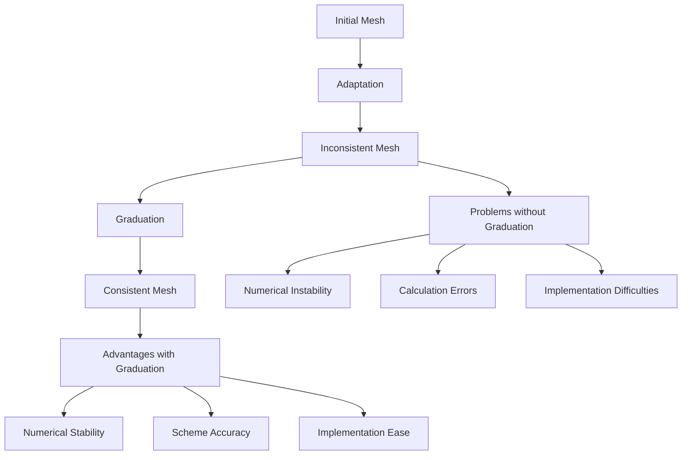
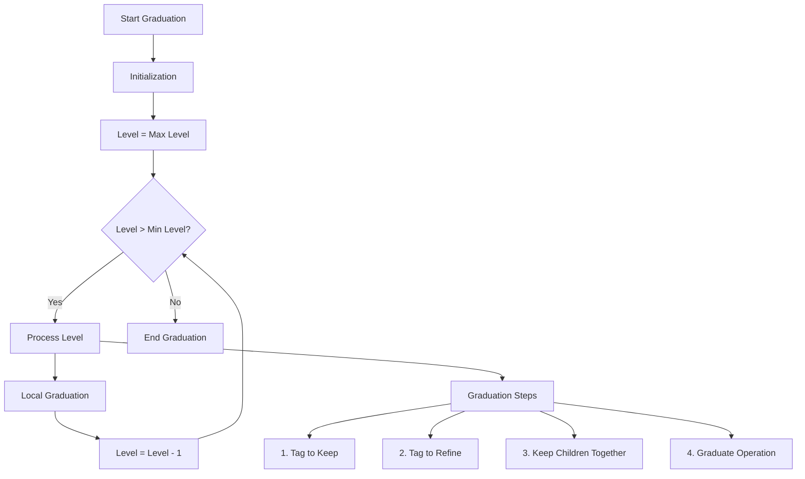
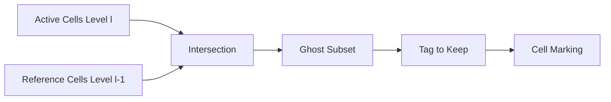
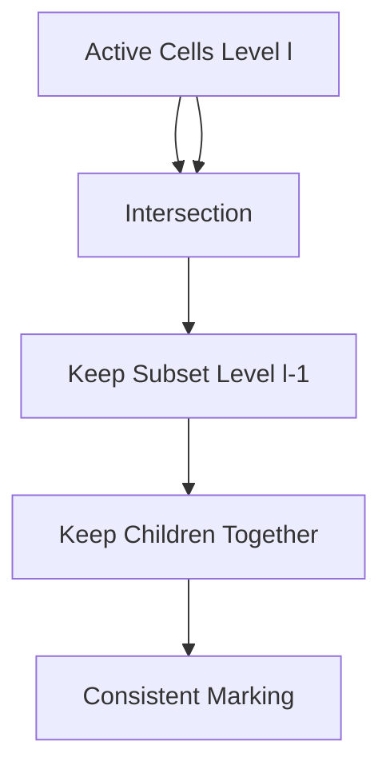
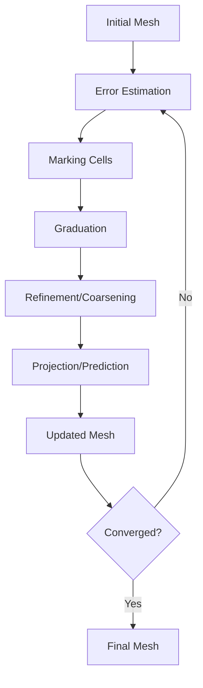

# Graduation Algorithm

## Introduction

The graduation algorithm is a crucial component of Samurai that ensures the consistency and quality of adaptive meshing. It ensures that the mesh respects the **2:1 balance condition**, meaning that no cell can have more than one level of refinement difference with its neighboring cells.

## Fundamental Principle

### Why Graduation?



### 2:1 Balance Condition

The 2:1 balance condition states that:

```
For any cell C at level l, its direct neighboring cells 
can only have level l-1, l, or l+1.
```

**Visual Example:**

```
Level l+1:  [F][F] [F][F]     F = Fine cells
Level l:    [C][C][C][C]      C = Coarse cells
Level l-1:  [G][G][G][G]      G = Very coarse cells

✅ VALID: Maximum difference of 1 level
❌ INVALID: Difference of 2 levels or more
```

## Algorithm Architecture

> **Note sur l'implémentation :** Ce document décrit la fonction `samurai::graduation`, qui opère sur un champ de `tag` pour marquer les cellules à raffiner ou à dé-raffiner. C'est un mécanisme de bas niveau basé sur des marqueurs. Le moteur d'adaptation principal de Samurai, `samurai::make_MRAdapt`, utilise une fonction de plus haut niveau, `samurai::make_graduation`, qui opère itérativement sur un `CellArray` et n'utilise pas ce schéma de marquage. Les concepts expliqués ici restent fondamentaux pour comprendre la mise en application de la condition d'équilibre 2:1 dans Samurai.

### General Structure



### Main Components

#### 1. Graduate Operator

```cpp
template <std::size_t dim, class TInterval>
class graduate_op : public field_operator_base<dim, TInterval>
{
public:
    template <std::size_t d, class T, class Stencil>
    inline void operator()(Dim<d>, T& tag, const Stencil& s) const
    {
        // Graduation logic implementation
    }
};
```

#### 2. Cell Flags

```cpp
enum class CellFlag : int
{
    keep = 1,      // Keep the cell
    coarsen = 2,   // Coarsen the cell
    refine = 4,    // Refine the cell
    enlarge = 8    // Enlarge the cell
};
```

## Detailed Algorithm Steps

### Step 1: Tag to Keep

**Objective:** Mark cells that must be kept to maintain connectivity.



**Code:**
```cpp
auto ghost_subset = intersection(
    mesh[mesh_id_t::cells][level], 
    mesh[mesh_id_t::reference][level - 1]
).on(level - 1);

ghost_subset.apply_op(tag_to_keep<0>(tag));
```

**Visual Scheme:**
```
Level l:   [A][A][A][A]  A = Active cells
Level l-1: [R][R][R][R]  R = Reference cells

Intersection: [G][G][G][G]  G = Ghost cells to keep
```

### Step 2: Tag to Refine

**Objective:** Mark cells that must be refined to respect the 2:1 condition.


**Code:**
```cpp
auto subset_2 = intersection(
    mesh[mesh_id_t::cells][level], 
    mesh[mesh_id_t::cells][level]
);

subset_2.apply_op(tag_to_keep<ghost_width>(tag, CellFlag::refine));
```

**Visual Scheme:**
```
Before:     [K][R][K][R]  K = Keep, R = Refine
After:      [K][R][K][R]  Marking maintained
```

### Step 3: Keep Children Together

**Objective:** Ensure that child cells of the same parent cell are treated together.



**Code:**
```cpp
auto keep_subset = intersection(
    mesh[mesh_id_t::cells][level], 
    mesh[mesh_id_t::cells][level]
).on(level - 1);

keep_subset.apply_op(keep_children_together(tag));
```

**Visual Scheme:**
```
Level l:   [C1][C2][C3][C4]  Ci = Children
Level l-1: [P1][P2]          Pi = Parents

Relation: P1 → [C1,C2], P2 → [C3,C4]
Consistency: If C1 is kept, C2 must also be kept
```

### Step 4: Graduate Operation

**Objective:** Apply the actual graduation operation using a stencil.


**Code:**
```cpp
auto graduate_subset = intersection(
    mesh[mesh_id_t::cells][level], 
    mesh[mesh_id_t::cells][level]
).on(level - 1);

graduate_subset.apply_op(graduate(tag, s));
```

**Visual Scheme:**
```
Stencil:    [S][S][S][S]  S = Stencil points
Translation: [T][T][T][T]  T = Translated points
Result:     [G][G][G][G]  G = Graduated cells
```

## Implementation Details

### Stencil Operations

The graduation algorithm uses stencils to propagate information between mesh levels. The stencil is defined as a set of translation vectors that determine which neighboring cells to consider during the graduation process.

### Ghost Width Management

The ghost width determines the extent of the graduation operation:

```cpp
constexpr std::size_t ghost_width = 1;  // Default value
// Can be adjusted based on numerical scheme requirements
```

## Performance Considerations

### Memory Efficiency

- **Contiguous Operations:** Process cells in contiguous blocks
- **Minimal Allocations:** Reuse temporary objects
- **Cache-friendly Access:** Optimize memory access patterns

### Computational Complexity

- **Linear Complexity:** O(n) where n is the number of cells
- **Level-wise Processing:** Process each level independently
- **Parallel Potential:** Algorithm can be parallelized

## Error Handling

### Common Issues

1. **Inconsistent Mesh:** Mesh violates 2:1 balance condition
2. **Memory Issues:** Insufficient memory for large meshes
3. **Convergence Problems:** Graduation fails to converge

### Validation

The graduation result can be validated using the `is_graduated()` function:

```cpp
// Check if mesh is graduated
bool is_graduated = samurai::is_graduated(mesh);
```

## Integration with Adaptation

### Adaptation Workflow



### Code Integration

La fonction `graduation` est typiquement utilisée après une étape initiale de marquage des cellules basée sur certains critères (par exemple, l'estimation de l'erreur). Elle modifie un champ de `tag` pour s'assurer que le maillage résultant sera gradué.

```cpp
// 1. Créer un champ de tags initialisé avec des indicateurs de dé-raffinement/raffinement
auto tag = samurai::make_field<int>("tag", mesh);
// ... marquer les cellules en fonction de l'estimation de l'erreur ...
// (par exemple, marquer les champs avec CellFlag::coarsen ou CellFlag::refine)

// 2. Appliquer la graduation sur le champ de tags
// Cela garantit que la balance 2:1 est respectée
auto stencil = samurai::stencil_graduation::call(samurai::Dim<dim>{});
samurai::graduation(tag, stencil);

// 3. Créer le nouveau tableau de cellules à partir des tags corrigés
auto new_cell_array = samurai::update_cell_array_from_tag(mesh.cells(), tag);

// Puis créer le nouveau maillage
samurai::Mesh<Config> new_mesh(new_cell_array, mesh);
```

## Advanced Features

### `make_graduation`

Bien que ce document se concentre sur la fonction `samurai::graduation` basée sur les tags, la bibliothèque fournit également une fonction de plus haut niveau, `samurai::make_graduation`.

```cpp
// Exemple d'utilisation
samurai::make_graduation(cell_array);
```

Cette fonction opère directement sur un `samurai::CellArray` plutôt que sur un champ de `tag`. Elle ajoute ou supprime itérativement des cellules au `CellArray` jusqu'à ce que le maillage soit entièrement gradué. C'est la fonction utilisée par la routine d'adaptation principale, `make_MRAdapt`, car son implémentation est plus directe à cette fin.

## Conclusion

The graduation algorithm is essential for maintaining mesh quality and numerical stability in adaptive mesh refinement. It ensures that the mesh remains consistent and suitable for high-order numerical schemes while providing efficient performance and flexibility for various applications.

Key benefits:
- **Numerical Stability:** Prevents instabilities from mesh inconsistencies
- **Scheme Accuracy:** Maintains accuracy of numerical schemes
- **Implementation Ease:** Simplifies the implementation of complex schemes
- **Performance:** Efficient algorithm with linear complexity
- **Reliability:** Standardized algorithm ensures consistent results 