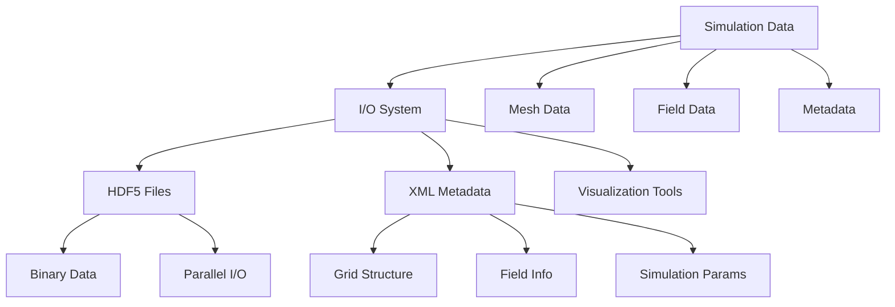
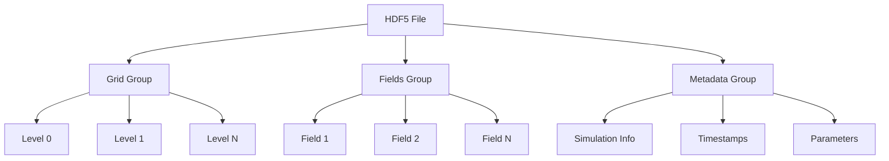
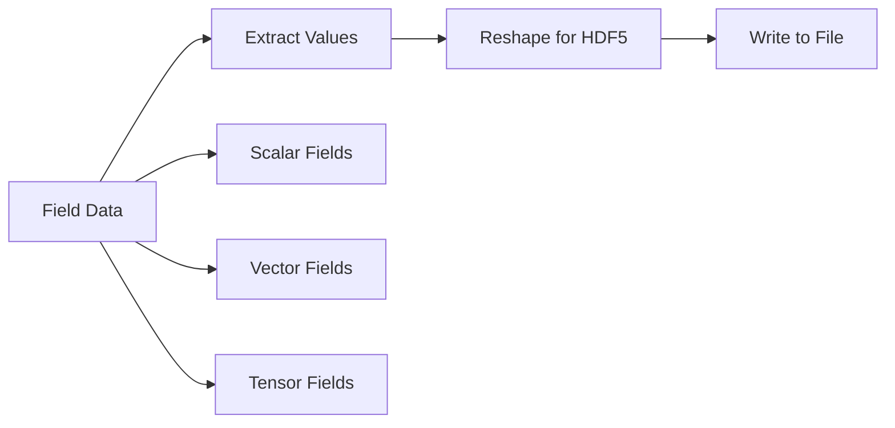
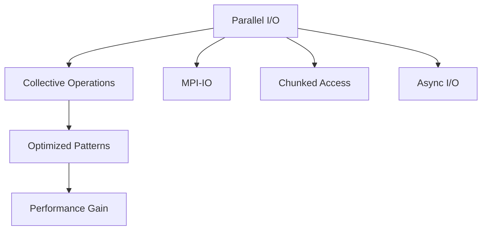

# Input/Output System and Data Formats

## Introduction

Samurai's input/output (I/O) system provides comprehensive capabilities for saving and loading simulation data, including meshes, fields, and metadata. It primarily supports the HDF5 format with XML metadata for maximum portability and interoperability.

## I/O System Overview

### General Architecture



### Supported Formats

- **HDF5** : Primary format for binary data
- **XML** : Metadata and grid structure (XDMF format)
- **CGAL** : Import of complex geometries

## HDF5 System

### File Structure



### HDF5 Classes

#### Hdf5 Base Class

```cpp
template <class D>
class Hdf5
{
public:
    Hdf5(const fs::path& path, const std::string& filename);
    ~Hdf5();
    
protected:
    pugi::xml_node& domain();
    template <class Submesh, class Field>
    void save_field(pugi::xml_node& grid, const std::string& prefix, 
                   const Submesh& submesh, const Field& field);
    
private:
    HighFive::File h5_file;
    fs::path m_path;
    std::string m_filename;
    pugi::xml_document m_doc;
    pugi::xml_node m_domain;
};
```

#### SaveBase Template

```cpp
template <class D, class Mesh, class... T>
class SaveBase : public Hdf5<SaveBase<D, Mesh, T...>>
{
public:
    using mesh_t = Mesh;
    using options_t = Hdf5Options<mesh_t>;
    using fields_type = std::tuple<const T&...>;
    
    SaveBase(const fs::path& path, const std::string& filename, 
             const options_t& options, const Mesh& mesh, const T&... fields);
    
    void save();
    
protected:
    template <class Submesh>
    void save_fields(pugi::xml_node& grid, const std::string& prefix, 
                    const Submesh& submesh);
    
private:
    const mesh_t& m_mesh;
    options_t m_options;
    fields_type m_fields;
};
```

### Save Options

```cpp
template <class D>
struct Hdf5Options
{
    Hdf5Options(bool level = false, bool mesh_id = false)
        : by_level(level), by_mesh_id(mesh_id) {}
    
    bool by_level = false;    // Save by level
    bool by_mesh_id = false;  // Save by mesh ID
};
```

## Mesh Saving

### Uniform Meshes

```cpp
template <class Config, class... T>
void save(const fs::path& path, const std::string& filename, 
          const UniformMesh<Config>& mesh, const T&... fields)
{
    Hdf5_mesh_base_level<UniformMesh<Config>, T...> h5(path, filename, 
                                                       Hdf5Options<UniformMesh<Config>>(), 
                                                       mesh, fields...);
    h5.save();
}
```

### Adaptive Meshes

```cpp
template <std::size_t dim, class TInterval, class... T>
void save(const fs::path& path, const std::string& filename, 
          const LevelCellArray<dim, TInterval>& mesh, const T&... fields)
{
    Hdf5_LevelCellArray<LevelCellArray<dim, TInterval>, T...> h5(path, filename, 
                                                                Hdf5Options<LevelCellArray<dim, TInterval>>(), 
                                                                mesh, fields...);
    h5.save();
}
```

## Coordinate and Connectivity Extraction

### Extraction Function

```cpp
template <class Mesh>
auto extract_coords_and_connectivity(const Mesh& mesh)
{
    static constexpr std::size_t dim = Mesh::dim;
    std::size_t nb_cells = mesh.nb_cells();
    
    if (nb_cells == 0) {
        xt::xtensor<std::size_t, 2> connectivity = xt::zeros<std::size_t>({0, 0});
        xt::xtensor<double, 2> coords = xt::zeros<double>({0, 0});
        return std::make_pair(coords, connectivity);
    }
    
    std::size_t nb_points_per_cell = 1 << dim;
    std::map<std::array<double, dim>, std::size_t> points_id;
    auto element = get_element(std::integral_constant<std::size_t, dim>{});
    
    // Coordinate and connectivity extraction
    // ...
    
    return std::make_pair(coords, connectivity);
}
```

### Elements by Dimension

#### 1D - Line

```cpp
inline auto get_element(std::integral_constant<std::size_t, 1>)
{
    return std::array<double, 2>{{0, 1}};
}
```

**Visual Scheme:**
```
[0]----[1]
```

#### 2D - Quadrilateral

```cpp
inline auto get_element(std::integral_constant<std::size_t, 2>)
{
    return std::array<xt::xtensor_fixed<std::size_t, xt::xshape<2>>, 4>{
        {{0, 0}, {1, 0}, {1, 1}, {0, 1}}
    };
}
```

**Visual Scheme:**
```
[0,0]----[1,0]
  |        |
  |        |
[0,1]----[1,1]
```

#### 3D - Hexahedron

```cpp
inline auto get_element(std::integral_constant<std::size_t, 3>)
{
    return std::array<xt::xtensor_fixed<std::size_t, xt::xshape<3>>, 8>{
        {{0, 0, 0}, {1, 0, 0}, {1, 1, 0}, {0, 1, 0},
         {0, 0, 1}, {1, 0, 1}, {1, 1, 1}, {0, 1, 1}}
    };
}
```

**Visual Scheme:**
```
    [0,0,1]----[1,0,1]
   /|         /|
  / |        / |
[0,0,0]----[1,0,0]
 |  |       |  |
 | [0,1,1]--|-[1,1,1]
 | /        | /
 |/         |/
[0,1,0]----[1,1,0]
```

## Field Saving

### Data Structure



### Save by Level

```cpp
template <class Submesh, class Field>
void save_field(pugi::xml_node& grid, const std::string& prefix, 
               const Submesh& submesh, const Field& field)
{
    // Extract field values
    auto values = extract_data(field, submesh);
    
    // Save to HDF5
    std::string dataset_name = prefix + "_values";
    h5_file.createDataSet(dataset_name, values);
    
    // XML metadata
    auto field_node = grid.append_child("Field");
    field_node.append_attribute("name") = prefix.c_str();
    field_node.append_attribute("dataset") = dataset_name.c_str();
}
```

## XML Metadata

### XML Structure

```xml
<?xml version="1.0" encoding="UTF-8"?>
<Xdmf xmlns:xi="http://www.w3.org/2001/XInclude">
    <Domain>
        <Grid Name="Samurai_Mesh" GridType="Collection">
            <Grid Name="Level_0" GridType="Uniform">
                <Topology TopologyType="Quadrilateral" NumberOfElements="100">
                    <DataItem DataType="Int" Dimensions="100 4" Format="HDF">
                        mesh.h5:/connectivity
                    </DataItem>
                </Topology>
                <Geometry GeometryType="XY">
                    <DataItem DataType="Float" Dimensions="400 2" Format="HDF">
                        mesh.h5:/coordinates
                    </DataItem>
                </Geometry>
                <Attribute Name="velocity" AttributeType="Vector" Center="Cell">
                    <DataItem DataType="Float" Dimensions="100 2" Format="HDF">
                        mesh.h5:/velocity_values
                    </DataItem>
                </Attribute>
            </Grid>
        </Grid>
    </Domain>
</Xdmf>
```

### Automatic Generation

```cpp
void generate_xml_metadata()
{
    auto domain = m_doc.append_child("Domain");
    auto grid = domain.append_child("Grid");
    grid.append_attribute("Name") = "Samurai_Mesh";
    grid.append_attribute("GridType") = "Collection";
    
    // Add mesh levels
    for (std::size_t level = 0; level < mesh.max_level() + 1; ++level) {
        auto level_grid = grid.append_child("Grid");
        level_grid.append_attribute("Name") = fmt::format("Level_{}", level).c_str();
        level_grid.append_attribute("GridType") = "Uniform";
        
        // Topology and geometry
        add_topology(level_grid, level);
        add_geometry(level_grid, level);
        
        // Fields
        add_fields(level_grid, level);
    }
}
```

## Usage Examples

### Example 1: Simple Save

```cpp
#include <samurai/io/hdf5.hpp>

int main() {
    // Create a mesh and fields
    auto mesh = samurai::make_mesh(/* ... */);
    auto field1 = samurai::make_scalar_field<double>("pressure", mesh);
    auto field2 = samurai::make_vector_field<double, 2>("velocity", mesh);
    
    // Initialize fields
    samurai::for_each_cell(mesh, [&](const auto& cell) {
        field1[cell] = initial_pressure(cell.center());
        field2[cell] = initial_velocity(cell.center());
    });
    
    // Save
    samurai::save("output", "simulation.h5", mesh, field1, field2);
    
    return 0;
}
```

### Example 2: Save with Options

```cpp
#include <samurai/io/hdf5.hpp>

int main() {
    // Save options
    samurai::Hdf5Options<decltype(mesh)> options(true, false); // by level
    
    // Save with options
    samurai::save("output", "simulation.h5", options, mesh, field1, field2);
    
    return 0;
}
```

### Example 3: Parallel Save

```cpp
#ifdef SAMURAI_WITH_MPI
#include <samurai/io/hdf5.hpp>

int main() {
    // MPI configuration
    mpi::communicator world;
    
    // Parallel save
    if (world.rank() == 0) {
        samurai::save("output", "simulation.h5", mesh, field1, field2);
    }
    
    return 0;
}
#endif
```

## CGAL Import

### Geometry Import

```cpp
#include <samurai/io/from_geometry.hpp>

template <class Mesh>
void import_from_cgal(const std::string& filename, Mesh& mesh)
{
    // Import CGAL geometry
    auto geometry = samurai::from_geometry<3>(filename, start_level, max_level);
    
    // Mesh adaptation
    samurai::adapt_mesh_to_geometry(mesh, geometry);
}
```

## Restart System

### Save Restart

```cpp
#include <samurai/io/restart.hpp>

template <class Mesh, class... Fields>
void save_restart(const std::string& filename, const Mesh& mesh, const Fields&... fields)
{
    // Save simulation state for restart
    samurai::dump(filename, mesh, fields...);
}
```

### Load Restart

```cpp
#include <samurai/io/restart.hpp>

template <class Mesh, class... Fields>
void load_restart(const std::string& filename, Mesh& mesh, Fields&... fields)
{
    // Load simulation state
    samurai::load(filename, mesh, fields...);
}
```

## Parallel I/O

### MPI Support



### Parallel Save Example

```cpp
#ifdef SAMURAI_WITH_MPI
template <class Mesh, class... Fields>
void parallel_save(const std::string& filename, const Mesh& mesh, const Fields&... fields)
{
    mpi::communicator world;
    
    // Parallel save with collective operations
    samurai::save(filename, mesh, fields...);
}
#endif
```

## Performance Monitoring

### Built-in Timers

```cpp
void monitor_io_performance()
{
    // I/O operations are automatically timed
    samurai::save("output", "benchmark.h5", mesh, field1, field2);
    
    // Access timing information
    auto stats = samurai::times::timers.get("data saving");
    std::cout << "I/O Write time: " << stats.total_time << "s" << std::endl;
}
```

## Conclusion

Samurai's I/O system offers:

- **Flexibility** with HDF5 format and XML metadata
- **Performance** through parallel I/O and MPI support
- **Interoperability** with standard visualization tools via XDMF
- **Robustness** with comprehensive restart capabilities
- **Extensibility** for custom data formats

This system enables seamless integration into simulation and post-processing workflows, facilitating result analysis and visualization. 