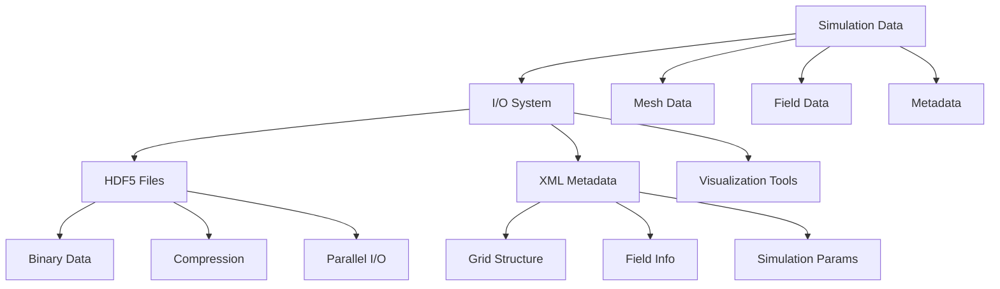
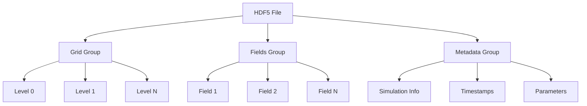
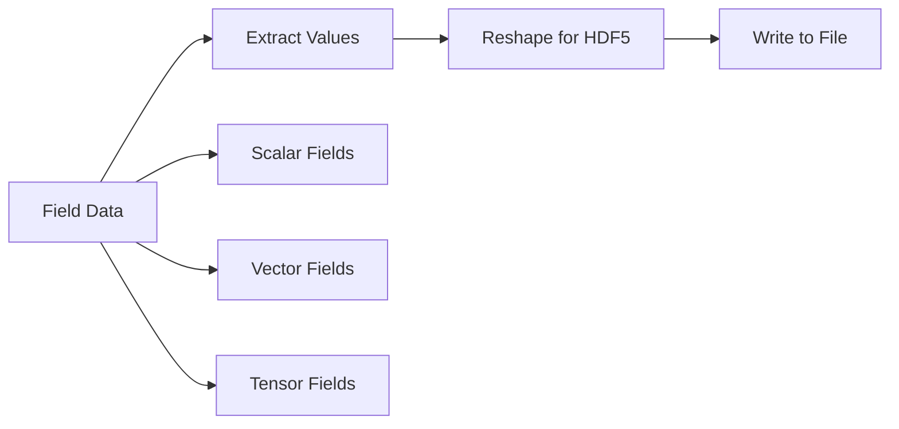
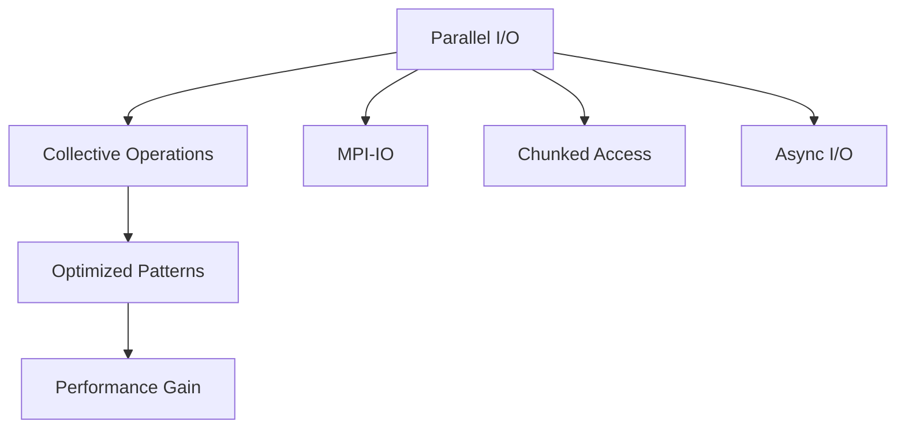

# Input/Output System and Data Formats

## Introduction

Le système d'entrée/sortie (I/O) de Samurai fournit des capacités complètes pour sauvegarder et charger des données de simulation, incluant les maillages, les champs et les métadonnées. Il supporte principalement le format HDF5 avec des métadonnées XML pour une portabilité et une interopérabilité maximales.

## Vue d'Ensemble du Système I/O

### Architecture Générale



### Formats Supportés

- **HDF5** : Format principal pour les données binaires
- **XML** : Métadonnées et structure de grille
- **VTK** : Compatibilité avec Paraview/VTK
- **CGAL** : Import de géométries complexes

## Système HDF5

### Structure des Fichiers



### Classes HDF5

#### Hdf5 Base Class

```cpp
template <class D>
class Hdf5
{
public:
    Hdf5(const fs::path& path, const std::string& filename);
    ~Hdf5();
    
protected:
    pugi::xml_node& domain();
    template <class Submesh, class Field>
    void save_field(pugi::xml_node& grid, const std::string& prefix, 
                   const Submesh& submesh, const Field& field);
    
private:
    HighFive::File h5_file;
    fs::path m_path;
    std::string m_filename;
    pugi::xml_document m_doc;
    pugi::xml_node m_domain;
};
```

#### SaveBase Template

```cpp
template <class D, class Mesh, class... T>
class SaveBase : public Hdf5<SaveBase<D, Mesh, T...>>
{
public:
    using mesh_t = Mesh;
    using options_t = Hdf5Options<mesh_t>;
    using fields_type = std::tuple<const T&...>;
    
    SaveBase(const fs::path& path, const std::string& filename, 
             const options_t& options, const Mesh& mesh, const T&... fields);
    
    void save();
    
protected:
    template <class Submesh>
    void save_fields(pugi::xml_node& grid, const std::string& prefix, 
                    const Submesh& submesh);
    
private:
    const mesh_t& m_mesh;
    options_t m_options;
    fields_type m_fields;
};
```

### Options de Sauvegarde

```cpp
template <class D>
struct Hdf5Options
{
    Hdf5Options(bool level = false, bool mesh_id = false)
        : by_level(level), by_mesh_id(mesh_id) {}
    
    bool by_level = false;    // Sauvegarder par niveau
    bool by_mesh_id = false;  // Sauvegarder par ID de maillage
};
```

## Sauvegarde de Maillages

### Maillages Uniformes

```cpp
template <class Config, class... T>
void save(const fs::path& path, const std::string& filename, 
          const UniformMesh<Config>& mesh, const T&... fields)
{
    Hdf5_mesh_base<UniformMesh<Config>, T...> h5(path, filename, 
                                                 Hdf5Options<UniformMesh<Config>>(), 
                                                 mesh, fields...);
    h5.save();
}
```

### Maillages Adaptatifs

```cpp
template <std::size_t dim, class TInterval, class... T>
void save(const fs::path& path, const std::string& filename, 
          const LevelCellArray<dim, TInterval>& mesh, const T&... fields)
{
    Hdf5_LevelCellArray<LevelCellArray<dim, TInterval>, T...> h5(path, filename, 
                                                                Hdf5Options<LevelCellArray<dim, TInterval>>(), 
                                                                mesh, fields...);
    h5.save();
}
```

## Extraction de Coordonnées et Connectivité

### Fonction d'Extraction

```cpp
template <class Mesh>
auto extract_coords_and_connectivity(const Mesh& mesh)
{
    static constexpr std::size_t dim = Mesh::dim;
    std::size_t nb_cells = mesh.nb_cells();
    
    if (nb_cells == 0) {
        xt::xtensor<std::size_t, 2> connectivity = xt::zeros<std::size_t>({0, 0});
        xt::xtensor<double, 2> coords = xt::zeros<double>({0, 0});
        return std::make_pair(coords, connectivity);
    }
    
    std::size_t nb_points_per_cell = 1 << dim;
    std::map<std::array<double, dim>, std::size_t> points_id;
    auto element = get_element(std::integral_constant<std::size_t, dim>{});
    
    // Extraction des coordonnées et connectivité
    // ...
    
    return std::make_pair(coords, connectivity);
}
```

### Éléments par Dimension

#### 1D - Ligne

```cpp
inline auto get_element(std::integral_constant<std::size_t, 1>)
{
    return std::array<double, 2>{{0, 1}};
}
```

**Schéma Visuel :**
```
[0]----[1]
```

#### 2D - Quadrilatère

```cpp
inline auto get_element(std::integral_constant<std::size_t, 2>)
{
    return std::array<xt::xtensor_fixed<std::size_t, xt::xshape<2>>, 4>{
        {{0, 0}, {1, 0}, {1, 1}, {0, 1}}
    };
}
```

**Schéma Visuel :**
```
[0,0]----[1,0]
  |        |
  |        |
[0,1]----[1,1]
```

#### 3D - Hexaèdre

```cpp
inline auto get_element(std::integral_constant<std::size_t, 3>)
{
    return std::array<xt::xtensor_fixed<std::size_t, xt::xshape<3>>, 8>{
        {{0, 0, 0}, {1, 0, 0}, {1, 1, 0}, {0, 1, 0},
         {0, 0, 1}, {1, 0, 1}, {1, 1, 1}, {0, 1, 1}}
    };
}
```

**Schéma Visuel :**
```
    [0,0,1]----[1,0,1]
   /|         /|
  / |        / |
[0,0,0]----[1,0,0]
 |  |       |  |
 | [0,1,1]--|-[1,1,1]
 | /        | /
 |/         |/
[0,1,0]----[1,1,0]
```

## Sauvegarde de Champs

### Structure des Données



### Sauvegarde par Niveau

```cpp
template <class Submesh, class Field>
void save_field(pugi::xml_node& grid, const std::string& prefix, 
               const Submesh& submesh, const Field& field)
{
    // Extraction des valeurs du champ
    auto values = extract_field_values(field, submesh);
    
    // Sauvegarde dans HDF5
    std::string dataset_name = prefix + "_values";
    h5_file.createDataSet(dataset_name, values);
    
    // Métadonnées XML
    auto field_node = grid.append_child("Field");
    field_node.append_attribute("name") = prefix.c_str();
    field_node.append_attribute("dataset") = dataset_name.c_str();
}
```

## Métadonnées XML

### Structure XML

```xml
<?xml version="1.0" encoding="UTF-8"?>
<Xdmf xmlns:xi="http://www.w3.org/2001/XInclude">
    <Domain>
        <Grid Name="Samurai_Mesh" GridType="Collection">
            <Grid Name="Level_0" GridType="Uniform">
                <Topology TopologyType="Quadrilateral" NumberOfElements="100">
                    <DataItem DataType="Int" Dimensions="100 4" Format="HDF">
                        mesh.h5:/connectivity
                    </DataItem>
                </Topology>
                <Geometry GeometryType="XY">
                    <DataItem DataType="Float" Dimensions="400 2" Format="HDF">
                        mesh.h5:/coordinates
                    </DataItem>
                </Geometry>
                <Attribute Name="velocity" AttributeType="Vector" Center="Cell">
                    <DataItem DataType="Float" Dimensions="100 2" Format="HDF">
                        mesh.h5:/velocity_values
                    </DataItem>
                </Attribute>
            </Grid>
        </Grid>
    </Domain>
</Xdmf>
```

### Génération Automatique

```cpp
void generate_xml_metadata()
{
    auto domain = m_doc.append_child("Domain");
    auto grid = domain.append_child("Grid");
    grid.append_attribute("Name") = "Samurai_Mesh";
    grid.append_attribute("GridType") = "Collection";
    
    // Ajout des niveaux de maillage
    for (std::size_t level = 0; level < mesh.max_level() + 1; ++level) {
        auto level_grid = grid.append_child("Grid");
        level_grid.append_attribute("Name") = fmt::format("Level_{}", level).c_str();
        level_grid.append_attribute("GridType") = "Uniform";
        
        // Topologie et géométrie
        add_topology(level_grid, level);
        add_geometry(level_grid, level);
        
        // Champs
        add_fields(level_grid, level);
    }
}
```

## Exemples d'Utilisation

### Exemple 1: Sauvegarde Simple

```cpp
#include <samurai/io/hdf5.hpp>

int main() {
    // Créer un maillage et des champs
    auto mesh = samurai::make_mesh(/* ... */);
    auto field1 = samurai::make_scalar_field<double>("pressure", mesh);
    auto field2 = samurai::make_vector_field<double, 2>("velocity", mesh);
    
    // Initialiser les champs
    samurai::for_each_cell(mesh, [&](const auto& cell) {
        field1[cell] = initial_pressure(cell.center());
        field2[cell] = initial_velocity(cell.center());
    });
    
    // Sauvegarder
    samurai::save("output", "simulation.h5", mesh, field1, field2);
    
    return 0;
}
```

### Exemple 2: Sauvegarde avec Options

```cpp
#include <samurai/io/hdf5.hpp>

int main() {
    // Options de sauvegarde
    samurai::Hdf5Options<decltype(mesh)> options(true, false); // par niveau
    
    // Sauvegarder avec options
    samurai::save("output", "simulation.h5", options, mesh, field1, field2);
    
    return 0;
}
```

### Exemple 3: Sauvegarde Parallèle

```cpp
#ifdef SAMURAI_WITH_MPI
#include <samurai/io/hdf5.hpp>

int main() {
    // Configuration MPI
    mpi::communicator world;
    
    // Sauvegarde parallèle
    if (world.rank() == 0) {
        samurai::save("output", "simulation.h5", mesh, field1, field2);
    }
    
    return 0;
}
#endif
```

## Formats de Sortie Alternatifs

### Format VTK

```cpp
template <class Mesh, class... Fields>
void save_vtk(const std::string& filename, const Mesh& mesh, const Fields&... fields)
{
    // Génération du fichier VTK
    std::ofstream file(filename);
    
    // En-tête VTK
    file << "# vtk DataFile Version 3.0\n";
    file << "Samurai Simulation Output\n";
    file << "ASCII\n";
    file << "DATASET UNSTRUCTURED_GRID\n";
    
    // Coordonnées et connectivité
    auto [coords, connectivity] = extract_coords_and_connectivity(mesh);
    write_vtk_coordinates(file, coords);
    write_vtk_connectivity(file, connectivity);
    
    // Champs
    write_vtk_fields(file, fields...);
}
```

### Import CGAL

```cpp
#include <samurai/io/cgal.hpp>

template <class Mesh>
void import_from_cgal(const std::string& filename, Mesh& mesh)
{
    // Import de géométrie CGAL
    auto geometry = samurai::cgal::load_geometry(filename);
    
    // Adaptation du maillage
    samurai::adapt_mesh_to_geometry(mesh, geometry);
}
```

## Optimisations de Performance

### Compression HDF5

```cpp
HighFive::File create_h5file(const fs::path& path, const std::string& filename)
{
    HighFive::FileCreateProps fcprops;
    fcprops.add(HighFive::Chunking(std::vector<hsize_t>{1000, 1000}));
    fcprops.add(HighFive::Deflate(9)); // Compression maximale
    
    return HighFive::File((path / filename).string(), HighFive::File::Create, fcprops);
}
```

### I/O Parallèle



### Streaming pour Grands Datasets

```cpp
template <class Field>
void save_field_streaming(const std::string& filename, const Field& field)
{
    // Sauvegarde par blocs pour éviter la surcharge mémoire
    const std::size_t block_size = 10000;
    
    for (std::size_t block = 0; block < field.size() / block_size; ++block) {
        auto block_data = extract_field_block(field, block, block_size);
        append_to_hdf5(filename, block_data, block);
    }
}
```

## Monitoring et Validation

### Vérification d'Intégrité

```cpp
bool verify_hdf5_file(const std::string& filename)
{
    try {
        HighFive::File file(filename, HighFive::File::ReadOnly);
        
        // Vérifier la structure
        if (!file.exist("Grid")) return false;
        if (!file.exist("Fields")) return false;
        
        // Vérifier les données
        auto grid_group = file.getGroup("Grid");
        auto fields_group = file.getGroup("Fields");
        
        return true;
    } catch (...) {
        return false;
    }
}
```

### Analyse de Performance I/O

```cpp
void benchmark_io_performance()
{
    samurai::times::timers.start("io_write");
    samurai::save("output", "benchmark.h5", mesh, field1, field2);
    samurai::times::timers.stop("io_write");
    
    auto stats = samurai::times::timers.get("io_write");
    std::cout << "I/O Write time: " << stats.total_time << "s" << std::endl;
    std::cout << "File size: " << get_file_size("output/benchmark.h5") << " bytes" << std::endl;
}
```

## Cas d'Usage Avancés

### 1. Sauvegarde Incrémentale

```cpp
template <class Mesh, class... Fields>
void save_incremental(const std::string& base_filename, int iteration, 
                     const Mesh& mesh, const Fields&... fields)
{
    std::string filename = fmt::format("{}_{:06d}.h5", base_filename, iteration);
    samurai::save("output", filename, mesh, fields...);
}
```

### 2. Restart de Simulation

```cpp
template <class Mesh, class... Fields>
void load_restart(const std::string& filename, Mesh& mesh, Fields&... fields)
{
    // Charger l'état de la simulation
    samurai::load(filename, mesh, fields...);
}
```

### 3. Visualisation en Temps Réel

```cpp
template <class Mesh, class... Fields>
void setup_realtime_visualization(const Mesh& mesh, const Fields&... fields)
{
    // Configuration pour visualisation en temps réel
    samurai::setup_vtk_pipeline(mesh, fields...);
}
```

## Conclusion

Le système I/O de Samurai offre :

- **Flexibilité** avec support de multiples formats
- **Performance** grâce aux optimisations HDF5 et I/O parallèle
- **Interopérabilité** avec les outils de visualisation standards
- **Robustesse** avec validation et gestion d'erreurs
- **Extensibilité** pour les formats personnalisés

Ce système permet une intégration transparente dans les workflows de simulation et de post-traitement, facilitant l'analyse et la visualisation des résultats. 