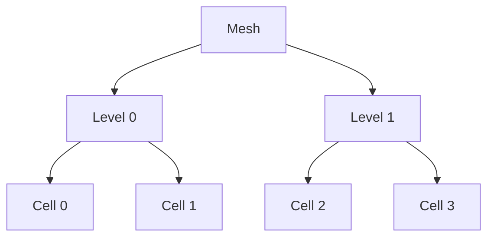
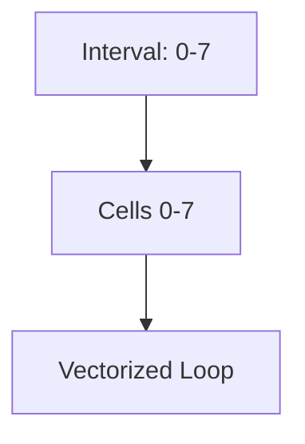
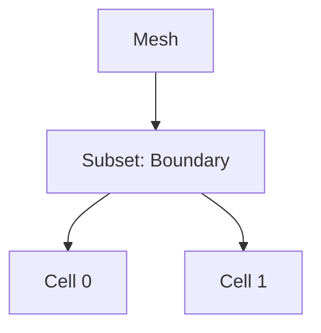

# Iterator System and Mesh Loops

## Introduction

Iterators in Samurai provide a flexible and efficient way to traverse mesh cells, intervals, and subsets. They are designed for both performance and expressiveness, enabling high-level algorithms and low-level optimizations.

## Types of Iterators

### 1. Cell Iterators
- Traverse all cells at a given level or across levels.
- Used for cell-wise operations (e.g., field updates).

### 2. Interval Iterators
- Traverse contiguous intervals of cells for vectorized operations.
- Reduce loop overhead and improve cache usage.

### 3. Subset Iterators
- Traverse only a subset of the mesh (e.g., boundary, refined region).
- Used for localized operations and AMR.

## Visual Schematics

### Cell Iteration



### Interval Iteration



### Subset Iteration



## Example Usage

```cpp
// For each cell
samurai::for_each_cell(mesh, [&](const auto& cell) {
    // ...
});

// For each interval
samurai::for_each_interval(mesh, [&](std::size_t level, const auto& interval, const auto& index) {
    // ...
});

// For each cell in a subset
subset.apply_op([&](const auto& cell) {
    // ...
});
```

## Performance Impact

- Interval iterators enable vectorized, cache-friendly loops.
- Subset iterators avoid unnecessary work on irrelevant cells.
- Iterators are designed to minimize overhead and maximize throughput.

## Advanced: Parallel Iteration

- Iterators can be combined with OpenMP or TBB for parallel loops.
- Example:

```cpp
#pragma omp parallel for
for (auto it = mesh.begin(); it != mesh.end(); ++it) {
    // ...
}
```

## Conclusion

The iterator system in Samurai is a key enabler for both high-level expressiveness and low-level performance. 