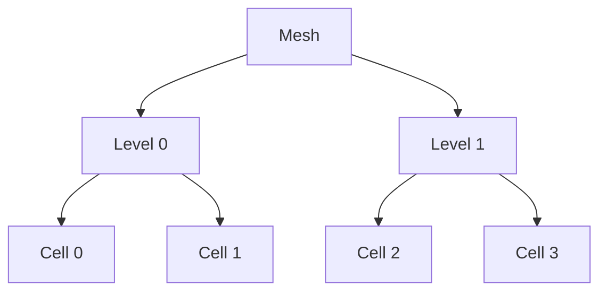
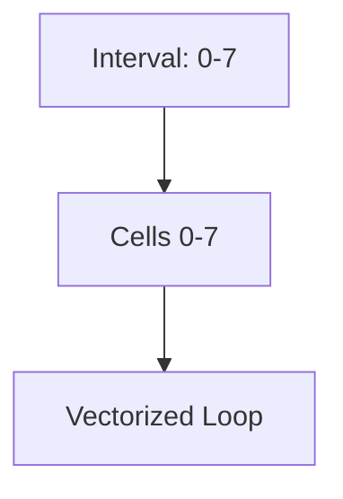
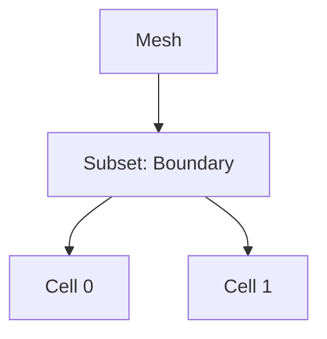

# Iterator System and Mesh Loops

## Introduction

Samurai provides a comprehensive set of iteration functions for traversing mesh cells, intervals, and subsets. These functions are designed for both performance and expressiveness, enabling high-level algorithms and low-level optimizations through interval-based processing and parallel execution.

## Core Iteration Functions

### 1. Cell Iteration
- `for_each_cell()`: Traverse all cells at a given level or across levels
- Used for cell-wise operations (e.g., field updates, initialization)

### 2. Interval Iteration
- `for_each_interval()`: Traverse contiguous intervals of cells for vectorized operations
- Reduces loop overhead and improves cache usage through interval-based processing

### 3. Level Iteration
- `for_each_level()`: Traverse all levels in the mesh
- Used for level-wise operations and multiresolution algorithms

### 4. Mesh Interval Iteration
- `for_each_meshinterval()`: Traverse mesh intervals with level information
- Provides access to both interval data and level information

## Visual Schematics

### Cell Iteration



### Interval Iteration



### Subset Iteration



## Basic Usage Examples

### Cell Iteration

```cpp
// For each cell in the mesh
samurai::for_each_cell(mesh, [&](const auto& cell) {
    // Access cell properties
    auto level = cell.level;
    auto center = cell.center();
    auto length = cell.length;
    
    // Update field values
    field[cell] = compute_value(cell);
});

// For each cell at a specific level
samurai::for_each_cell(mesh[level], [&](const auto& cell) {
    // Process cells at specific level
});
```

### Interval Iteration

```cpp
// For each interval in the mesh
samurai::for_each_interval(mesh, [&](std::size_t level, const auto& interval, const auto& index) {
    // Process entire interval at once
    for (auto i = interval.start; i < interval.end; i += interval.step) {
        // Vectorized operations on interval
        field(level, i, index) = compute_value(level, i, index);
    }
});
```

### Level Iteration

```cpp
// For each level in the mesh
samurai::for_each_level(mesh, [&](std::size_t level) {
    // Process all levels
    auto level_field = samurai::make_scalar_field<double>("level_field", mesh[level]);
    // ...
});
```

### Subset Iteration

```cpp
// Create a subset (e.g., intersection of two mesh regions)
auto subset = samurai::intersection(mesh[level], mesh[level+1]);

// Apply operation on subset
subset([&](const auto& interval, const auto& index) {
    // Process subset intervals
    for (auto i = interval.start; i < interval.end; i += interval.step) {
        // Apply operation on subset cells
    }
});

// Apply operator on subset
subset.apply_op(operator_function);
```

## Advanced Iteration Features

### Stencil Iteration

```cpp
// Define a stencil
auto stencil = samurai::make_stencil<2>({{-1, 0}, {1, 0}, {0, -1}, {0, 1}});

// Iterate over stencils
samurai::for_each_stencil(mesh, stencil, [&](const auto& stencil_cells) {
    // Process stencil cells
    auto center_cell = stencil_cells[0];
    auto neighbor_cells = stencil_cells[1];
    // ...
});
```

### Mesh Interval Iteration

```cpp
// Iterate over mesh intervals
samurai::for_each_meshinterval(mesh, [&](const auto& mesh_interval) {
    auto level = mesh_interval.level;
    auto interval = mesh_interval.i;
    auto index = mesh_interval.index;
    
    // Process mesh interval
});
```

## Parallel Iteration

### OpenMP Support

Samurai provides built-in OpenMP parallelization for iteration functions:

```cpp
// Parallel cell iteration
samurai::for_each_cell<samurai::Run::Parallel>(mesh, [&](const auto& cell) {
    // This will be executed in parallel
    field[cell] = compute_value(cell);
});

// Parallel mesh interval iteration
samurai::for_each_meshinterval<mesh_interval_t, samurai::Run::Parallel>(
    subset, [&](const auto& mesh_interval) {
        // Parallel processing of mesh intervals
    });
```

### Parallel Interface Iteration

```cpp
// Parallel interface iteration
samurai::for_each_interior_interface__same_level<samurai::Run::Parallel>(
    mesh, level, direction, stencil, [&](const auto& interface_cells, const auto& stencil_cells) {
        // Parallel processing of interfaces
    });
```

## Performance Considerations

### Interval-based Processing

- **Efficiency**: Interval iterators enable vectorized, cache-friendly loops
- **Memory Access**: Optimized memory access patterns through contiguous interval processing
- **Reduced Overhead**: Minimal loop overhead compared to cell-by-cell iteration

### Subset Optimization

- **Targeted Processing**: Subset iterators avoid unnecessary work on irrelevant cells
- **Set Algebra**: Efficient set operations (intersection, union, difference) for complex mesh regions
- **Level-specific Operations**: Operations can be restricted to specific mesh levels

### Parallel Performance

- **OpenMP Integration**: Automatic parallelization with OpenMP task-based parallelism
- **Load Balancing**: Efficient distribution of work across threads
- **Thread Safety**: Built-in thread safety for parallel operations

## Common Use Cases

### Field Initialization

```cpp
// Initialize field with function
samurai::for_each_cell(mesh, [&](const auto& cell) {
    field[cell] = initial_condition(cell.center());
});
```

### Multiresolution Operations

```cpp
// Project fine solution to coarse level
auto fine_cells = samurai::intersection(mesh[level], mesh[level+1]).on(level);
fine_cells([&](const auto& interval, const auto& index) {
    for (auto i = interval.start; i < interval.end; i += interval.step) {
        // Average fine cells to coarse cell
        coarse_field(level, i, index) = 0.25 * (
            fine_field(level+1, 2*i, 2*index) +
            fine_field(level+1, 2*i+1, 2*index) +
            fine_field(level+1, 2*i, 2*index+1) +
            fine_field(level+1, 2*i+1, 2*index+1)
        );
    }
});
```

### Boundary Condition Application

```cpp
// Apply boundary conditions
auto boundary_cells = samurai::difference(
    mesh[samurai::MRMeshID::cells], 
    mesh[samurai::MRMeshID::ghosts]
).on(level);

boundary_cells([&](const auto& interval, const auto& index) {
    for (auto i = interval.start; i < interval.end; i += interval.step) {
        field(level, i, index) = boundary_condition(level, i, index);
    }
});
```

## Conclusion

Samurai's iteration system provides:

- **Flexibility** with multiple iteration patterns (cells, intervals, levels, subsets)
- **Performance** through interval-based processing and OpenMP parallelization
- **Expressiveness** with high-level subset operations and stencil iteration
- **Efficiency** with optimized memory access patterns and minimal overhead

This system enables both high-level algorithm development and low-level performance optimization, making it suitable for a wide range of numerical simulation tasks. 