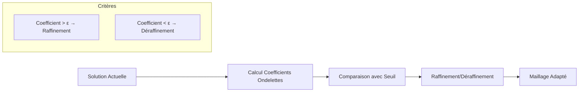
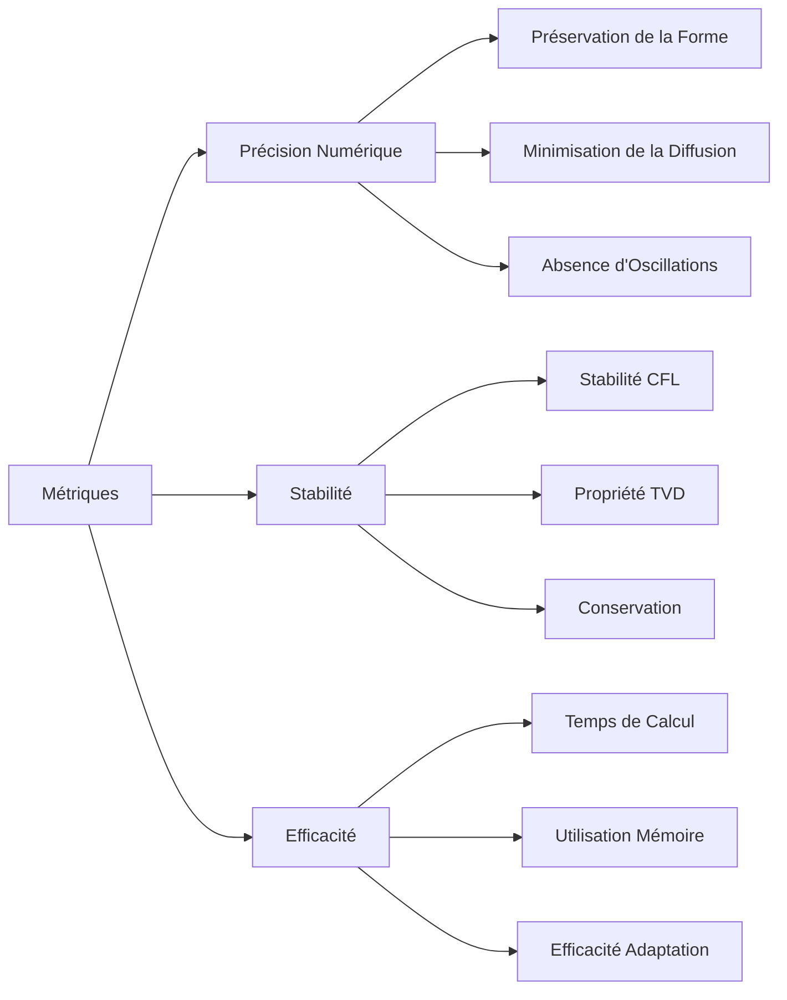
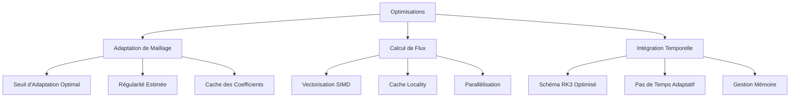

# Cas Test : Convection Linéaire - Samurai

## Vue d'ensemble

Le cas test de convection linéaire dans Samurai est un benchmark fondamental pour valider les schémas numériques de convection sur des maillages adaptatifs. Il résout l'équation de convection linéaire avec des conditions aux limites périodiques et utilise le schéma WENO5 pour une précision d'ordre élevé.

## Équation Modélisée

### Formulation Mathématique

L'équation de convection linéaire en dimension `d` s'écrit :

```
∂u/∂t + ∇·(v u) = 0
```

où :
- `u(x,t)` est la variable d'état scalaire
- `v = (v₁, v₂, ..., v_d)` est le vecteur vitesse constant
- `∇·` est l'opérateur divergence

### Forme Développée

**En 1D :**
```
∂u/∂t + v₁ ∂u/∂x = 0
```

**En 2D :**
```
∂u/∂t + v₁ ∂u/∂x + v₂ ∂u/∂y = 0
```

**En 3D :**
```
∂u/∂t + v₁ ∂u/∂x + v₂ ∂u/∂y + v₃ ∂u/∂z = 0
```

## Configuration du Problème

### Paramètres de Simulation

```cpp
// Paramètres de simulation
double left_box = -1;      // Bordure gauche du domaine
double right_box = 1;      // Bordure droite du domaine
double Tf = 3;             // Temps final
double dt = 0;             // Pas de temps (calculé automatiquement si 0)
double cfl = 0.95;         // Nombre de Courant-Friedrichs-Lewy
double t = 0.;             // Temps initial
std::string restart_file;  // Fichier de redémarrage (optionnel)
```

### Configuration du Maillage

```cpp
// Paramètres multirésolution
std::size_t min_level = 1;           // Niveau minimum de raffinement
std::size_t max_level = dim == 1 ? 6 : 4;  // Niveau maximum
double mr_epsilon = 1e-4;            // Seuil d'adaptation multirésolution
double mr_regularity = 1.;           // Régularité estimée pour l'adaptation

// Configuration du domaine
point_t box_corner1, box_corner2;
box_corner1.fill(left_box);
box_corner2.fill(right_box);
Box box(box_corner1, box_corner2);

// Conditions aux limites périodiques
std::array<bool, dim> periodic;
periodic.fill(true);
```

### Configuration de Sortie

```cpp
// Paramètres de sortie
fs::path path = fs::current_path();
std::string filename = "linear_convection_" + std::to_string(dim) + "D";
std::size_t nfiles = 0;  // Nombre de fichiers de sortie (0 = automatique)
```

## Condition Initiale

### Définition Mathématique

La condition initiale est une fonction échelon (fonction caractéristique) :

**En 1D :**
```
u₀(x) = 1  si x ∈ [-0.8, -0.3]
u₀(x) = 0  sinon
```

**En 2D :**
```
u₀(x,y) = 1  si x ∈ [-0.8, -0.3] et y ∈ [0.3, 0.8]
u₀(x,y) = 0  sinon
```

### Implémentation

```cpp
// Création du champ initial
u = samurai::make_scalar_field<double>("u", mesh,
    [](const auto& coords)
    {
        if constexpr (dim == 1)
        {
            const auto& x = coords(0);
            return (x >= -0.8 && x <= -0.3) ? 1. : 0.;
        }
        else
        {
            const auto& x = coords(0);
            const auto& y = coords(1);
            return (x >= -0.8 && x <= -0.3 && 
                    y >= 0.3 && y <= 0.8) ? 1. : 0.;
        }
    });
```

### Visualisation de la Condition Initiale

```mermaid
graph LR
    A[Condition Initiale] --> B[1D: Fonction Échelon]
    A --> C[2D: Rectangle]
    
    B --> D[Intervalle [-0.8, -0.3]]
    B --> E[Valeur 1.0]
    
    C --> F[Rectangle [-0.8, -0.3] × [0.3, 0.8]]
    C --> G[Valeur 1.0 à l'intérieur]
    C --> H[Valeur 0.0 à l'extérieur]
```

## Configuration du Vecteur Vitesse

### Définition du Vecteur Vitesse

```cpp
// Convection operator
samurai::VelocityVector<dim> velocity;
velocity.fill(1);  // Vitesse unitaire dans toutes les directions

if constexpr (dim == 2)
{
    velocity(1) = -1;  // Vitesse diagonale en 2D
}
```

### Interprétation Physique

**En 1D :**
- `v = (1)` : Convection vers la droite à vitesse unitaire

**En 2D :**
- `v = (1, -1)` : Convection diagonale (haut-droite vers bas-gauche)

**En 3D :**
- `v = (1, 1, 1)` : Convection diagonale dans toutes les directions

## Schéma Numérique WENO5

### Principe du Schéma WENO5

Le schéma WENO5 (Weighted Essentially Non-Oscillatory) est un schéma d'ordre 5 qui combine plusieurs stencils pour obtenir une reconstruction non-oscillatoire.

```cpp
// Création de l'opérateur de convection WENO5
auto conv = samurai::make_convection_weno5<decltype(u)>(velocity);
```

### Algorithme WENO5

```mermaid
graph TD
    A[Données d'Entrée] --> B[Calcul des Flux Locaux]
    B --> C[Calcul des Indicateurs de Lissage]
    C --> D[Calcul des Poids Non-Oscillatoires]
    D --> E[Reconstruction WENO]
    E --> F[Flux Final]
    
    subgraph "Indicateurs de Lissage"
        G[β₀ = (uᵢ₊₁ - uᵢ)² + (uᵢ - uᵢ₋₁)²]
        H[β₁ = (uᵢ₊₂ - uᵢ₊₁)² + (uᵢ₊₁ - uᵢ)²]
        I[β₂ = (uᵢ₊₃ - uᵢ₊₂)² + (uᵢ₊₂ - uᵢ₊₁)²]
    end
    
    subgraph "Poids WENO"
        J[ωᵢ = αᵢ / Σαⱼ]
        K[αᵢ = Cᵢ / (ε + βᵢ)²]
    end
```

### Avantages du Schéma WENO5

- **Précision d'ordre 5** en espace
- **Limitation d'oscillations** aux discontinuités
- **Stabilité TVD** (Total Variation Diminishing)
- **Robustesse** pour les problèmes avec chocs

## Intégration Temporelle RK3

### Schéma SSPRK3 (Strong Stability Preserving)

Le schéma RK3 utilisé est le schéma SSPRK3 qui préserve la stabilité forte :

```cpp
// TVD-RK3 (SSPRK3)
u1 = u - dt * conv(u);
samurai::update_ghost_mr(u1);

u2 = 3./4 * u + 1./4 * (u1 - dt * conv(u1));
samurai::update_ghost_mr(u2);

unp1 = 1./3 * u + 2./3 * (u2 - dt * conv(u2));
```

### Formulation Mathématique

Le schéma SSPRK3 s'écrit :

```
u⁽¹⁾ = uⁿ - Δt L(uⁿ)
u⁽²⁾ = 3/4 uⁿ + 1/4 (u⁽¹⁾ - Δt L(u⁽¹⁾))
uⁿ⁺¹ = 1/3 uⁿ + 2/3 (u⁽²⁾ - Δt L(u⁽²⁾))
```

où `L(u)` représente l'opérateur spatial de convection.

### Propriétés du Schéma

- **Ordre 3** en temps
- **Stabilité forte** préservée
- **Propriété TVD** maintenue
- **Région de stabilité** étendue

## Calcul du Pas de Temps

### Condition CFL

Le pas de temps est calculé automatiquement selon la condition CFL :

```cpp
if (dt == 0)
{
    double dx = mesh.cell_length(max_level);
    auto a = xt::abs(velocity);
    double sum_velocities = xt::sum(xt::abs(velocity))();
    dt = cfl * dx / sum_velocities;
}
```

### Formulation Mathématique

La condition CFL s'écrit :

```
Δt ≤ CFL × Δx / (|v₁| + |v₂| + ... + |v_d|)
```

où :
- `CFL = 0.95` (paramètre de sécurité)
- `Δx` est la taille de maille au niveau le plus fin
- `|vᵢ|` sont les composantes absolues du vecteur vitesse

## Adaptation de Maillage Multirésolution

### Principe de l'Adaptation

L'adaptation multirésolution utilise un critère basé sur les coefficients d'ondelettes pour déterminer les zones nécessitant un raffinement.

```cpp
// Création de l'adaptateur multirésolution
auto MRadaptation = samurai::make_MRAdapt(u);

// Adaptation initiale
MRadaptation(mr_epsilon, mr_regularity);
```

### Paramètres d'Adaptation

```cpp
double mr_epsilon = 1e-4;    // Seuil d'adaptation
double mr_regularity = 1.;   // Régularité estimée
```

- **`mr_epsilon`** : Seuil en dessous duquel les coefficients d'ondelettes sont négligés
- **`mr_regularity`** : Estimation de la régularité de la solution (influence les coefficients d'ondelettes)

### Workflow d'Adaptation



## Conditions aux Limites Périodiques

### Configuration

```cpp
// Conditions aux limites périodiques
std::array<bool, dim> periodic;
periodic.fill(true);

// Création du maillage avec conditions périodiques
mesh = {box, min_level, max_level, periodic};
```

### Implémentation

Les conditions périodiques sont automatiquement gérées par Samurai :
- **1D** : `u(x) = u(x + L)` où `L` est la taille du domaine
- **2D** : `u(x,y) = u(x + L_x, y + L_y)`
- **3D** : `u(x,y,z) = u(x + L_x, y + L_y, z + L_z)`

### Avantages

- **Pas de réflexions** aux bords
- **Simulation de domaine infini**
- **Évite les artefacts** de conditions aux limites

## Boucle Temporelle

### Structure Générale

```cpp
while (t != Tf)
{
    // Mise à jour du temps
    t += dt;
    if (t > Tf)
    {
        dt += Tf - t;
        t = Tf;
    }
    
    // Adaptation du maillage
    MRadaptation(mr_epsilon, mr_regularity);
    
    // Mise à jour des cellules fantômes
    samurai::update_ghost_mr(u);
    
    // Redimensionnement des champs
    unp1.resize();
    u1.resize();
    u2.resize();
    u1.fill(0);
    u2.fill(0);
    
    // Intégration temporelle RK3
    u1 = u - dt * conv(u);
    samurai::update_ghost_mr(u1);
    
    u2 = 3./4 * u + 1./4 * (u1 - dt * conv(u1));
    samurai::update_ghost_mr(u2);
    
    unp1 = 1./3 * u + 2./3 * (u2 - dt * conv(u2));
    
    // Échange des champs
    std::swap(u.array(), unp1.array());
    
    // Sauvegarde
    if (nfiles == 0 || t >= static_cast<double>(nsave + 1) * dt_save || t == Tf)
    {
        save(path, filename, u, suffix);
    }
}
```

### Gestion des Cellules Fantômes

```cpp
// Mise à jour des cellules fantômes après chaque étape RK
samurai::update_ghost_mr(u);
samurai::update_ghost_mr(u1);
samurai::update_ghost_mr(u2);
```

## Sauvegarde et Visualisation

### Fonction de Sauvegarde

```cpp
template <class Field>
void save(const fs::path& path, const std::string& filename, 
          const Field& u, const std::string& suffix = "")
{
    auto mesh = u.mesh();
    auto level_ = samurai::make_scalar_field<std::size_t>("level", mesh);

    if (!fs::exists(path))
    {
        fs::create_directory(path);
    }

    // Sauvegarde du niveau de raffinement
    samurai::for_each_cell(mesh, [&](const auto& cell)
    {
        level_[cell] = cell.level;
    });

    // Sauvegarde HDF5 et fichier de redémarrage
    samurai::save(path, fmt::format("{}{}", filename, suffix), mesh, u, level_);
    samurai::dump(path, fmt::format("{}_restart{}", filename, suffix), mesh, u);
}
```

### Visualisation avec Python

```bash
# Visualisation des résultats 1D
python ../python/read_mesh.py linear_convection_1D_ite_ --field u level --start 0 --end nsave
```

## Exemples d'Exécution

### Compilation

```bash
# Compilation du cas test
mkdir build && cd build
cmake ..
make linear_convection
```

### Exécution avec Paramètres Par Défaut

```bash
# Exécution 2D avec paramètres par défaut
./linear_convection

# Exécution avec paramètres personnalisés
./linear_convection --min-level 2 --max-level 6 --mr-eps 1e-4 --Tf 2.0 --cfl 0.8
```

### Paramètres de Ligne de Commande

```bash
# Paramètres de simulation
--left -1                    # Bordure gauche
--right 1                    # Bordure droite
--Ti 0                       # Temps initial
--Tf 3                       # Temps final
--dt 0                       # Pas de temps (auto si 0)
--cfl 0.95                   # Nombre CFL

# Paramètres multirésolution
--min-level 1                # Niveau minimum
--max-level 4                # Niveau maximum
--mr-eps 1e-4                # Seuil d'adaptation
--mr-reg 1.0                 # Régularité estimée

# Paramètres de sortie
--path ./results             # Dossier de sortie
--filename linear_conv       # Préfixe des fichiers
--nfiles 50                  # Nombre de fichiers
```

## Analyse des Résultats

### Métriques de Performance



### Validation Numérique

**Tests de Conservation :**
```cpp
// Calcul de la masse totale
double mass_initial = compute_total_mass(u_initial);
double mass_final = compute_total_mass(u_final);
double conservation_error = std::abs(mass_final - mass_initial);
```

**Tests de Stabilité :**
```cpp
// Vérification de la propriété TVD
double tv_initial = compute_total_variation(u_initial);
double tv_final = compute_total_variation(u_final);
bool tvd_property = (tv_final <= tv_initial);
```

## Cas d'Usage Avancés

### Étude de Convergence

```bash
# Étude de convergence en espace
for level in 4 5 6 7 8; do
    ./linear_convection --min-level $level --max-level $level --Tf 1.0
done
```

### Étude de Stabilité

```bash
# Étude de stabilité CFL
for cfl in 0.1 0.3 0.5 0.7 0.9 0.95 0.99; do
    ./linear_convection --cfl $cfl --Tf 1.0
done
```

### Comparaison de Schémas

```bash
# Comparaison avec d'autres schémas (si disponibles)
./linear_convection --scheme weno5 --Tf 1.0
./linear_convection --scheme upwind --Tf 1.0
./linear_convection --scheme central --Tf 1.0
```

## Optimisations et Performance

### Optimisations Compile-Time

```cpp
// Utilisation de constantes compile-time
static constexpr std::size_t dim = 2;
static constexpr std::size_t ghost_width = 3;

// Spécialisation des templates
using Config = samurai::MRConfig<dim, ghost_width>;
```

### Optimisations Runtime



## Conclusion

Le cas test de convection linéaire dans Samurai fournit :

- **Validation complète** des schémas de convection WENO5
- **Test de robustesse** de l'adaptation multirésolution
- **Benchmark de performance** pour l'intégration temporelle RK3
- **Référence numérique** pour les problèmes de convection

Ce cas test constitue une base solide pour valider et optimiser les méthodes numériques de Samurai sur des problèmes de convection linéaire, avec une attention particulière portée à la précision, la stabilité et l'efficacité des schémas implémentés. 