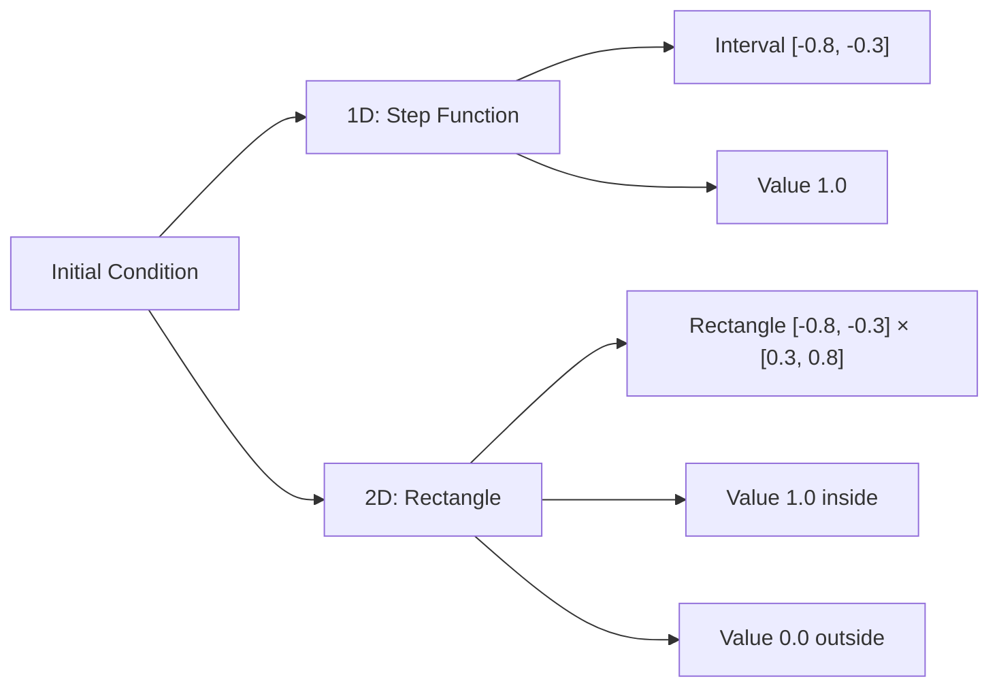
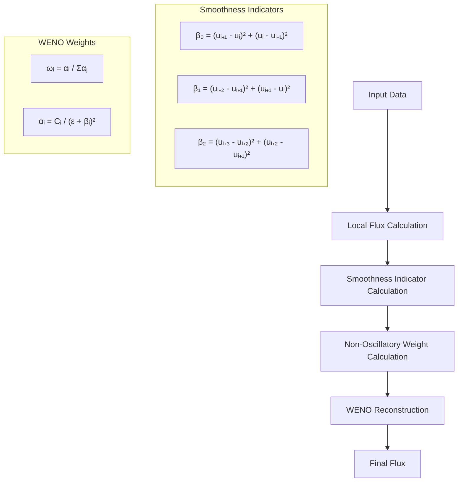

# Test Case: Linear Convection - Samurai

## Overview

The linear convection test case in Samurai is a fundamental benchmark for validating numerical convection schemes on adaptive meshes. It solves the linear convection equation with periodic boundary conditions and uses the WENO5 scheme for high-order accuracy.

## Modeled Equation

### Mathematical Formulation

The linear convection equation in dimension `d` is written as:

```
∂u/∂t + ∇·(v u) = 0
```

where:
- `u(x,t)` is the scalar state variable
- `v = (v₁, v₂, ..., v_d)` is the constant velocity vector
- `∇·` is the divergence operator

### Expanded Form

**In 1D:**
```
∂u/∂t + v₁ ∂u/∂x = 0
```

**In 2D:**
```
∂u/∂t + v₁ ∂u/∂x + v₂ ∂u/∂y = 0
```

## Problem Configuration

### Simulation Parameters

```cpp
// Simulation parameters
double left_box = -1;      // Left domain boundary
double right_box = 1;      // Right domain boundary
double Tf = 3;             // Final time
double dt = 0;             // Time step (automatically calculated if 0)
double cfl = 0.95;         // Courant-Friedrichs-Lewy number
double t = 0.;             // Initial time
std::string restart_file;  // Restart file (optional)
```

### Mesh Configuration

```cpp
// Multiresolution parameters
std::size_t min_level = 1;           // Minimum refinement level
std::size_t max_level = dim == 1 ? 6 : 4;  // Maximum level
double mr_epsilon = 1e-4;            // Multiresolution adaptation threshold
double mr_regularity = 1.;           // Estimated regularity for adaptation

// Domain configuration
point_t box_corner1, box_corner2;
box_corner1.fill(left_box);
box_corner2.fill(right_box);
Box box(box_corner1, box_corner2);

// Periodic boundary conditions
std::array<bool, dim> periodic;
periodic.fill(true);
```

### Output Configuration

```cpp
// Output parameters
fs::path path = fs::current_path();
std::string filename = "linear_convection_" + std::to_string(dim) + "D";
std::size_t nfiles = 0;  // Number of output files (0 = automatic)
```

## Initial Condition

### Mathematical Definition

The initial condition is a step function (characteristic function):

**In 1D:**
```
u₀(x) = 1  if x ∈ [-0.8, -0.3]
u₀(x) = 0  otherwise
```

**In 2D:**
```
u₀(x,y) = 1  if x ∈ [-0.8, -0.3] and y ∈ [0.3, 0.8]
u₀(x,y) = 0  otherwise
```

### Implementation

```cpp
// Create initial field
u = samurai::make_scalar_field<double>("u", mesh,
    [](const auto& coords)
    {
        if constexpr (dim == 1)
        {
            const auto& x = coords(0);
            return (x >= -0.8 && x <= -0.3) ? 1. : 0.;
        }
        else
        {
            const auto& x = coords(0);
            const auto& y = coords(1);
            return (x >= -0.8 && x <= -0.3 && 
                    y >= 0.3 && y <= 0.8) ? 1. : 0.;
        }
    });
```

### Initial Condition Visualization



## Velocity Vector Configuration

### Velocity Vector Definition

```cpp
// Convection operator
samurai::VelocityVector<dim> velocity;
velocity.fill(1);  // Unit velocity in all directions

if constexpr (dim == 2)
{
    velocity(1) = -1;  // Diagonal velocity in 2D
}
```

### Physical Interpretation

**In 1D:**
- `v = (1)` : Convection to the right at unit velocity

**In 2D:**
- `v = (1, -1)` : Diagonal convection (top-right to bottom-left)

## WENO5 Numerical Scheme

### WENO5 Scheme Principle

The WENO5 (Weighted Essentially Non-Oscillatory) scheme is a 5th-order scheme that combines multiple stencils to obtain a non-oscillatory reconstruction. **Note:** WENO5 requires at least 3 ghost cells for proper operation.

```cpp
// Create WENO5 convection operator
auto conv = samurai::make_convection_weno5<decltype(u)>(velocity);
```

### WENO5 Algorithm



### WENO5 Scheme Advantages

- **5th order accuracy** in space
- **Oscillation limiting** at discontinuities
- **Non-oscillatory reconstruction** at shocks and discontinuities
- **Automatic stencil selection** based on smoothness indicators

## Time Integration

### TVD-RK3 (SSPRK3) Scheme

The test case uses a third-order Total Variation Diminishing Runge-Kutta scheme (SSPRK3):

```cpp
// TVD-RK3 (SSPRK3) time integration
u1 = u - dt * conv(u);
samurai::update_ghost_mr(u1);

u2 = 3./4 * u + 1./4 * (u1 - dt * conv(u1));
samurai::update_ghost_mr(u2);

unp1 = 1./3 * u + 2./3 * (u2 - dt * conv(u2));
```

### Time Step Calculation

```cpp
// Automatic time step calculation based on CFL condition
if (dt == 0)
{
    double dx = mesh.cell_length(max_level);
    auto a = xt::abs(velocity);
    double sum_velocities = xt::sum(xt::abs(velocity))();
    dt = cfl * dx / sum_velocities;
}
```

## Mesh Adaptation

### Multiresolution Adaptation

The test case uses multiresolution adaptation to dynamically refine and coarsen the mesh:

```cpp
// Multiresolution adaptation
auto MRadaptation = samurai::make_MRAdapt(u);
MRadaptation(mr_epsilon, mr_regularity);

// Update ghost cells after adaptation
samurai::update_ghost_mr(u);
```

### Adaptation Parameters

- **`mr_epsilon`**: Threshold for adaptation (default: 1e-4)
- **`mr_regularity`**: Estimated regularity for adaptation (default: 1.0)

## Boundary Conditions

### Periodic Boundary Conditions

The test case uses periodic boundary conditions in all directions:

```cpp
// Periodic boundary conditions
std::array<bool, dim> periodic;
periodic.fill(true);
mesh = {box, min_level, max_level, periodic};
```

This ensures that the solution wraps around the domain boundaries, making it suitable for testing numerical schemes without boundary effects.

## Output and Visualization

### Solution Output

```cpp
// Save solution at regular intervals
if (nfiles == 0 || t >= static_cast<double>(nsave + 1) * dt_save || t == Tf)
{
    std::string suffix = (nfiles != 1) ? fmt::format("_ite_{}", nsave++) : "";
    save(path, filename, u, suffix);
}
```

### Expected Results

- **1D**: The step function should convect to the right at unit velocity
- **2D**: The rectangular pulse should convect diagonally (top-right to bottom-left)
- **Periodic**: The solution should wrap around the domain boundaries
- **Adaptive**: The mesh should refine around discontinuities and coarsen in smooth regions

## Performance Considerations

### WENO5 Requirements

- **Ghost cells**: Minimum 3 ghost cells required
- **Stencil size**: 6-point stencil in each direction
- **Memory**: Higher memory usage compared to lower-order schemes

### Adaptation Benefits

- **Efficiency**: Computational effort concentrated where needed
- **Accuracy**: Fine resolution around discontinuities
- **Memory**: Reduced memory usage in smooth regions

## Conclusion

The linear convection test case demonstrates:

- **High-order accuracy** with WENO5 scheme
- **Adaptive mesh refinement** with multiresolution analysis
- **Periodic boundary conditions** for clean numerical testing
- **TVD time integration** for stability
- **Efficient implementation** with interval-based processing

This test case serves as a fundamental benchmark for validating numerical convection schemes in Samurai. 