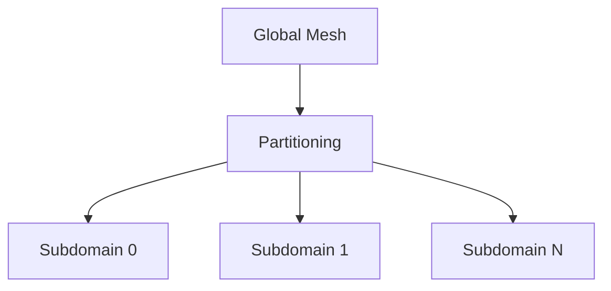

# MPI Parallelism and Distributed Mesh Management

## Introduction

Samurai supports distributed memory parallelism via MPI, enabling large-scale simulations on multiple nodes. The MPI implementation is based on Boost.MPI and provides efficient communication patterns for adaptive mesh refinement.

## Mesh Partitioning and Distribution



The mesh is automatically partitioned across MPI ranks during initialization:

```cpp
// Mesh partitioning is handled automatically
samurai::MRMesh<Config> mesh(box, min_level, max_level);
```

## Communication and Synchronization

### Ghost Cell Exchange

Ghost cells are automatically exchanged between subdomains using non-blocking MPI communication:

```cpp
// Ghost cells are updated automatically during mesh operations
samurai::update_ghost_mr(field);
```

### Tag Synchronization

Tags for mesh adaptation are synchronized at boundaries:

```cpp
// Tags are synchronized automatically during adaptation
auto adaptation = samurai::make_MRAdapt(field);
adaptation(epsilon, regularity);
```

## MPI Implementation Details

### Communication Patterns

- **Non-blocking communication**: Uses `mpi::request` for efficient overlap
- **Collective operations**: `mpi::all_reduce` for global mesh information
- **Point-to-point**: Direct communication between neighboring subdomains

### Load Balancing

Basic load balancing is implemented but limited:

```cpp
// Load balancing is available but experimental
mesh.load_balancing();
```

The current implementation provides:
- Load distribution analysis
- Basic load transfer mechanisms
- Limited dynamic repartitioning

## Performance Considerations

### Scalability

- Efficient for moderate numbers of cores
- Communication overhead scales with mesh complexity
- Ghost cell exchange optimized for adaptive meshes

### Memory Management

- Distributed mesh storage across ranks
- Automatic ghost cell allocation
- Efficient data serialization for communication

## Example Usage

```cpp
#include <samurai/mr/mesh.hpp>
#include <samurai/algorithm/update.hpp>

// MPI is automatically handled when SAMURAI_WITH_MPI is defined
samurai::MRMesh<Config> mesh(box, min_level, max_level);
auto field = samurai::make_scalar_field<double>("u", mesh);

// Ghost cells are updated automatically
samurai::update_ghost_mr(field);

// Mesh adaptation works across MPI ranks
auto adaptation = samurai::make_MRAdapt(field);
adaptation(epsilon, regularity);
```

## Conclusion

MPI support in Samurai provides efficient distributed memory parallelism for adaptive mesh simulations, with automatic ghost cell management and basic load balancing capabilities. 