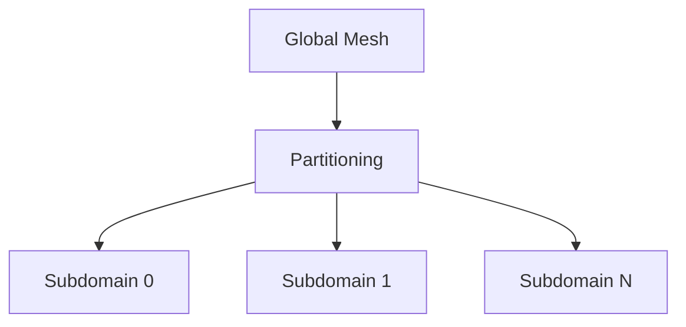
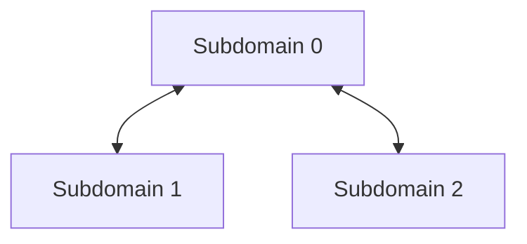

# MPI Parallelism and Distributed Mesh Management

## Introduction

Samurai supports distributed memory parallelism via MPI, enabling large-scale simulations on multiple nodes.

## Mesh Partitioning and Distribution



## Communication and Synchronization

- Ghost cells are exchanged between subdomains.
- Tags and field values are synchronized at boundaries.
- Non-blocking MPI communication is used for efficiency.

### Communication Schematic



## Example Code

```cpp
// Exchange ghost cells
samurai::mpi::exchange_ghost_cells(mesh, field);

// Synchronize tags
samurai::mpi::synchronize_tags(mesh, tag_field);
```

## Advanced: Load Balancing and Scalability

- Mesh repartitioning for dynamic load balancing.
- Scalability to thousands of cores with PETSc and MPI.

## Conclusion

MPI support in Samurai enables efficient, scalable simulations on distributed architectures. 