# Schémas Numériques - Samurai

## Vue d'ensemble

Samurai propose une collection complète de schémas numériques pour la résolution d'équations aux dérivées partielles (EDP) sur des maillages adaptatifs. Ces schémas sont conçus pour fonctionner efficacement avec le système AMR et supportent les simulations multi-physiques.

## Architecture des Schémas

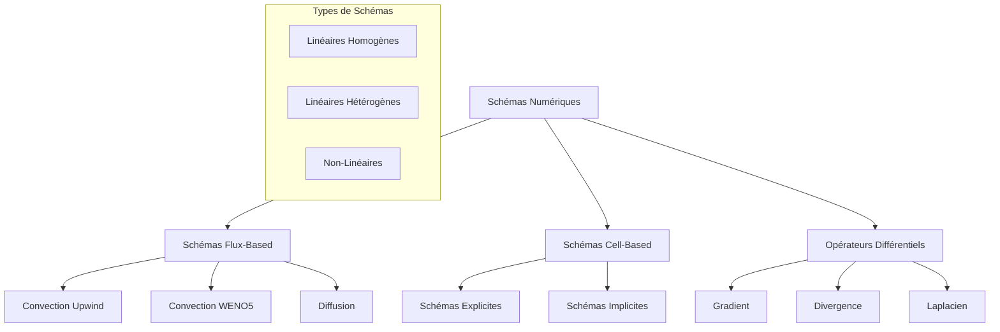

## Schémas Flux-Based

### Conception Générale

Les schémas flux-based dans Samurai sont basés sur une approche conservative où les flux sont calculés aux interfaces entre cellules.


### Configuration des Schémas Flux-Based

```cpp
template <SchemeType scheme_type,
          std::size_t output_n_comp,
          std::size_t stencil_size,
          class Field>
struct FluxConfig
{
    static constexpr SchemeType type = scheme_type;
    static constexpr std::size_t output_n_comp = output_n_comp;
    static constexpr std::size_t stencil_size = stencil_size;
    using field_t = Field;
};
```

## Schémas de Convection

### Convection Upwind Linéaire

Le schéma upwind est le schéma de convection le plus simple et robuste.

```cpp
template <class Field>
auto make_convection_upwind(const VelocityVector<Field::dim>& velocity)
```

**Principe du Schéma Upwind :**

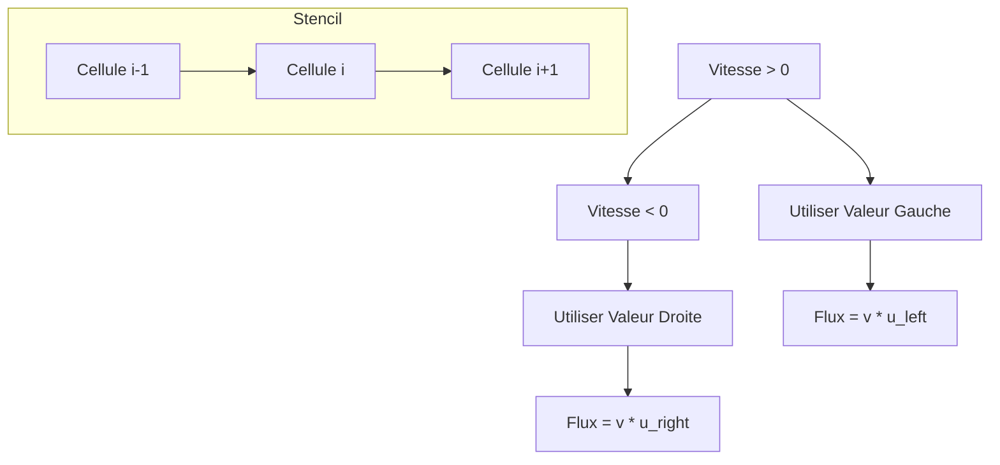

**Coefficients du Schéma :**

```cpp
// Pour v >= 0 (upwind gauche)
coeffs[left] = velocity(d);
coeffs[right] = 0;

// Pour v < 0 (upwind droite)
coeffs[left] = 0;
coeffs[right] = velocity(d);
```

### Convection WENO5

Le schéma WENO5 (Weighted Essentially Non-Oscillatory) offre une précision d'ordre 5 avec une limitation d'oscillations.

```cpp
template <class Field>
auto make_convection_weno5(const VelocityVector<Field::dim>& velocity)
```

**Structure du Stencil WENO5 :**

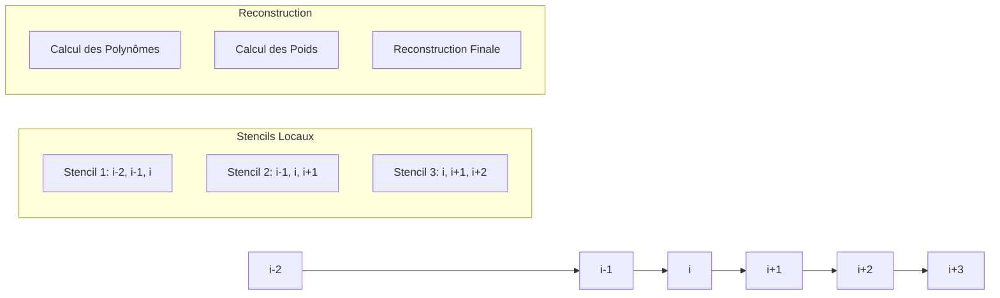

**Algorithme WENO5 :**

```mermaid
graph TD
    A[Données d'Entrée] --> B[Calcul des Flux Locaux]
    B --> C[Calcul des Indicateurs de Lissage]
    C --> D[Calcul des Poids Non-Oscillatoires]
    D --> E[Reconstruction WENO]
    E --> F[Flux Final]
    
    subgraph "Indicateurs de Lissage"
        G[β₀ = (uᵢ₊₁ - uᵢ)² + (uᵢ - uᵢ₋₁)²]
        H[β₁ = (uᵢ₊₂ - uᵢ₊₁)² + (uᵢ₊₁ - uᵢ)²]
        I[β₂ = (uᵢ₊₃ - uᵢ₊₂)² + (uᵢ₊₂ - uᵢ₊₁)²]
    end
```

### Convection avec Champ de Vitesse Variable

```cpp
template <class Field, class VelocityField>
auto make_convection_upwind(const VelocityField& velocity_field)
```

**Workflow avec Vitesse Variable :**

```mermaid
graph LR
    A[Champ de Vitesse] --> B[Évaluation Locale]
    B --> C[Détermination Direction]
    C --> D[Application Schéma Upwind]
    D --> E[Flux Résultant]
    
    subgraph "Évaluation"
        F[Calcul v(x,t)]
        G[Test v ≥ 0]
        H[Sélection Stencil]
    end
```

## Schémas de Diffusion

### Diffusion Linéaire Homogène

```cpp
template <class Field, DirichletEnforcement dirichlet_enfcmt = Equation>
auto make_diffusion_order2(const DiffCoeff<Field::dim>& K)
```

**Principe du Schéma de Diffusion :**

```mermaid
graph TD
    A[Laplacien Discret] --> B[Différences Finies Centrées]
    B --> C[Flux de Diffusion]
    C --> D[Opérateur -∇·(K∇u)]
    
    subgraph "Stencil 1D"
        E[uᵢ₋₁] --> F[uᵢ] --> G[uᵢ₊₁]
        H[Flux i-1/2] --> F
        F --> I[Flux i+1/2]
    end
```

**Coefficients du Schéma :**

```cpp
// Flux de diffusion
coeffs[left] = -K(d) / h;
coeffs[right] = K(d) / h;

// Opérateur -Laplacien
coeffs[left] *= -1;
coeffs[right] *= -1;
```

### Diffusion Multi-Composantes

```cpp
template <class Field, DirichletEnforcement dirichlet_enfcmt = Equation>
auto make_multi_diffusion_order2(const DiffCoeff<Field::n_comp>& K)
```

**Structure Multi-Composantes :**

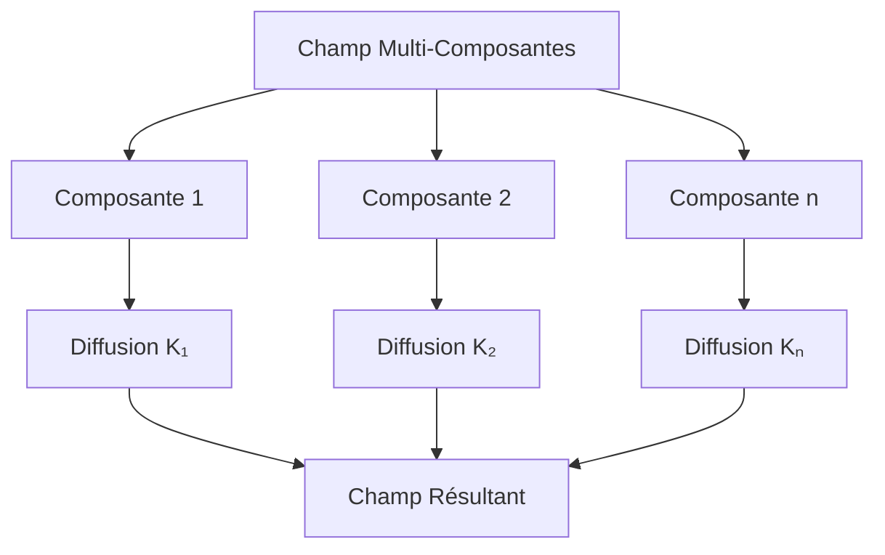

### Conditions aux Limites pour la Diffusion

#### Conditions de Dirichlet

```cpp
void set_dirichlet_config()
{
    // Équation: (u_ghost + u_cell)/2 = dirichlet_value
    // Coefficient: [1/2, 1/2] = dirichlet_value
    coeffs[cell] = -1/(h*h);
    coeffs[ghost] = -1/(h*h);
    rhs_coeffs = -2/(h*h) * dirichlet_value;
}
```

#### Conditions de Neumann

```cpp
void set_neumann_config()
{
    // Équation: (u_ghost - u_cell)/h = neumann_value
    // Coefficient: [1/h², -1/h²] = (1/h) * neumann_value
    coeffs[cell] = -1/(h*h);
    coeffs[ghost] = 1/(h*h);
    rhs_coeffs = (1/h) * neumann_value;
}
```

## Schémas Cell-Based

### Schémas Explicites

```cpp
template <class cfg>
class ExplicitCellBasedScheme : public CellBasedScheme<cfg>
```

**Workflow des Schémas Explicites :**

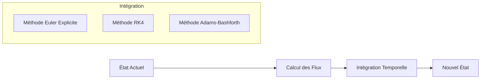

### Schémas Implicites

```cpp
template <class cfg>
class ImplicitCellBasedScheme : public CellBasedScheme<cfg>
```

**Workflow des Schémas Implicites :**

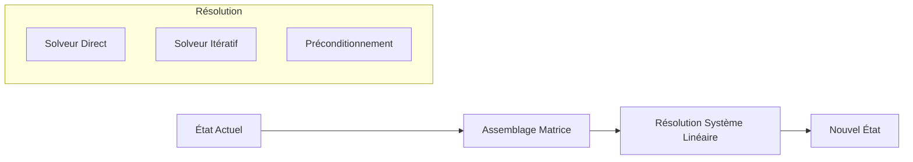

## Opérateurs Différentiels

### Opérateur Gradient

```cpp
template <class Field>
auto make_gradient()
```

**Calcul du Gradient :**

```mermaid
graph TD
    A[Champ Scalaire] --> B[Calcul ∂u/∂x]
    A --> C[Calcul ∂u/∂y]
    A --> D[Calcul ∂u/∂z]
    
    B --> E[Gradient ∇u]
    C --> E
    D --> E
    
    subgraph "Différences Finies"
        F[∂u/∂x ≈ (uᵢ₊₁ - uᵢ₋₁)/(2h)]
        G[∂u/∂y ≈ (uⱼ₊₁ - uⱼ₋₁)/(2h)]
        H[∂u/∂z ≈ (uₖ₊₁ - uₖ₋₁)/(2h)]
    end
```

### Opérateur Divergence

```cpp
template <class Field>
auto make_divergence()
```

**Calcul de la Divergence :**

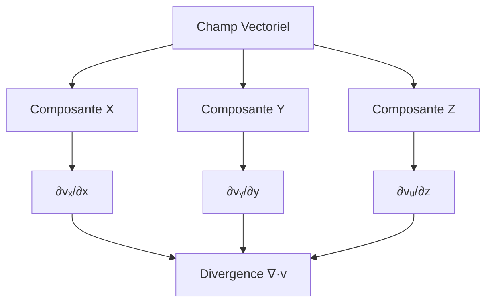

### Opérateur Laplacien

```cpp
template <class Field>
auto make_laplacian_order2()
{
    return make_diffusion_order2<Field>(1.0);
}
```

## Schémas Non-Linéaires

### Convection Non-Linéaire

```cpp
template <class Field>
auto make_convection_nonlinear()
```

**Gestion de la Non-Linéarité :**

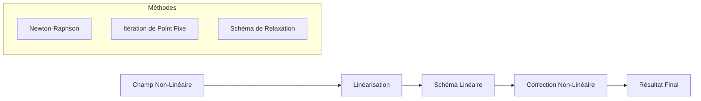

## Intégration Temporelle

### Schémas Explicites

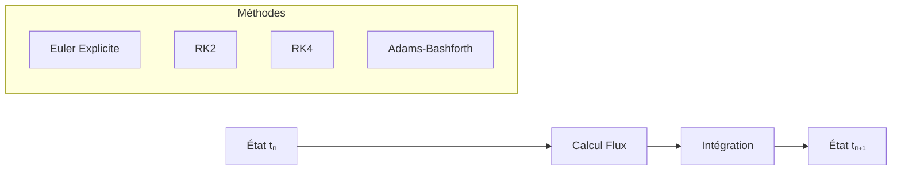

### Schémas Implicites

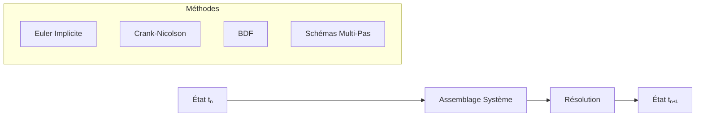

## Conditions aux Limites

### Types de Conditions

```mermaid
graph TB
    A[Conditions aux Limites] --> B[Dirichlet]
    A --> C[Neumann]
    A --> D[Périodiques]
    A --> E[Robin]
    A --> F[Personnalisées]
    
    B --> G[u = g sur ∂Ω]
    C --> H[∂u/∂n = h sur ∂Ω]
    D --> I[u(x) = u(x+L)]
    E --> J[αu + β∂u/∂n = γ]
    F --> K[Conditions Spécifiques]
```

### Implémentation des Conditions

```cpp
// Configuration Dirichlet
scheme.set_dirichlet_config();

// Configuration Neumann  
scheme.set_neumann_config();

// Configuration Périodique
scheme.set_periodic_config();
```

## Optimisations et Performance

### Optimisations Compile-Time

```cpp
// Utilisation de constantes compile-time
static constexpr std::size_t stencil_size = 2;
static constexpr std::size_t output_n_comp = n_comp;

// Spécialisation des templates
template <std::size_t dim>
using VelocityVector = xt::xtensor_fixed<double, xt::xshape<dim>>;
```

### Optimisations Runtime

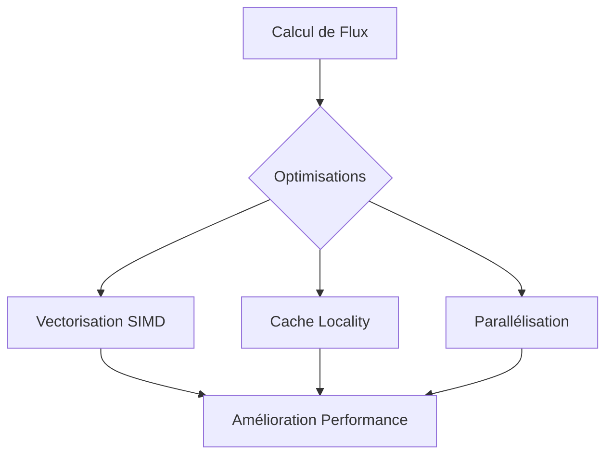

## Validation et Tests

### Tests de Convergence

```cpp
// Test de convergence pour un schéma
auto error = compute_convergence_error(scheme, exact_solution);
std::cout << "Convergence rate: " << error << std::endl;
```

### Tests de Conservation

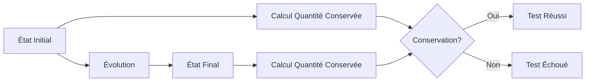

## Exemples Complets

### Exemple 1: Équation de Convection-Diffusion

```cpp
#include <samurai/schemes/fv.hpp>

int main()
{
    // Configuration du maillage
    auto mesh = make_mesh();
    
    // Création des champs
    auto u = make_field<double, 1>("u", mesh);
    auto velocity = make_field<double, 2>("velocity", mesh);
    
    // Schémas numériques
    auto convection = make_convection_upwind(velocity);
    auto diffusion = make_diffusion_order2(1.0);
    
    // Combinaison des schémas
    auto scheme = convection + diffusion;
    
    // Application
    scheme.apply(u);
    
    return 0;
}
```

### Exemple 2: Équation de Burgers avec WENO5

```cpp
#include <samurai/schemes/fv.hpp>

int main()
{
    // Configuration
    auto mesh = make_amr_mesh();
    auto u = make_field<double, 1>("u", mesh);
    
    // Schéma WENO5 pour l'équation de Burgers
    auto burgers_scheme = make_convection_weno5(u);
    
    // Intégration temporelle
    for (std::size_t step = 0; step < n_steps; ++step)
    {
        burgers_scheme.apply(u);
        update_time_step();
    }
    
    return 0;
}
```

### Exemple 3: Système Multi-Physiques

```cpp
#include <samurai/schemes/fv.hpp>

int main()
{
    // Champs multi-composantes
    auto rho = make_field<double, 1>("density", mesh);
    auto v = make_field<double, 2>("velocity", mesh);
    auto p = make_field<double, 1>("pressure", mesh);
    
    // Schémas pour chaque équation
    auto mass_equation = make_convection_upwind(v);
    auto momentum_equation = make_convection_weno5(v) + make_diffusion_order2(mu);
    auto energy_equation = make_convection_upwind(v) + make_diffusion_order2(kappa);
    
    // Système couplé
    mass_equation.apply(rho);
    momentum_equation.apply(v);
    energy_equation.apply(p);
    
    return 0;
}
```

## Monitoring et Debugging

### Monitoring des Schémas

```cpp
// Activation du monitoring
scheme.set_monitoring(true);

// Affichage des statistiques
std::cout << "Scheme statistics:" << std::endl;
std::cout << "  - CFL number: " << scheme.get_cfl() << std::endl;
std::cout << "  - Max eigenvalue: " << scheme.get_max_eigenvalue() << std::endl;
std::cout << "  - Min eigenvalue: " << scheme.get_min_eigenvalue() << std::endl;
```

### Debugging des Schémas

```cpp
// Validation des coefficients
scheme.validate_coefficients();

// Vérification de la stabilité
if (!scheme.check_stability())
{
    std::cerr << "Warning: Scheme may be unstable!" << std::endl;
}
```

## Intégration avec AMR

### Schémas Adaptatifs

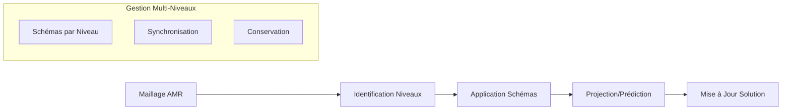

### Schémas avec Raffinement

```cpp
// Application sur maillage AMR
for (std::size_t level = mesh.min_level(); level <= mesh.max_level(); ++level)
{
    auto level_scheme = make_scheme_for_level(level);
    level_scheme.apply(field);
}

// Synchronisation entre niveaux
synchronize_levels(field);
```

## Conclusion

Les schémas numériques de Samurai offrent une palette complète d'outils pour la résolution d'EDP sur des maillages adaptatifs. Ils combinent précision numérique, robustesse et efficacité, tout en s'intégrant parfaitement avec le système AMR.

La modularité des schémas permet une grande flexibilité dans la conception de solveurs pour des problèmes multi-physiques complexes. 