# Numerical Schemes - Samurai

## Overview

Samurai provides a comprehensive collection of numerical schemes for solving partial differential equations (PDEs) on adaptive meshes. These schemes are designed to work efficiently with the AMR system and support multi-physics simulations.

## Scheme Architecture

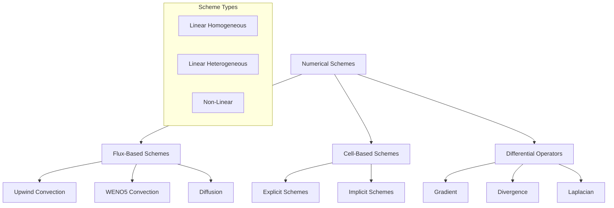

## Flux-Based Schemes

### General Design

Flux-based schemes in Samurai are based on a conservative approach where fluxes are calculated at interfaces between cells.

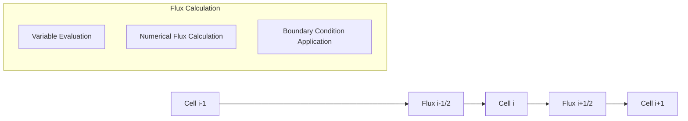

### Flux-Based Scheme Configuration

```cpp
template <SchemeType scheme_type,
          std::size_t output_n_comp,
          std::size_t stencil_size,
          class Field>
struct FluxConfig
{
    static constexpr SchemeType type = scheme_type;
    static constexpr std::size_t output_n_comp = output_n_comp;
    static constexpr std::size_t stencil_size = stencil_size;
    using field_t = Field;
};
```

## Convection Schemes

### Linear Upwind Convection

The upwind scheme is the simplest and most robust convection scheme.

```cpp
template <class Field>
auto make_convection_upwind(const VelocityVector<Field::dim>& velocity)
```

**Upwind Scheme Principle:**

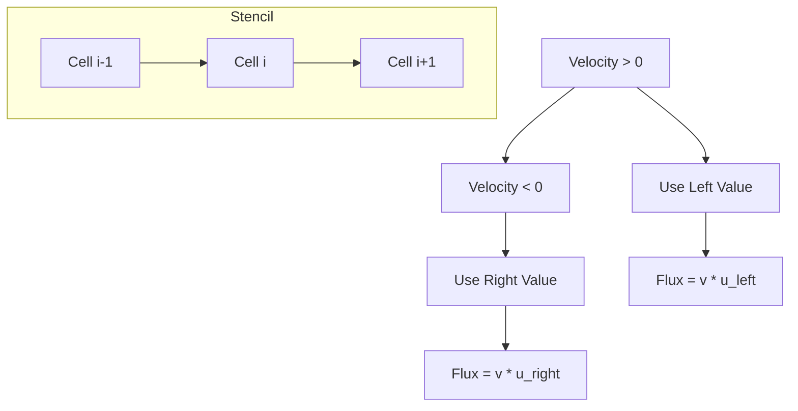

**Scheme Coefficients:**

```cpp
// For v >= 0 (left upwind)
coeffs[left] = velocity(d);
coeffs[right] = 0;

// For v < 0 (right upwind)
coeffs[left] = 0;
coeffs[right] = velocity(d);
```

### WENO5 Convection

The WENO5 (Weighted Essentially Non-Oscillatory) scheme provides 5th order accuracy with oscillation limiting.

```cpp
template <class Field>
auto make_convection_weno5(const VelocityVector<Field::dim>& velocity)
```

**WENO5 Stencil Structure:**


**WENO5 Algorithm:**

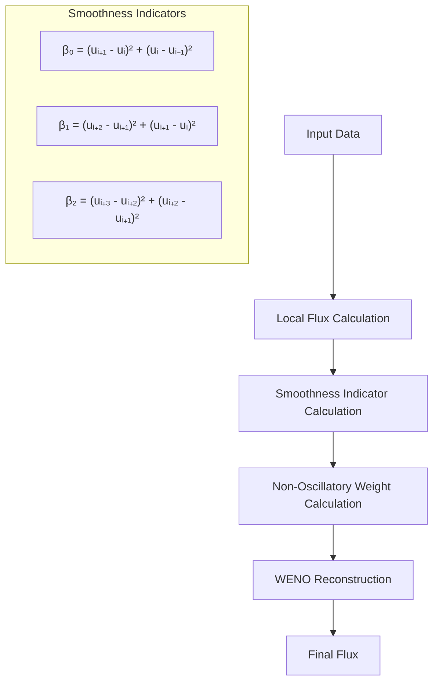

### Convection with Variable Velocity Field

```cpp
template <class Field, class VelocityField>
auto make_convection_upwind(const VelocityField& velocity_field)
```

**Variable Velocity Workflow:**

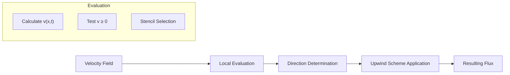

## Diffusion Schemes

### Linear Homogeneous Diffusion

```cpp
template <class Field, DirichletEnforcement dirichlet_enfcmt = Equation>
auto make_diffusion_order2(const DiffCoeff<Field::dim>& K)
```

**Diffusion Scheme Principle:**

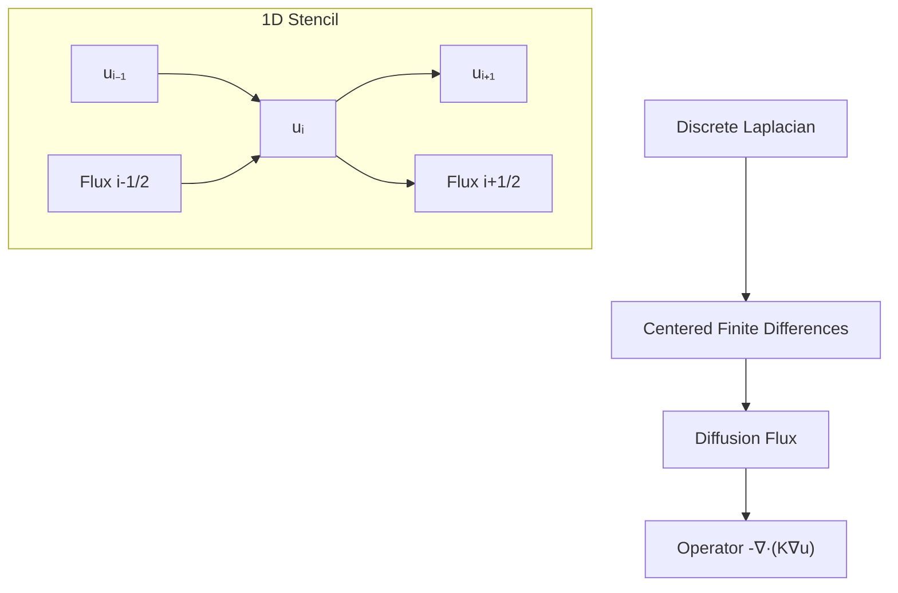

**Scheme Coefficients:**

```cpp
// Diffusion flux
coeffs[left] = -K(d) / h;
coeffs[right] = K(d) / h;

// Opérateur -Laplacien
coeffs[left] *= -1;
coeffs[right] *= -1;
```

### Multi-Component Diffusion

```cpp
template <class Field, DirichletEnforcement dirichlet_enfcmt = Equation>
auto make_multi_diffusion_order2(const DiffCoeff<Field::n_comp>& K)
```

**Multi-Component Structure:**

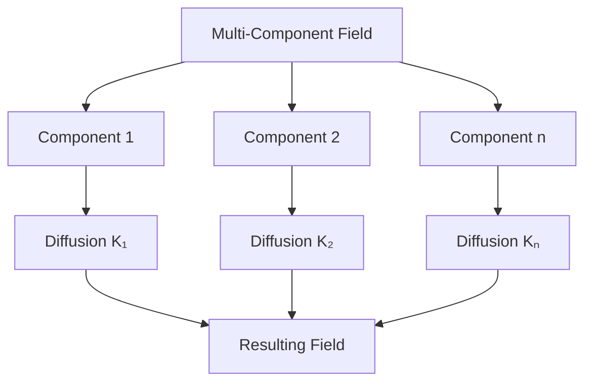

### Boundary Conditions for Diffusion

#### Dirichlet Conditions

```cpp
void set_dirichlet_config()
{
    // Equation: (u_ghost + u_cell)/2 = dirichlet_value
    // Coefficient: [1/2, 1/2] = dirichlet_value
    coeffs[cell] = -1/(h*h);
    coeffs[ghost] = -1/(h*h);
    rhs_coeffs = -2/(h*h) * dirichlet_value;
}
```

#### Neumann Conditions

```cpp
void set_neumann_config()
{
    // Equation: (u_ghost - u_cell)/h = neumann_value
    // Coefficient: [1/h², -1/h²] = (1/h) * neumann_value
    coeffs[cell] = -1/(h*h);
    coeffs[ghost] = 1/(h*h);
    rhs_coeffs = (1/h) * neumann_value;
}
```

## Cell-Based Schemes

### Explicit Schemes

```cpp
template <class cfg>
class ExplicitCellBasedScheme : public CellBasedScheme<cfg>
```

**Explicit Scheme Workflow:**

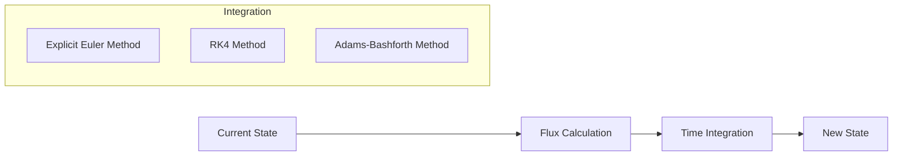

### Implicit Schemes

```cpp
template <class cfg>
class ImplicitCellBasedScheme : public CellBasedScheme<cfg>
```

**Implicit Scheme Workflow:**

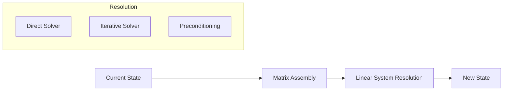

## Differential Operators

### Gradient Operator

```cpp
template <class Field>
auto make_gradient()
```

**Gradient Calculation:**

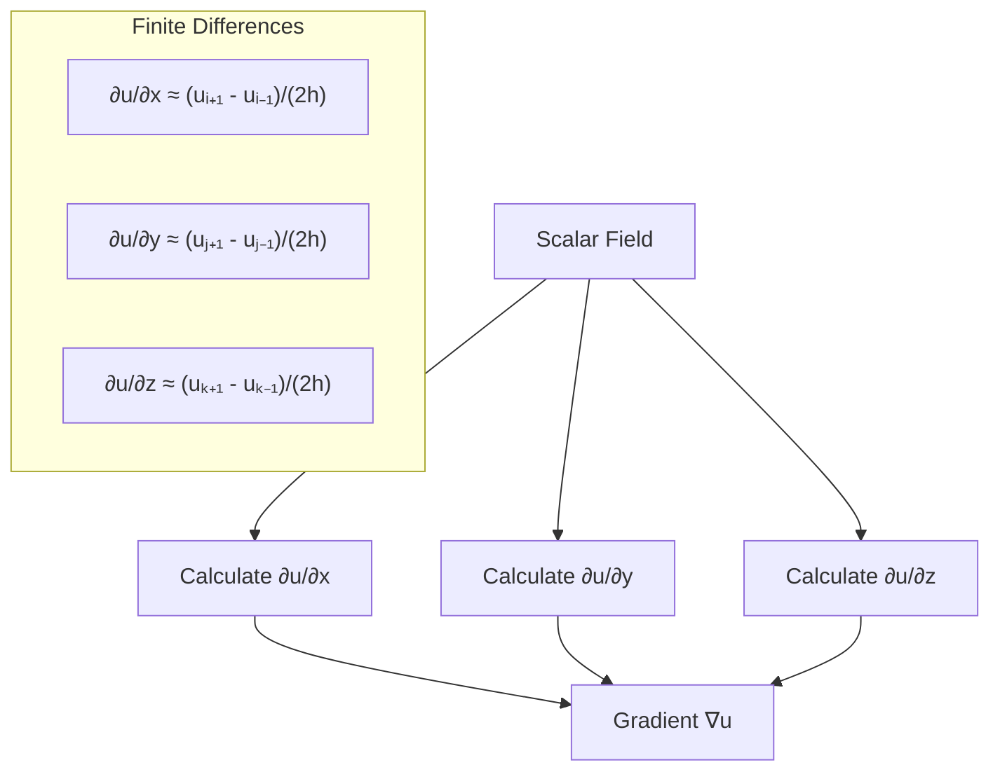

### Divergence Operator

```cpp
template <class Field>
auto make_divergence()
```

**Divergence Calculation:**

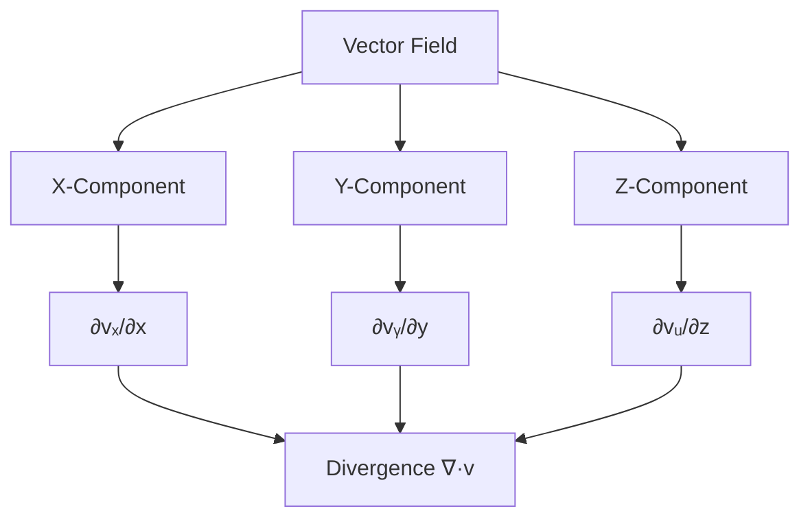

### Laplacian Operator

```cpp
template <class Field>
auto make_laplacian_order2()
{
    return make_diffusion_order2<Field>(1.0);
}
```

## Non-Linear Schemes

### Non-Linear Convection

```cpp
template <class Field>
auto make_convection_nonlinear()
```

**Non-Linearity Management:**

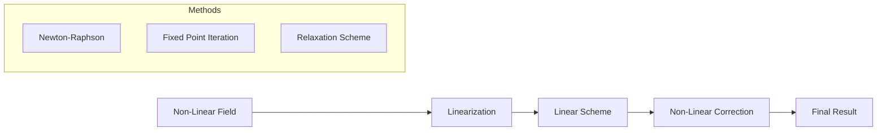

## Time Integration

### Explicit Schemes

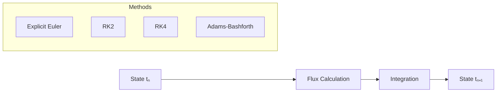

### Implicit Schemes

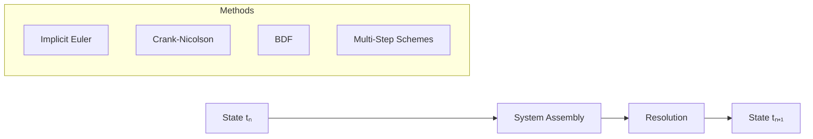

## Boundary Conditions

### Types of Boundary Conditions

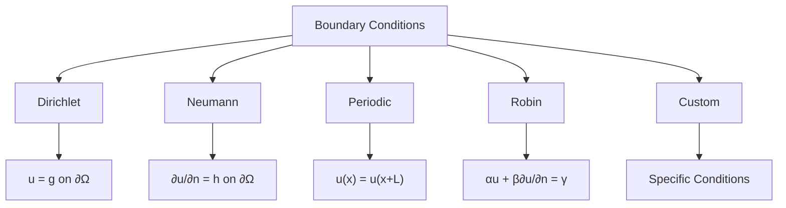

### Implementation of Boundary Conditions

```cpp
// Dirichlet Configuration
scheme.set_dirichlet_config();

// Neumann Configuration  
scheme.set_neumann_config();

// Periodic Configuration
scheme.set_periodic_config();
```

## Optimizations and Performance

### Compile-Time Optimizations

```cpp
// Use compile-time constants
static constexpr std::size_t stencil_size = 2;
static constexpr std::size_t output_n_comp = n_comp;

// Template specialization
template <std::size_t dim>
using VelocityVector = xt::xtensor_fixed<double, xt::xshape<dim>>;
```

### Runtime Optimizations

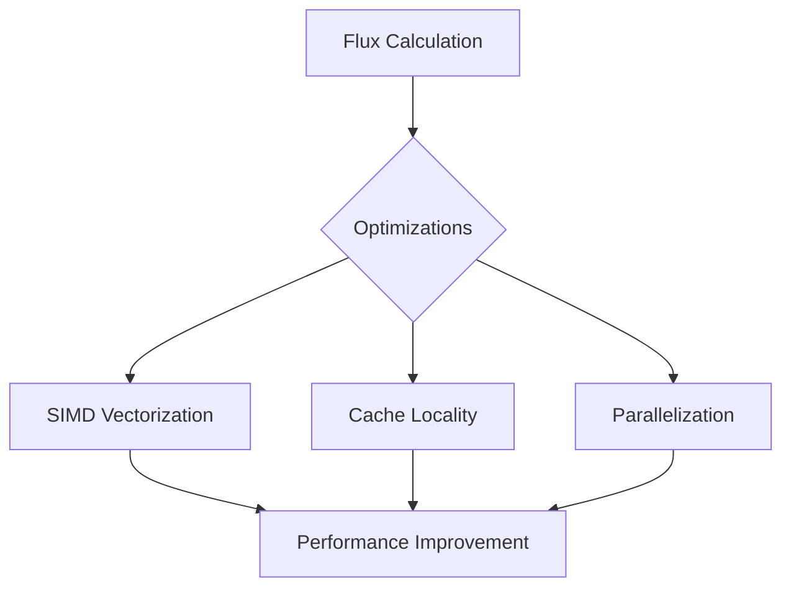

## Validation and Testing

### Convergence Tests

```cpp
// Test for a scheme
auto error = compute_convergence_error(scheme, exact_solution);
std::cout << "Convergence rate: " << error << std::endl;
```

### Conservation Tests

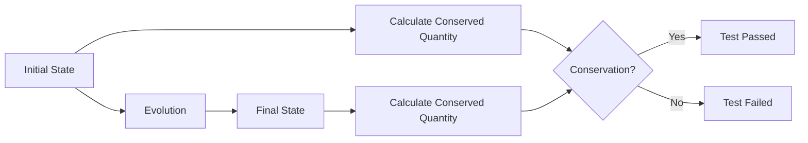

## Complete Examples

### Example 1: Convection-Diffusion Equation

```cpp
#include <samurai/schemes/fv.hpp>

int main()
{
    // Mesh Configuration
    auto mesh = make_mesh();
    
    // Field Creation
    auto u = make_field<double, 1>("u", mesh);
    auto velocity = make_field<double, 2>("velocity", mesh);
    
    // Numerical Schemes
    auto convection = make_convection_upwind(velocity);
    auto diffusion = make_diffusion_order2(1.0);
    
    // Scheme Combination
    auto scheme = convection + diffusion;
    
    // Application
    scheme.apply(u);
    
    return 0;
}
```

### Example 2: Burgers Equation with WENO5

```cpp
#include <samurai/schemes/fv.hpp>

int main()
{
    // Configuration
    auto mesh = make_amr_mesh();
    auto u = make_field<double, 1>("u", mesh);
    
    // WENO5 Scheme for Burgers Equation
    auto burgers_scheme = make_convection_weno5(u);
    
    // Time Integration
    for (std::size_t step = 0; step < n_steps; ++step)
    {
        burgers_scheme.apply(u);
        update_time_step();
    }
    
    return 0;
}
```

### Example 3: Multi-Physics System

```cpp
#include <samurai/schemes/fv.hpp>

int main()
{
    // Multi-Component Fields
    auto rho = make_field<double, 1>("density", mesh);
    auto v = make_field<double, 2>("velocity", mesh);
    auto p = make_field<double, 1>("pressure", mesh);
    
    // Schemes for each equation
    auto mass_equation = make_convection_upwind(v);
    auto momentum_equation = make_convection_weno5(v) + make_diffusion_order2(mu);
    auto energy_equation = make_convection_upwind(v) + make_diffusion_order2(kappa);
    
    // Coupled System
    mass_equation.apply(rho);
    momentum_equation.apply(v);
    energy_equation.apply(p);
    
    return 0;
}
```

## Monitoring and Debugging

### Monitoring Schemes

```cpp
// Enable monitoring
scheme.set_monitoring(true);

// Display statistics
std::cout << "Scheme statistics:" << std::endl;
std::cout << "  - CFL number: " << scheme.get_cfl() << std::endl;
std::cout << "  - Max eigenvalue: " << scheme.get_max_eigenvalue() << std::endl;
std::cout << "  - Min eigenvalue: " << scheme.get_min_eigenvalue() << std::endl;
```

### Debugging Schemes

```cpp
// Validate coefficients
scheme.validate_coefficients();

// Check stability
if (!scheme.check_stability())
{
    std::cerr << "Warning: Scheme may be unstable!" << std::endl;
}
```

## Integration with AMR

### Adaptive Schemes

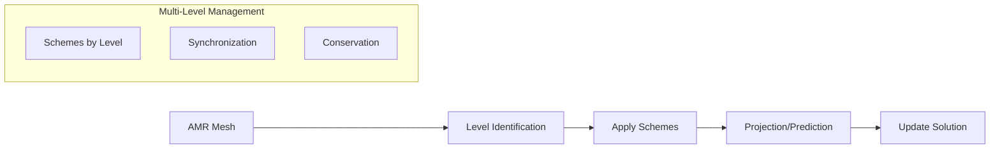

### Schemes with Refinement

```cpp
// Apply on AMR mesh
for (std::size_t level = mesh.min_level(); level <= mesh.max_level(); ++level)
{
    auto level_scheme = make_scheme_for_level(level);
    level_scheme.apply(field);
}

// Synchronization between levels
synchronize_levels(field);
```

## Conclusion

The numerical schemes of Samurai offer a complete palette of tools for solving PDEs on adaptive meshes. They combine numerical precision, robustness, and efficiency, seamlessly integrating with the AMR system.

The modularity of the schemes allows for great flexibility in designing solvers for complex multi-physics problems. 