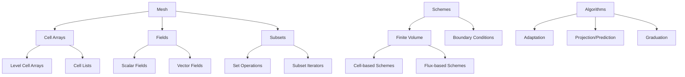

# Samurai Overview

## Introduction

Samurai is a C++ library designed for numerical simulations with adaptive mesh refinement (AMR). It provides a unified framework for implementing various mesh adaptation methods including patch-based AMR, cell-based AMR, and multiresolution approaches. The library's strength lies in its flexible data structure based on intervals and set algebra, which enables efficient subset operations and mesh management.

## Core Philosophy

Samurai is built around several key design principles:

1. **Unified Data Structure**: A single mesh representation that can handle different adaptation strategies
2. **Set Algebra**: Efficient operations on mesh subsets using interval-based set operations
3. **Template-based Design**: Compile-time optimization and type safety
4. **Flexible Interface**: Easy implementation of numerical schemes with minimal boilerplate code

## Architecture Overview



## Key Components

### 1. Mesh System

The mesh in Samurai is represented using a hierarchical structure:

- **Box**: Defines the computational domain
- **Cell Arrays**: Store the actual mesh cells organized by levels
- **Level Cell Arrays**: Manage cells at each refinement level
- **Cell Lists**: Efficient storage of intervals representing cell ranges

```cpp
// Example: Creating a 2D multiresolution mesh
constexpr size_t dim = 2;
using Config = samurai::MRConfig<dim>;
samurai::Box<double, dim> box({0., 0.}, {1., 1.});
samurai::MRMesh<Config> mesh(box, min_level, max_level);
```

### 2. Field System

Fields represent the solution variables on the mesh:

- **ScalarField**: Single-component fields (e.g., temperature, pressure)
- **VectorField**: Multi-component fields (e.g., velocity, momentum)
- **Field Expressions**: Enable mathematical operations between fields

```cpp
// Creating scalar and vector fields
auto temperature = samurai::make_scalar_field<double>("T", mesh);
auto velocity = samurai::make_vector_field<double, 2>("u", mesh);
```

### 3. Subset System

The subset system provides set algebra operations on mesh regions:

- **Self**: Complete mesh at a given level
- **Intersection**: Common cells between different mesh regions
- **Union**: Combined cells from different regions
- **Difference**: Cells in one region but not another

```cpp
// Example: Working with subsets
auto fine_cells = samurai::intersection(mesh[level], mesh[level+1]).on(level);
auto coarse_cells = samurai::difference(mesh[level], mesh[level+1]).on(level);
```

### 4. Numerical Schemes

Samurai provides a framework for implementing numerical schemes:

- **Finite Volume Schemes**: Both cell-based and flux-based approaches
- **Boundary Conditions**: Dirichlet, Neumann, and periodic conditions
- **Stencil Operations**: Efficient computation of spatial derivatives

```cpp
// Example: Creating a diffusion scheme
samurai::DiffCoeff<dim> K;
K.fill(diffusion_coefficient);
auto diffusion = samurai::make_diffusion_order2<decltype(field)>(K);
```

## Design Patterns

### 1. CRTP (Curiously Recurring Template Pattern)

Samurai extensively uses CRTP for static polymorphism and compile-time optimization:

```cpp
template <class DerivedScheme, class cfg_, class bdry_cfg_>
class FVScheme
{
    DerivedScheme& derived_cast() & noexcept
    {
        return *static_cast<DerivedScheme*>(this);
    }
    // ...
};
```

### 2. Expression Templates

Field operations use expression templates to avoid unnecessary temporary objects:

```cpp
// This creates an expression, not a temporary field
auto result = field1 + field2 * 2.0;
```

### 3. Type Erasure

The library uses type erasure for flexible boundary condition handling:

```cpp
using bc_container = std::vector<std::unique_ptr<Bc_derived>>;
```

## Memory Management

Samurai employs several strategies for efficient memory management:

1. **Contiguous Storage**: Fields use contiguous memory layouts for cache efficiency
2. **SOA/AOS**: Support for both Structure of Arrays and Array of Structures layouts
3. **Smart Pointers**: Automatic memory management for complex objects
4. **Memory Pools**: Efficient allocation for frequently created/destroyed objects

## Performance Considerations

### 1. Compile-time Optimization

- Template metaprogramming for compile-time computations
- Static polymorphism to avoid virtual function overhead
- Compile-time dimension checking

### 2. Cache Efficiency

- Contiguous memory layouts for field data
- Optimized iteration patterns over mesh cells
- Minimal memory allocation during computation

### 3. Parallelization Support

- MPI support for distributed memory parallelism
- Thread-safe operations where appropriate
- Efficient load balancing for adaptive meshes

## Usage Patterns

### 1. Basic Workflow

```cpp
// 1. Initialize Samurai
auto& app = samurai::initialize("My Simulation", argc, argv);

// 2. Create mesh
samurai::MRMesh<Config> mesh(box, min_level, max_level);

// 3. Create fields
auto u = samurai::make_scalar_field<double>("u", mesh);

// 4. Set boundary conditions
samurai::make_bc<samurai::Dirichlet<1>>(u, 0.);

// 5. Initialize solution
samurai::for_each_cell(mesh, [&](const auto& cell) {
    u[cell] = initial_condition(cell.center());
});

// 6. Time loop with adaptation
for (std::size_t iter = 0; iter < max_iterations; ++iter) {
    // Adapt mesh
    adaptation_criterion(u);
    
    // Update solution
    update_solution(u);
}
```

### 2. Mesh Adaptation

```cpp
// Create adaptation criterion
auto MRadaptation = samurai::make_MRAdapt(u);

// Apply adaptation
MRadaptation(epsilon, regularity);
```

### 3. Set Operations

```cpp
// Apply operation on specific subset
samurai::intersection(mesh[level], mesh[level+1]).on(level)(
    [&](const auto& interval, const auto& index) {
        // Operation on fine cells that have children
    }
);
```

## Integration with External Libraries

Samurai is designed to integrate with various external libraries:

- **PETSc**: Linear algebra and solvers
- **HDF5**: Data I/O and restart capabilities
- **MPI**: Parallel computing support
- **xtensor**: Multi-dimensional array operations

This modular design allows users to leverage existing numerical libraries while benefiting from Samurai's mesh adaptation capabilities. 