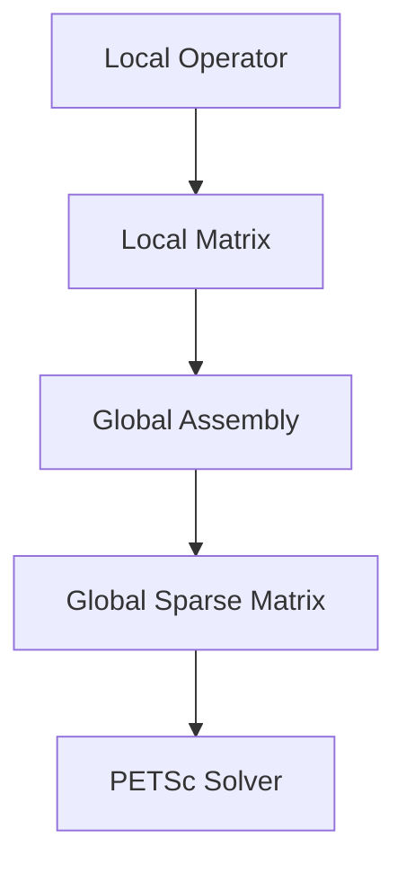

# Matrix Assembly and PETSc Integration

## Introduction

Samurai supports the assembly of sparse matrices for linear solvers, with optional integration with PETSc for scalable parallel computations.

## Matrix Assembly Workflow



## Memory Structure

- Matrices are stored in compressed sparse row (CSR) or block formats.
- Each mesh cell or interval contributes local entries to the global matrix.
- PETSc integration allows distributed storage and parallel assembly.

## Example Code

```cpp
// Assemble a matrix
samurai::petsc::Matrix A(mesh);
samurai::assemble_matrix(A, mesh, scheme);

// Solve with PETSc
samurai::petsc::Solver solver;
solver.solve(A, x, b);
```

## PETSc Integration

- PETSc objects (Mat, Vec, KSP) are wrapped for C++ use.
- Communication and assembly are handled transparently for the user.

## Advanced: Block and Nonlinear Assembly

- Block matrices for systems of equations.
- Nonlinear operator assembly for advanced solvers.

## Conclusion

Matrix assembly and PETSc integration enable scalable, high-performance linear algebra in Samurai. 