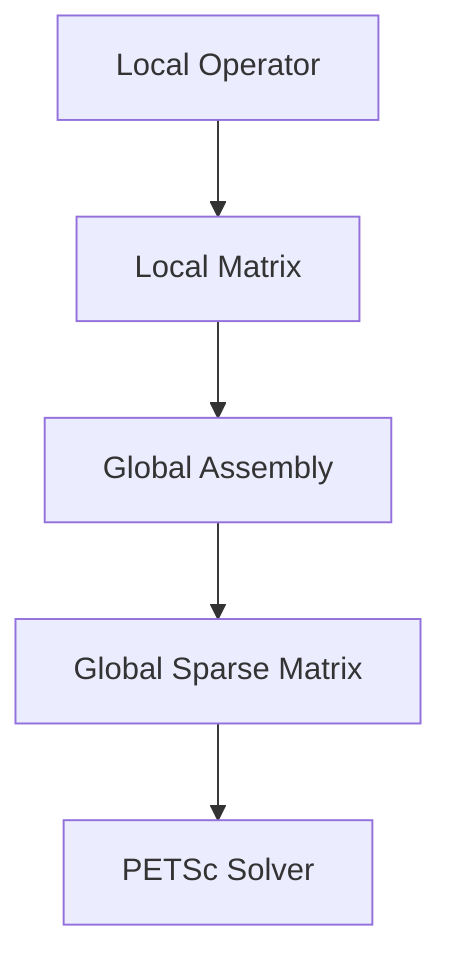

# Matrix Assembly and PETSc Integration

## Introduction

Samurai supports the assembly of sparse matrices for linear solvers, with integration with PETSc for scalable parallel computations. The PETSc integration provides efficient linear and nonlinear solvers with support for various preconditioners and iterative methods.

## Matrix Assembly Workflow



## Memory Structure

- Matrices are stored in compressed sparse row (CSR) format.
- Each mesh cell or interval contributes local entries to the global matrix.
- PETSc integration allows distributed storage and parallel assembly.

## Example Code

```cpp
// Create a solver for a scheme
auto solver = samurai::petsc::make_solver(scheme);

// Set the unknown field
solver.set_unknown(u);

// Solve the system
solver.solve(rhs);
```

## PETSc Integration

- PETSc objects (Mat, Vec, KSP, SNES) are wrapped for C++ use.
- Communication and assembly are handled transparently for the user.
- Support for both linear and nonlinear solvers.

## Advanced: Block and Nonlinear Assembly

- Block matrices for systems of equations using `LinearBlockSolver`.
- Nonlinear operator assembly for advanced solvers using `NonLinearSolver`.

## Conclusion

Matrix assembly and PETSc integration enable scalable, high-performance linear algebra in Samurai. 