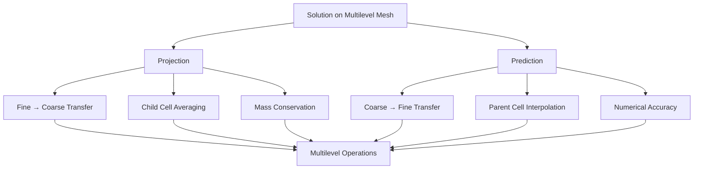

# Projection and Prediction Operators

## Introduction

Projection and prediction operators are fundamental components of Samurai for managing solutions on multilevel meshes. These operators allow transferring solutions between different refinement levels, ensuring consistency and accuracy of calculations on adaptive meshes.

## Overview

### Role of Operators



### Conservation Principle

The operators respect the **mass conservation** principle:

```
∫_Ω u(x) dx = constant
```

Where `Ω` represents the domain and `u(x)` the solution.

## Projection Operator

### Fundamental Principle

The projection operator calculates the average value of a solution on a coarse cell from the values on the fine child cells.

### Mathematical Formulation

For a coarse cell `C` at level `l` and its children `c_i` at level `l+1`:

```
u_l(C) = (1/|C|) * Σ |c_i| * u_{l+1}(c_i)
```

Where `|C|` and `|c_i|` represent the cell volumes.

### Implementation by Dimension

#### 1D - Projection

```cpp
template <class T1, class T2>
inline void operator()(Dim<1>, T1& dest, const T2& src) const
{
    dest(level, i) = 0.5 * (src(level + 1, 2 * i) + src(level + 1, 2 * i + 1));
}
```

**1D Visual Scheme:**
```
Level l+1 (fine):   [u0][u1] [u2][u3] [u4][u5] [u6][u7]
Level l (coarse):   [  U0  ] [  U1  ] [  U2  ] [  U3  ]

U0 = 0.5 * (u0 + u1)
U1 = 0.5 * (u2 + u3)
U2 = 0.5 * (u4 + u5)
U3 = 0.5 * (u6 + u7)
```

#### 2D - Projection

```cpp
template <class T1, class T2>
inline void operator()(Dim<2>, T1& dest, const T2& src) const
{
    dest(level, i, j) = 0.25 * (
        src(level + 1, 2 * i, 2 * j) + 
        src(level + 1, 2 * i, 2 * j + 1) + 
        src(level + 1, 2 * i + 1, 2 * j) + 
        src(level + 1, 2 * i + 1, 2 * j + 1)
    );
}
```

**2D Visual Scheme:**
```
Level l+1 (fine):
[u00][u01] [u02][u03]
[u10][u11] [u12][u13]

Level l (coarse):
[    U0    ]

U0 = 0.25 * (u00 + u01 + u10 + u11)
```

#### 3D - Projection

```cpp
template <class T1, class T2>
inline void operator()(Dim<3>, T1& dest, const T2& src) const
{
    dest(level, i, j, k) = 0.125 * (
        src(level + 1, 2 * i, 2 * j, 2 * k) + 
        src(level + 1, 2 * i + 1, 2 * j, 2 * k) + 
        src(level + 1, 2 * i, 2 * j + 1, 2 * k) + 
        src(level + 1, 2 * i + 1, 2 * j + 1, 2 * k) + 
        src(level + 1, 2 * i, 2 * j, 2 * k + 1) + 
        src(level + 1, 2 * i + 1, 2 * j, 2 * k + 1) + 
        src(level + 1, 2 * i, 2 * j + 1, 2 * k + 1) + 
        src(level + 1, 2 * i + 1, 2 * j + 1, 2 * k + 1)
    );
}
```

**3D Visual Scheme:**
```
Level l+1: 8 fine cells (2×2×2)
Level l:   1 coarse cell

U = 0.125 * Σ(u_i) for i = 1 to 8
```

### Operator Usage

```cpp
// Simple projection
auto proj_op = samurai::projection(field);

// Projection with explicit source and destination
auto proj_op = samurai::projection(dest_field, src_field);

// Variadic projection (multiple fields)
auto proj_op = samurai::variadic_projection(field1, field2, field3);
```

## Prediction Operator

### Fundamental Principle

The prediction operator calculates values on fine cells from values on coarse parent cells, using high-order interpolation schemes.

### Mathematical Formulation

Prediction uses interpolation schemes based on Taylor series expansions:

```
u_{l+1}(x) = u_l(x) + Σ c_k * (u_l(x + kh) - u_l(x - kh))
```

Where `c_k` are the interpolation coefficients and `h` the cell size.

### Interpolation Coefficients

#### Prediction Coefficients

```cpp
template <std::size_t s>
inline std::array<double, s> prediction_coeffs();

// Order 1
template <>
inline std::array<double, 1> prediction_coeffs<1>()
{
    return {-1. / 8.};
}

// Order 2
template <>
inline std::array<double, 2> prediction_coeffs<2>()
{
    return {-22. / 128., 3. / 128.};
}

// Order 3
template <>
inline std::array<double, 3> prediction_coeffs<3>()
{
    return {-201. / 1024., 11. / 256., -5. / 1024.};
}
```

#### Interpolation Coefficients

```cpp
template <std::size_t s>
inline std::array<double, s> interp_coeffs(double sign);

// Order 1
template <>
inline std::array<double, 1> interp_coeffs(double)
{
    return {1};
}

// Order 3
template <>
inline std::array<double, 3> interp_coeffs(double sign)
{
    return {sign / 8., 1, -sign / 8.};
}
```

### Implementation by Dimension

#### 1D - Prediction

```cpp
template <class T1, class T2, std::size_t order>
inline void operator()(Dim<1>, T1& dest, const T2& src) const
{
    auto coeffs = prediction_coeffs<order>();
    
    // Prediction for even cells
    if (auto i_even = i.even_elements(); i_even.is_valid()) {
        dest(level + 1, i_even) = src(level, i_even >> 1);
    }
    
    // Prediction for odd cells
    if (auto i_odd = i.odd_elements(); i_odd.is_valid()) {
        auto qs = Qs_i<order>(src, level, i_odd >> 1);
        dest(level + 1, i_odd) = src(level, i_odd >> 1) + qs;
    }
}
```

**1D Visual Scheme:**
```
Level l (coarse):     [U0][U1][U2][U3]
Level l+1 (fine):      [u0][u1][u2][u3][u4][u5][u6][u7]

u0 = U0 (even cell)
u1 = U0 + Q1(U0, U1, U2, ...) (odd cell)
u2 = U1 (even cell)
u3 = U1 + Q1(U0, U1, U2, ...) (odd cell)
```

#### 2D - Prediction

```cpp
template <class T1, class T2, std::size_t order>
inline void operator()(Dim<2>, T1& dest, const T2& src) const
{
    // Prediction for even cells (pair, pair)
    if (auto i_even = i.even_elements(); i_even.is_valid()) {
        if (auto j_even = j.even_elements(); j_even.is_valid()) {
            dest(level + 1, i_even, j_even) = src(level, i_even >> 1, j_even >> 1);
        }
    }
    
    // Prediction for even cells (odd, pair)
    if (auto i_odd = i.odd_elements(); i_odd.is_valid()) {
        if (auto j_even = j.even_elements(); j_even.is_valid()) {
            auto qs = Qs_i<order>(src, level, i_odd >> 1, j_even >> 1);
            dest(level + 1, i_odd, j_even) = src(level, i_odd >> 1, j_even >> 1) + qs;
        }
    }
    
    // Prediction for even cells (pair, odd)
    if (auto i_even = i.even_elements(); i_even.is_valid()) {
        if (auto j_odd = j.odd_elements(); j_odd.is_valid()) {
            auto qs = Qs_j<order>(src, level, i_even >> 1, j_odd >> 1);
            dest(level + 1, i_even, j_odd) = src(level, i_even >> 1, j_odd >> 1) + qs;
        }
    }
    
    // Prediction for odd cells (odd, odd)
    if (auto i_odd = i.odd_elements(); i_odd.is_valid()) {
        if (auto j_odd = j.odd_elements(); j_odd.is_valid()) {
            auto qs_ij = Qs_ij<order>(src, level, i_odd >> 1, j_odd >> 1);
            dest(level + 1, i_odd, j_odd) = src(level, i_odd >> 1, j_odd >> 1) + qs_ij;
        }
    }
}
```

**2D Visual Scheme:**
```
Level l (coarse):
[U00][U01]
[U10][U11]

Level l+1 (fine):
[u00][u01][u02][u03]
[u10][u11][u12][u13]
[u20][u21][u22][u23]
[u30][u31][u32][u33]

Cell types:
- (pair,pair): u00, u02, u20, u22 → direct copy
- (odd,pair): u01, u03, u21, u23 → prediction i
- (pair,odd): u10, u12, u30, u32 → prediction j
- (odd,odd): u11, u13, u31, u33 → prediction ij
```

### Qs Operators (Quadrature Stencils)

#### Qs_i (Direction i)

```cpp
template <std::size_t s, class Field, class interval_t, class... index_t>
inline auto Qs_i(const Field& field, std::size_t level, const interval_t& i, const index_t... index)
{
    auto c = prediction_coeffs<s>();
    auto qs = make_Qs_i<s>(make_field_hack(field), c);
    return qs(std::integral_constant<std::size_t, 1>{}, level, i, index...);
}
```

**Formulation:**
```
Qs_i = Σ c_k * (u(x + kh, y) - u(x - kh, y))
```

#### Qs_j (Direction j)

```cpp
template <std::size_t s, class Field, class interval_t, class coord_index_t, class... index_t>
inline auto Qs_j(const Field& field, std::size_t level, const interval_t& i, const coord_index_t j, const index_t... index)
{
    auto c = prediction_coeffs<s>();
    auto qs = make_Qs_j<s>(make_field_hack(field), c);
    return qs(std::integral_constant<std::size_t, 1>{}, level, i, j, index...);
}
```

**Formulation:**
```
Qs_j = Σ c_k * (u(x, y + kh) - u(x, y - kh))
```

#### Qs_ij (Directions i and j)

```cpp
template <std::size_t s, class Field, class interval_t, class coord_index_t, class... index_t>
inline auto Qs_ij(const Field& field, std::size_t level, const interval_t& i, const coord_index_t j, const index_t... index)
{
    return Qs_i<s>(field, level, i, j, index...) + Qs_j<s>(field, level, i, j, index...);
}
```

**Formulation:**
```
Qs_ij = Qs_i + Qs_j
```

## Practical Usage

### Example 1: Simple Projection

```cpp
#include <samurai/numeric/projection.hpp>

int main() {
    // Create fields on different levels
    auto fine_field = samurai::make_scalar_field<double>("fine", fine_mesh);
    auto coarse_field = samurai::make_scalar_field<double>("coarse", coarse_mesh);
    
    // Initialize the fine field
    samurai::for_each_cell(fine_mesh, [&](const auto& cell) {
        fine_field[cell] = initial_condition(cell.center());
    });
    
    // Project from fine to coarse
    auto proj_op = samurai::projection(coarse_field, fine_field);
    samurai::for_each_interval(fine_mesh, [&](std::size_t level, const auto& interval, const auto& index) {
        proj_op(level, interval, index);
    });
    
    return 0;
}
```

### Example 2: Prediction with Variable Order

```cpp
#include <samurai/numeric/prediction.hpp>

int main() {
    // Create fields
    auto fine_field = samurai::make_scalar_field<double>("fine", fine_mesh);
    auto coarse_field = samurai::make_scalar_field<double>("coarse", coarse_mesh);
    
    // Initialize the coarse field
    samurai::for_each_cell(coarse_mesh, [&](const auto& cell) {
        coarse_field[cell] = initial_condition(cell.center());
    });
    
    // Predict from coarse to fine (order 3)
    auto pred_op = samurai::prediction<3, false>(fine_field, coarse_field);
    samurai::for_each_interval(coarse_mesh, [&](std::size_t level, const auto& interval, const auto& index) {
        pred_op(level, interval, index);
    });
    
    return 0;
}
```

### Example 3: Multilevel Operations

```cpp
// Complete projection/prediction workflow
void multilevel_operations() {
    // 1. Initial prediction
    samurai::prediction<3>(fine_field, coarse_field);
    
    // 2. Compute on fine level
    compute_on_fine_level(fine_field);
    
    // 3. Project corrections
    samurai::projection(correction_coarse, correction_fine);
    
    // 4. Correct coarse level
    coarse_field = coarse_field + correction_coarse;
    
    // 5. Predict correction
    samurai::prediction<3>(correction_fine, correction_coarse);
    
    // 6. Apply correction
    fine_field = fine_field + correction_fine;
}
```

## Performance Optimizations

### 1. Processing by Intervals


### 2. Even and Odd Elements

```cpp
// Separate processing for memory access optimization
if (auto i_even = i.even_elements(); i_even.is_valid()) {
    // Process even elements
}
if (auto i_odd = i.odd_elements(); i_odd.is_valid()) {
    // Process odd elements
}
```

### 3. Reusing Coefficients

```cpp
// Pre-calculated coefficients to avoid recalculations
static const auto coeffs = prediction_coeffs<order>();
```

## Precision Analysis

### Order of Precision

```mermaid
graph TD
    A[Order 1] --> B[Precision O(h)]
    C[Order 3] --> D[Precision O(h³)]
    E[Order 5] --> F[Precision O(h⁵)]
    
    B --> G[Simple but less precise]
    D --> H[Balanced]
    F --> I[Precise but costly]
```

### Conservation of Properties

| Property | Projection | Prediction |
|-----------|------------|------------|
| Mass Conservation | ✅ Exact | ✅ Approximate |
| Continuity | ❌ Not guaranteed | ✅ Guaranteed |
| Stability | ✅ Stable | ⚠️ Conditional |

## Advanced Usage Cases

### 1. Multilevel Schemes

```cpp
// V-cycle multilevel
void v_cycle() {
    // 1. Smoothing on fine level
    smooth(fine_field);
    
    // 2. Compute residual
    auto residual = compute_residual(fine_field);
    
    // 3. Project residual
    samurai::projection(coarse_residual, residual);
    
    // 4. Solve on coarse level
    solve_coarse(coarse_residual);
    
    // 5. Predict correction
    samurai::prediction<3>(correction, coarse_residual);
    
    // 6. Correct fine level
    fine_field = fine_field + correction;
}
```

### 2. Mesh Adaptation

```cpp
// Adaptive refinement with projection/prediction
void adaptive_refinement() {
    // 1. Predict on new levels
    samurai::prediction<3>(new_level_field, parent_field);
    
    // 2. Compute on new level
    compute_on_new_level(new_level_field);
    
    // 3. Project corrections
    samurai::projection(parent_correction, new_level_correction);
    
    // 4. Update parent level
    parent_field = parent_field + parent_correction;
}
```

### 3. Boundary Conditions

```cpp
// Boundary condition handling
void boundary_conditions() {
    // 1. Predict with boundary conditions
    samurai::prediction<3>(fine_field, coarse_field);
    
    // 2. Apply boundary conditions
    apply_boundary_conditions(fine_field);
    
    // 3. Project with boundary conditions
    samurai::projection(coarse_field, fine_field);
}
```

## Monitoring and Validation

### Mass Conservation Check

```cpp
// Check mass conservation
double check_mass_conservation() {
    double mass_fine = 0.0, mass_coarse = 0.0;
    
    samurai::for_each_cell(fine_mesh, [&](const auto& cell) {
        mass_fine += fine_field[cell] * cell.volume();
    });
    
    samurai::for_each_cell(coarse_mesh, [&](const auto& cell) {
        mass_coarse += coarse_field[cell] * cell.volume();
    });
    
    return std::abs(mass_fine - mass_coarse) / mass_fine;
}
```

### Error Analysis

```cpp
// Compute projection/prediction error
double compute_error() {
    double error = 0.0;
    
    samurai::for_each_cell(fine_mesh, [&](const auto& cell) {
        auto exact = exact_solution(cell.center());
        auto computed = fine_field[cell];
        error += std::pow(exact - computed, 2) * cell.volume();
    });
    
    return std::sqrt(error);
}
```

## Conclusion

Projection and prediction operators are essential components of Samurai that allow:

- **Consistent transfer** of solutions between refinement levels
- **Mass conservation** to maintain physical accuracy
- **Numerical accuracy** through high-order schemes
- **Optimized performance** through interval processing
- **Flexibility** for different problem types

These operators form the basis of multilevel algorithms and mesh adaptation in Samurai, ensuring robustness and efficiency of numerical simulations on adaptive meshes. 