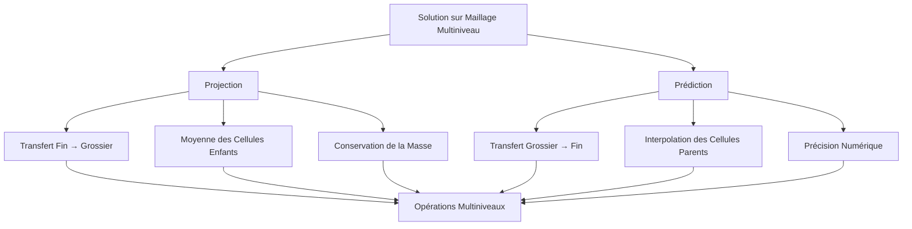

# Opérateurs de Projection et Prédiction

## Introduction

Les opérateurs de projection et prédiction sont des composants fondamentaux de Samurai pour la gestion des solutions sur des maillages multiniveaux. Ces opérateurs permettent de transférer les solutions entre différents niveaux de raffinement, assurant la cohérence et la précision des calculs sur maillages adaptatifs.

## Vue d'Ensemble

### Rôle des Opérateurs



### Principe de Conservation

Les opérateurs respectent le principe de **conservation de la masse** :

```
∫_Ω u(x) dx = constante
```

Où `Ω` représente le domaine et `u(x)` la solution.

## Opérateur de Projection

### Principe Fondamental

L'opérateur de projection calcule la valeur moyenne d'une solution sur une cellule grossière à partir des valeurs sur les cellules fines enfants.

### Formulation Mathématique

Pour une cellule grossière `C` de niveau `l` et ses enfants `c_i` de niveau `l+1` :

```
u_l(C) = (1/|C|) * Σ |c_i| * u_{l+1}(c_i)
```

Où `|C|` et `|c_i|` représentent les volumes des cellules.

### Implémentation par Dimension

#### 1D - Projection

```cpp
template <class T1, class T2>
inline void operator()(Dim<1>, T1& dest, const T2& src) const
{
    dest(level, i) = 0.5 * (src(level + 1, 2 * i) + src(level + 1, 2 * i + 1));
}
```

**Schéma Visuel 1D :**
```
Niveau l+1 (fin):   [u0][u1] [u2][u3] [u4][u5] [u6][u7]
Niveau l (grossier): [  U0  ] [  U1  ] [  U2  ] [  U3  ]

U0 = 0.5 * (u0 + u1)
U1 = 0.5 * (u2 + u3)
U2 = 0.5 * (u4 + u5)
U3 = 0.5 * (u6 + u7)
```

#### 2D - Projection

```cpp
template <class T1, class T2>
inline void operator()(Dim<2>, T1& dest, const T2& src) const
{
    dest(level, i, j) = 0.25 * (
        src(level + 1, 2 * i, 2 * j) + 
        src(level + 1, 2 * i, 2 * j + 1) + 
        src(level + 1, 2 * i + 1, 2 * j) + 
        src(level + 1, 2 * i + 1, 2 * j + 1)
    );
}
```

**Schéma Visuel 2D :**
```
Niveau l+1 (fin):
[u00][u01] [u02][u03]
[u10][u11] [u12][u13]

Niveau l (grossier):
[    U0    ]

U0 = 0.25 * (u00 + u01 + u10 + u11)
```

#### 3D - Projection

```cpp
template <class T1, class T2>
inline void operator()(Dim<3>, T1& dest, const T2& src) const
{
    dest(level, i, j, k) = 0.125 * (
        src(level + 1, 2 * i, 2 * j, 2 * k) + 
        src(level + 1, 2 * i + 1, 2 * j, 2 * k) + 
        src(level + 1, 2 * i, 2 * j + 1, 2 * k) + 
        src(level + 1, 2 * i + 1, 2 * j + 1, 2 * k) + 
        src(level + 1, 2 * i, 2 * j, 2 * k + 1) + 
        src(level + 1, 2 * i + 1, 2 * j, 2 * k + 1) + 
        src(level + 1, 2 * i, 2 * j + 1, 2 * k + 1) + 
        src(level + 1, 2 * i + 1, 2 * j + 1, 2 * k + 1)
    );
}
```

**Schéma Visuel 3D :**
```
Niveau l+1: 8 cellules fines (2×2×2)
Niveau l:   1 cellule grossière

U = 0.125 * Σ(u_i) pour i = 1 à 8
```

### Utilisation de l'Opérateur

```cpp
// Projection simple
auto proj_op = samurai::projection(field);

// Projection avec source et destination explicites
auto proj_op = samurai::projection(dest_field, src_field);

// Projection variadique (plusieurs champs)
auto proj_op = samurai::variadic_projection(field1, field2, field3);
```

## Opérateur de Prédiction

### Principe Fondamental

L'opérateur de prédiction calcule les valeurs sur les cellules fines à partir des valeurs sur les cellules grossières parents, en utilisant des schémas d'interpolation d'ordre élevé.

### Formulation Mathématique

La prédiction utilise des schémas d'interpolation basés sur des développements en série de Taylor :

```
u_{l+1}(x) = u_l(x) + Σ c_k * (u_l(x + kh) - u_l(x - kh))
```

Où `c_k` sont les coefficients d'interpolation et `h` la taille de cellule.

### Coefficients d'Interpolation

#### Coefficients de Prédiction

```cpp
template <std::size_t s>
inline std::array<double, s> prediction_coeffs();

// Ordre 1
template <>
inline std::array<double, 1> prediction_coeffs<1>()
{
    return {-1. / 8.};
}

// Ordre 2
template <>
inline std::array<double, 2> prediction_coeffs<2>()
{
    return {-22. / 128., 3. / 128.};
}

// Ordre 3
template <>
inline std::array<double, 3> prediction_coeffs<3>()
{
    return {-201. / 1024., 11. / 256., -5. / 1024.};
}
```

#### Coefficients d'Interpolation

```cpp
template <std::size_t s>
inline std::array<double, s> interp_coeffs(double sign);

// Ordre 1
template <>
inline std::array<double, 1> interp_coeffs(double)
{
    return {1};
}

// Ordre 3
template <>
inline std::array<double, 3> interp_coeffs(double sign)
{
    return {sign / 8., 1, -sign / 8.};
}
```

### Implémentation par Dimension

#### 1D - Prédiction

```cpp
template <class T1, class T2, std::size_t order>
inline void operator()(Dim<1>, T1& dest, const T2& src) const
{
    auto coeffs = prediction_coeffs<order>();
    
    // Prédiction pour les cellules paires
    if (auto i_even = i.even_elements(); i_even.is_valid()) {
        dest(level + 1, i_even) = src(level, i_even >> 1);
    }
    
    // Prédiction pour les cellules impaires
    if (auto i_odd = i.odd_elements(); i_odd.is_valid()) {
        auto qs = Qs_i<order>(src, level, i_odd >> 1);
        dest(level + 1, i_odd) = src(level, i_odd >> 1) + qs;
    }
}
```

**Schéma Visuel 1D :**
```
Niveau l (grossier):     [U0][U1][U2][U3]
Niveau l+1 (fin):      [u0][u1][u2][u3][u4][u5][u6][u7]

u0 = U0 (cellule paire)
u1 = U0 + Q1(U0, U1, U2, ...) (cellule impaire)
u2 = U1 (cellule paire)
u3 = U1 + Q1(U0, U1, U2, ...) (cellule impaire)
```

#### 2D - Prédiction

```cpp
template <class T1, class T2, std::size_t order>
inline void operator()(Dim<2>, T1& dest, const T2& src) const
{
    // Prédiction pour les cellules (pair, pair)
    if (auto i_even = i.even_elements(); i_even.is_valid()) {
        if (auto j_even = j.even_elements(); j_even.is_valid()) {
            dest(level + 1, i_even, j_even) = src(level, i_even >> 1, j_even >> 1);
        }
    }
    
    // Prédiction pour les cellules (impair, pair)
    if (auto i_odd = i.odd_elements(); i_odd.is_valid()) {
        if (auto j_even = j.even_elements(); j_even.is_valid()) {
            auto qs = Qs_i<order>(src, level, i_odd >> 1, j_even >> 1);
            dest(level + 1, i_odd, j_even) = src(level, i_odd >> 1, j_even >> 1) + qs;
        }
    }
    
    // Prédiction pour les cellules (pair, impair)
    if (auto i_even = i.even_elements(); i_even.is_valid()) {
        if (auto j_odd = j.odd_elements(); j_odd.is_valid()) {
            auto qs = Qs_j<order>(src, level, i_even >> 1, j_odd >> 1);
            dest(level + 1, i_even, j_odd) = src(level, i_even >> 1, j_odd >> 1) + qs;
        }
    }
    
    // Prédiction pour les cellules (impair, impair)
    if (auto i_odd = i.odd_elements(); i_odd.is_valid()) {
        if (auto j_odd = j.odd_elements(); j_odd.is_valid()) {
            auto qs_ij = Qs_ij<order>(src, level, i_odd >> 1, j_odd >> 1);
            dest(level + 1, i_odd, j_odd) = src(level, i_odd >> 1, j_odd >> 1) + qs_ij;
        }
    }
}
```

**Schéma Visuel 2D :**
```
Niveau l (grossier):
[U00][U01]
[U10][U11]

Niveau l+1 (fin):
[u00][u01][u02][u03]
[u10][u11][u12][u13]
[u20][u21][u22][u23]
[u30][u31][u32][u33]

Types de cellules:
- (pair,pair): u00, u02, u20, u22 → copie directe
- (impair,pair): u01, u03, u21, u23 → prédiction i
- (pair,impair): u10, u12, u30, u32 → prédiction j
- (impair,impair): u11, u13, u31, u33 → prédiction ij
```

### Opérateurs Qs (Quadrature Stencils)

#### Qs_i (Direction i)

```cpp
template <std::size_t s, class Field, class interval_t, class... index_t>
inline auto Qs_i(const Field& field, std::size_t level, const interval_t& i, const index_t... index)
{
    auto c = prediction_coeffs<s>();
    auto qs = make_Qs_i<s>(make_field_hack(field), c);
    return qs(std::integral_constant<std::size_t, 1>{}, level, i, index...);
}
```

**Formulation :**
```
Qs_i = Σ c_k * (u(x + kh, y) - u(x - kh, y))
```

#### Qs_j (Direction j)

```cpp
template <std::size_t s, class Field, class interval_t, class coord_index_t, class... index_t>
inline auto Qs_j(const Field& field, std::size_t level, const interval_t& i, const coord_index_t j, const index_t... index)
{
    auto c = prediction_coeffs<s>();
    auto qs = make_Qs_j<s>(make_field_hack(field), c);
    return qs(std::integral_constant<std::size_t, 1>{}, level, i, j, index...);
}
```

**Formulation :**
```
Qs_j = Σ c_k * (u(x, y + kh) - u(x, y - kh))
```

#### Qs_ij (Directions i et j)

```cpp
template <std::size_t s, class Field, class interval_t, class coord_index_t, class... index_t>
inline auto Qs_ij(const Field& field, std::size_t level, const interval_t& i, const coord_index_t j, const index_t... index)
{
    return Qs_i<s>(field, level, i, j, index...) + Qs_j<s>(field, level, i, j, index...);
}
```

**Formulation :**
```
Qs_ij = Qs_i + Qs_j
```

## Utilisation Pratique

### Exemple 1: Projection Simple

```cpp
#include <samurai/numeric/projection.hpp>

int main() {
    // Créer des champs sur différents niveaux
    auto fine_field = samurai::make_scalar_field<double>("fine", fine_mesh);
    auto coarse_field = samurai::make_scalar_field<double>("coarse", coarse_mesh);
    
    // Initialiser le champ fin
    samurai::for_each_cell(fine_mesh, [&](const auto& cell) {
        fine_field[cell] = initial_condition(cell.center());
    });
    
    // Projeter du fin vers le grossier
    auto proj_op = samurai::projection(coarse_field, fine_field);
    samurai::for_each_interval(fine_mesh, [&](std::size_t level, const auto& interval, const auto& index) {
        proj_op(level, interval, index);
    });
    
    return 0;
}
```

### Exemple 2: Prédiction avec Ordre Variable

```cpp
#include <samurai/numeric/prediction.hpp>

int main() {
    // Créer des champs
    auto fine_field = samurai::make_scalar_field<double>("fine", fine_mesh);
    auto coarse_field = samurai::make_scalar_field<double>("coarse", coarse_mesh);
    
    // Initialiser le champ grossier
    samurai::for_each_cell(coarse_mesh, [&](const auto& cell) {
        coarse_field[cell] = initial_condition(cell.center());
    });
    
    // Prédire du grossier vers le fin (ordre 3)
    auto pred_op = samurai::prediction<3, false>(fine_field, coarse_field);
    samurai::for_each_interval(coarse_mesh, [&](std::size_t level, const auto& interval, const auto& index) {
        pred_op(level, interval, index);
    });
    
    return 0;
}
```

### Exemple 3: Opérations Multiniveaux

```cpp
// Workflow complet projection/prédiction
void multilevel_operations() {
    // 1. Prédiction initiale
    samurai::prediction<3>(fine_field, coarse_field);
    
    // 2. Calcul sur niveau fin
    compute_on_fine_level(fine_field);
    
    // 3. Projection des corrections
    samurai::projection(correction_coarse, correction_fine);
    
    // 4. Correction du niveau grossier
    coarse_field = coarse_field + correction_coarse;
    
    // 5. Prédiction de la correction
    samurai::prediction<3>(correction_fine, correction_coarse);
    
    // 6. Application de la correction
    fine_field = fine_field + correction_fine;
}
```

## Optimisations de Performance

### 1. Traitement par Intervalles


### 2. Éléments Pairs et Impairs

```cpp
// Traitement séparé pour optimiser l'accès mémoire
if (auto i_even = i.even_elements(); i_even.is_valid()) {
    // Traitement des éléments pairs
}
if (auto i_odd = i.odd_elements(); i_odd.is_valid()) {
    // Traitement des éléments impairs
}
```

### 3. Réutilisation des Coefficients

```cpp
// Coefficients précalculés pour éviter les recalculs
static const auto coeffs = prediction_coeffs<order>();
```

## Analyse de Précision

### Ordre de Précision

```mermaid
graph TD
    A[Ordre 1] --> B[Précision O(h)]
    C[Ordre 3] --> D[Précision O(h³)]
    E[Ordre 5] --> F[Précision O(h⁵)]
    
    B --> G[Simple mais peu précis]
    D --> H[Équilibré]
    F --> I[Précis mais coûteux]
```

### Conservation des Propriétés

| Propriété | Projection | Prédiction |
|-----------|------------|------------|
| Conservation de masse | ✅ Exacte | ✅ Approchée |
| Continuité | ❌ Non garantie | ✅ Garantie |
| Stabilité | ✅ Stable | ⚠️ Conditionnelle |

## Cas d'Usage Avancés

### 1. Schémas Multiniveaux

```cpp
// Cycle V multiniveau
void v_cycle() {
    // 1. Lissage sur niveau fin
    smooth(fine_field);
    
    // 2. Calcul du résidu
    auto residual = compute_residual(fine_field);
    
    // 3. Projection du résidu
    samurai::projection(coarse_residual, residual);
    
    // 4. Résolution sur niveau grossier
    solve_coarse(coarse_residual);
    
    // 5. Prédiction de la correction
    samurai::prediction<3>(correction, coarse_residual);
    
    // 6. Correction du niveau fin
    fine_field = fine_field + correction;
}
```

### 2. Adaptation de Maillage

```cpp
// Adaptation avec projection/prédiction
void adaptive_refinement() {
    // 1. Prédiction sur nouveaux niveaux
    samurai::prediction<3>(new_level_field, parent_field);
    
    // 2. Calcul sur nouveau niveau
    compute_on_new_level(new_level_field);
    
    // 3. Projection des corrections
    samurai::projection(parent_correction, new_level_correction);
    
    // 4. Mise à jour du niveau parent
    parent_field = parent_field + parent_correction;
}
```

### 3. Conditions aux Limites

```cpp
// Gestion des conditions aux limites
void boundary_conditions() {
    // 1. Prédiction avec conditions aux limites
    samurai::prediction<3>(fine_field, coarse_field);
    
    // 2. Application des conditions aux limites
    apply_boundary_conditions(fine_field);
    
    // 3. Projection avec conditions aux limites
    samurai::projection(coarse_field, fine_field);
}
```

## Monitoring et Validation

### Vérification de la Conservation

```cpp
// Vérifier la conservation de la masse
double check_mass_conservation() {
    double mass_fine = 0.0, mass_coarse = 0.0;
    
    samurai::for_each_cell(fine_mesh, [&](const auto& cell) {
        mass_fine += fine_field[cell] * cell.volume();
    });
    
    samurai::for_each_cell(coarse_mesh, [&](const auto& cell) {
        mass_coarse += coarse_field[cell] * cell.volume();
    });
    
    return std::abs(mass_fine - mass_coarse) / mass_fine;
}
```

### Analyse d'Erreur

```cpp
// Calcul de l'erreur de projection/prédiction
double compute_error() {
    double error = 0.0;
    
    samurai::for_each_cell(fine_mesh, [&](const auto& cell) {
        auto exact = exact_solution(cell.center());
        auto computed = fine_field[cell];
        error += std::pow(exact - computed, 2) * cell.volume();
    });
    
    return std::sqrt(error);
}
```

## Conclusion

Les opérateurs de projection et prédiction sont des composants essentiels de Samurai qui permettent :

- **Transfert cohérent** des solutions entre niveaux de raffinement
- **Conservation de la masse** pour maintenir la précision physique
- **Précision numérique** grâce aux schémas d'ordre élevé
- **Performance optimisée** par le traitement par intervalles
- **Flexibilité** pour différents types de problèmes

Ces opérateurs forment la base des algorithmes multiniveaux et de l'adaptation de maillage dans Samurai, assurant la robustesse et l'efficacité des simulations numériques sur maillages adaptatifs. 