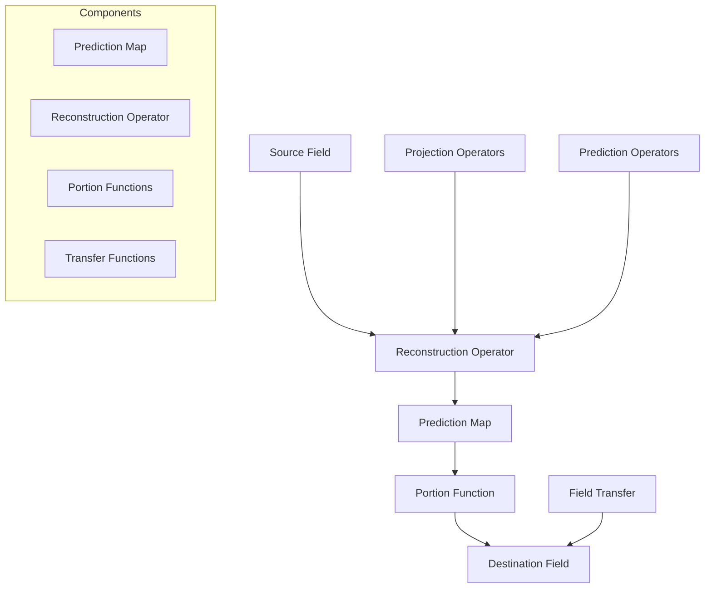
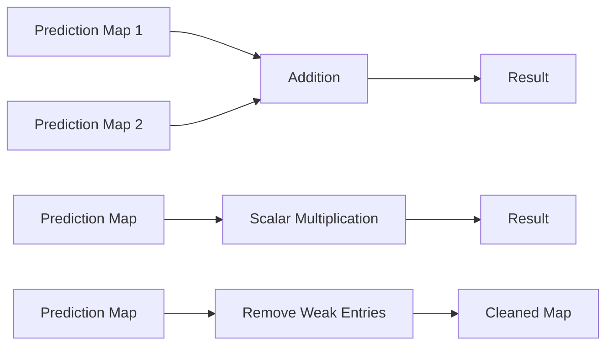
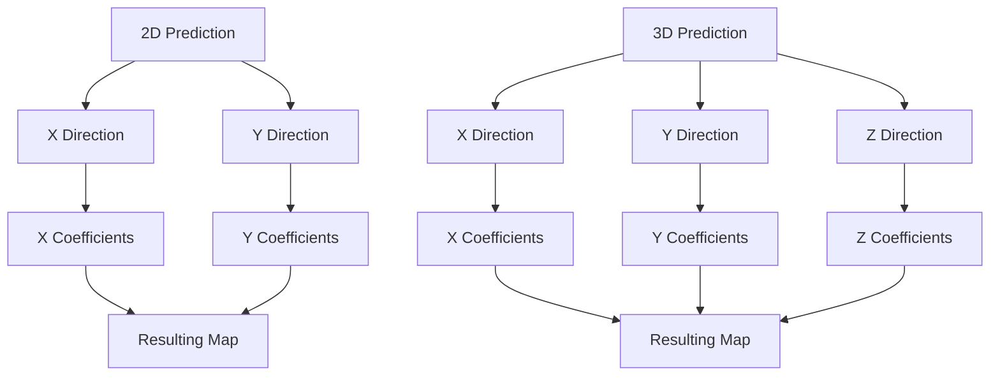
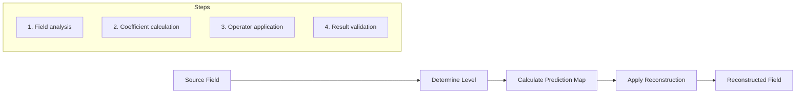
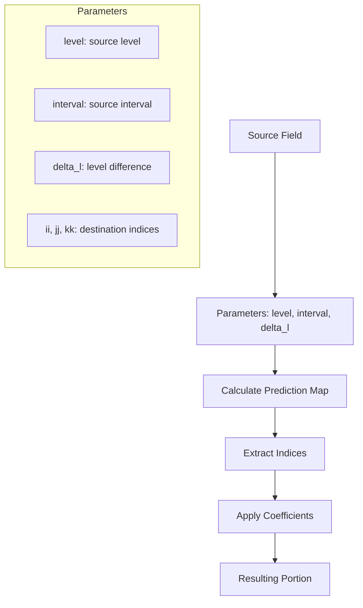
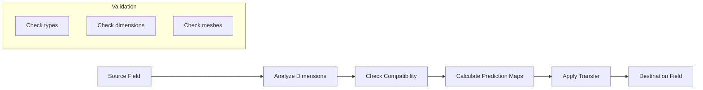
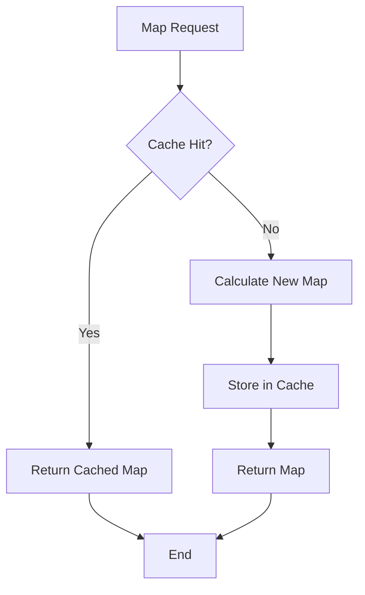

# Reconstruction System - Samurai

## Overview

Samurai's reconstruction system is a fundamental component for numerical simulations with adaptive mesh refinement (AMR). It allows reconstructing field values on different refinement levels using projection and prediction operators.

## System Architecture



## Prediction Maps

### Definition and Structure

Prediction maps are mathematical objects that encapsulate the interpolation coefficients necessary for reconstructing values on different refinement levels.

```cpp
template <std::size_t dim, class index_t = default_config::value_t>
class prediction_map
{
    std::map<std::array<index_t, dim>, double> coeff;
};
```

### Map Operations



### Usage Example

```cpp
// Creating a 1D prediction map
prediction_map<1> map1{{5}};  // Coefficient 1.0 at index 5
prediction_map<1> map2{{6}};  // Coefficient 1.0 at index 6

// Operations
auto result = map1 + map2;           // Addition
auto scaled = 2.0 * map1;            // Multiplication
map1.remove_small_entries(1e-10);    // Cleaning
```

## Prediction Functions

### 1D Prediction

```cpp
template <std::size_t order = 1, class index_t = default_config::value_t>
auto prediction(std::size_t level, index_t i) -> prediction_map<1, index_t>
```

**1D Prediction Algorithm:**

```mermaid
graph TD
    A[Level L, Index i] --> B{Level == 0?}
    B -->|Yes| C[Return Map with coefficient 1.0]
    B -->|No| D[Calculate ig = i >> 1]
    D --> E[Calculate sign = (i & 1) ? -1 : 1]
    E --> F[Recursion: prediction(level-1, ig)]
    F --> G[Calculate interpolation coefficients]
    G --> H[Apply interpolation]
    H --> I[Return resulting Map]
```

### 2D and 3D Prediction

```cpp
// 2D prediction
auto pred_2d = prediction<1>(level, i, j);

// 3D prediction  
auto pred_3d = prediction<1>(level, i, j, k);
```

**Multi-dimensional Prediction Structure:**



## Reconstruction Operator

### Definition

```cpp
template <std::size_t dim, class TInterval>
class reconstruction_op_ : public field_operator_base<dim, TInterval>
```

### Reconstruction Workflow



### Usage Example

```cpp
// Creating a reconstruction operator
auto reconstruct_level = 2;
auto reconstruct_field = make_field<double, 1>("reconstructed", mesh);
auto reconstruction_op = make_reconstruction(reconstruct_level, reconstruct_field, source_field);

// Application
reconstruction_op.apply();
```

## Portion Functions

### Concept

The `portion` functions allow extracting portions of fields on different refinement levels using prediction maps.

### Signatures Principales

```cpp
// Portion 1D
template <class Field>
auto portion(const Field& f, std::size_t level, 
             const typename Field::interval_t& i, 
             std::size_t delta_l, 
             typename Field::interval_t::value_t ii)

// Portion 2D
template <class Field>
auto portion(const Field& f, std::size_t level,
             const typename Field::interval_t& i,
             typename Field::interval_t::value_t j,
             std::size_t delta_l,
             typename Field::interval_t::value_t ii,
             typename Field::interval_t::value_t jj)

// Portion 3D
template <class Field>
auto portion(const Field& f, std::size_t level,
             const typename Field::interval_t& i,
             typename Field::interval_t::value_t j,
             typename Field::interval_t::value_t k,
             std::size_t delta_l,
             typename Field::interval_t::value_t ii,
             typename Field::interval_t::value_t jj,
             typename Field::interval_t::value_t kk)
```

### Portion Functions Workflow



### Usage Examples

```cpp
// Extract a 1D portion
auto portion_1d = portion(field, 2, interval_t{10, 20}, 1, 15);

// Extract a 2D portion
auto portion_2d = portion(field, 2, interval_t{10, 20}, 5, 1, 15, 3);

// Extract with specific prediction order
auto portion_high_order = portion<2>(field, 2, interval_t{10, 20}, 1, 15);
```

## Field Transfer

### Transfer Function

```cpp
template <class Field_src, class Field_dst>
void transfer(Field_src& field_src, Field_dst& field_dst)
```

### Transfer Workflow



### Transfer Example

```cpp
// Create fields
auto source_field = make_field<double, 1>("source", source_mesh);
auto dest_field = make_field<double, 1>("destination", dest_mesh);

// Transfer
transfer(source_field, dest_field);
```

## Optimizations and Performance

### Prediction Map Caching



### Memory Optimizations

```cpp
// Remove weak entries to save memory
prediction_map.remove_small_entries(1e-15);

// Use static cache for frequent maps
static std::map<std::tuple<std::size_t, std::size_t, index_t>, 
                prediction_map<1, index_t>> values;
```

## Advanced Use Cases

### Multi-level Reconstruction

```cpp
// Reconstruction on multiple levels
for (std::size_t level = min_level; level <= max_level; ++level)
{
    auto reconstruction_op = make_reconstruction(level, dest_field, source_field);
    reconstruction_op.apply();
}
```

### Reconstruction with Boundary Conditions

```cpp
// Reconstruction with boundary condition handling
auto reconstruction_op = make_reconstruction(level, dest_field, source_field);
reconstruction_op.set_bc(boundary_conditions);
reconstruction_op.apply();
```

### Parallel Reconstruction

```cpp
#ifdef SAMURAI_WITH_MPI
// Reconstruction with MPI synchronization
auto reconstruction_op = make_reconstruction(level, dest_field, source_field);
reconstruction_op.apply();
mpi::synchronize_ghosts(dest_field);
#endif
```

## Monitoring and Debugging

### Display Prediction Maps

```cpp
// Display a prediction map
std::cout << "Prediction map:" << std::endl;
prediction_map.to_stream(std::cout);

// Format: (index): coefficient
// Example: (5): 1.0
//         (6): 0.5
```

### Result Validation

```cpp
// Validate reconstruction
auto error = compute_reconstruction_error(source_field, reconstructed_field);
std::cout << "Reconstruction error: " << error << std::endl;

// Check conservation
auto conservation_error = check_conservation(source_field, reconstructed_field);
```

## AMR Integration

### Reconstruction in AMR Cycle


### Reconstruction with Graduation

```cpp
// Reconstruction after graduation
graduation(mesh);
auto reconstruction_op = make_reconstruction(level, dest_field, source_field);
reconstruction_op.apply();
```

## Complete Examples

### Example 1: Simple Reconstruction

```cpp
#include <samurai/reconstruction.hpp>

int main()
{
    // Create mesh
    auto mesh = make_mesh();
    
    // Create source field
    auto source_field = make_field<double, 1>("source", mesh);
    
    // Initialize
    samurai::for_each_cell(source_field, [&](auto& cell)
    {
        source_field[cell] = std::sin(cell.center(0));
    });
    
    // Reconstruction
    auto dest_field = make_field<double, 1>("destination", mesh);
    auto reconstruction_op = make_reconstruction(1, dest_field, source_field);
    reconstruction_op.apply();
    
    return 0;
}
```

### Example 2: Multi-level Reconstruction

```cpp
#include <samurai/reconstruction.hpp>

int main()
{
    // Configuration
    auto mesh = make_amr_mesh();
    auto source_field = make_field<double, 1>("source", mesh);
    
    // Reconstruction on all levels
    for (std::size_t level = mesh.min_level(); level <= mesh.max_level(); ++level)
    {
        auto dest_field = make_field<double, 1>("dest_" + std::to_string(level), mesh);
        auto reconstruction_op = make_reconstruction(level, dest_field, source_field);
        reconstruction_op.apply();
    }
    
    return 0;
}
```

### Example 3: Reconstruction with Monitoring

```cpp
#include <samurai/reconstruction.hpp>
#include <samurai/timers.hpp>

int main()
{
    // Timer for monitoring
    auto timer = samurai::Timer("reconstruction");
    
    // Reconstruction with monitoring
    timer.start();
    auto reconstruction_op = make_reconstruction(level, dest_field, source_field);
    reconstruction_op.apply();
    timer.stop();
    
    std::cout << "Reconstruction time: " << timer.elapsed() << " ms" << std::endl;
    
    return 0;
}
``` 