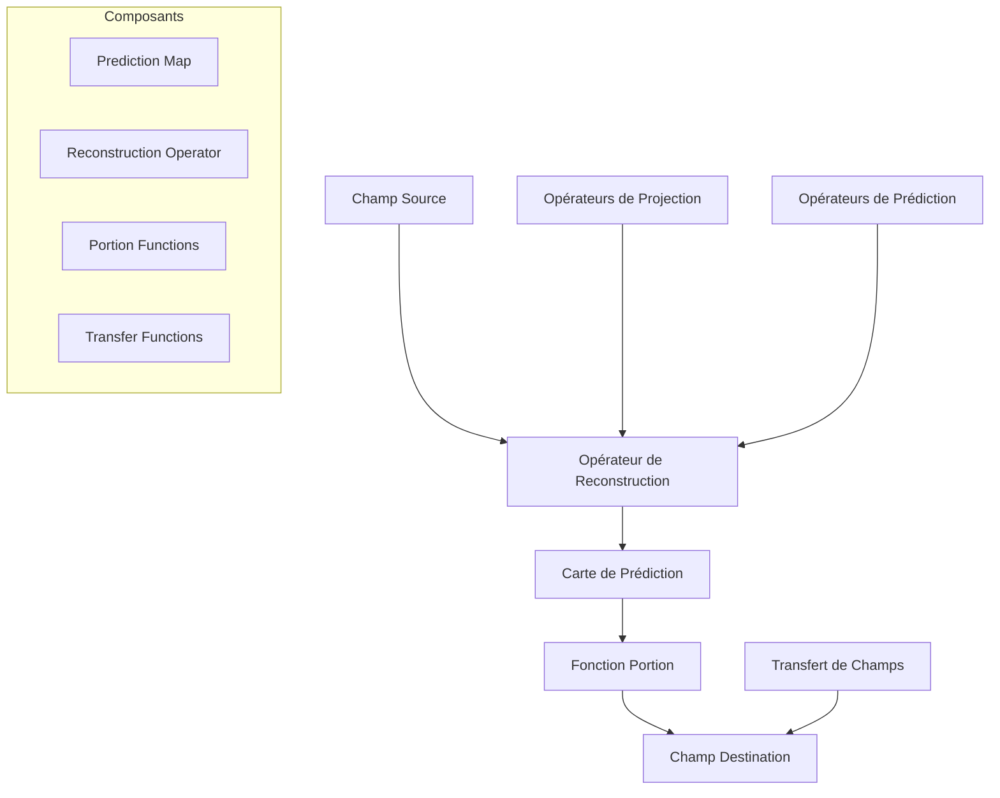
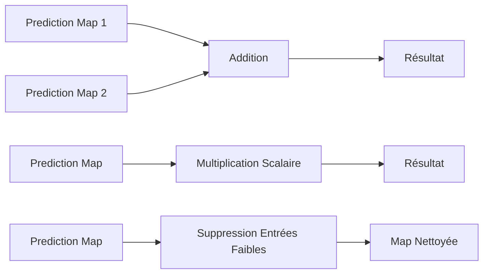
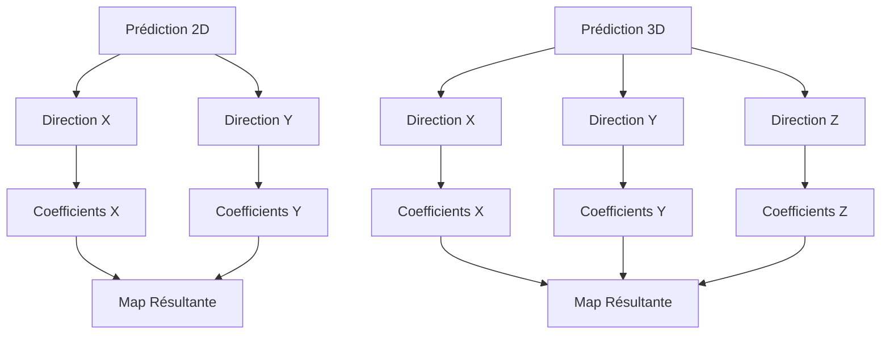
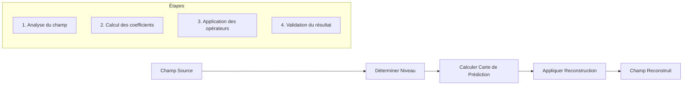
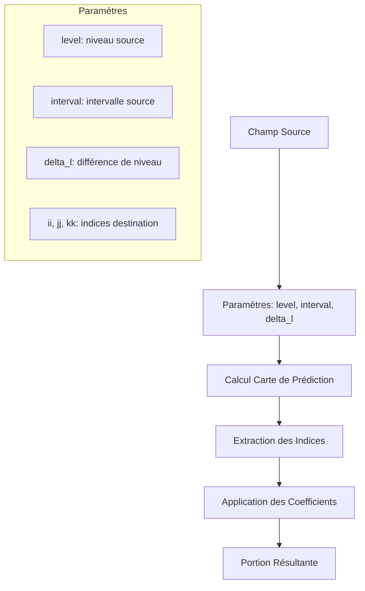
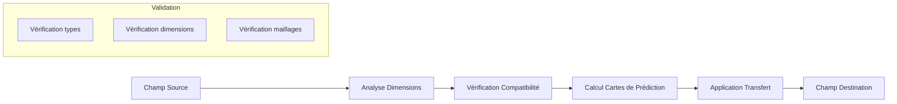
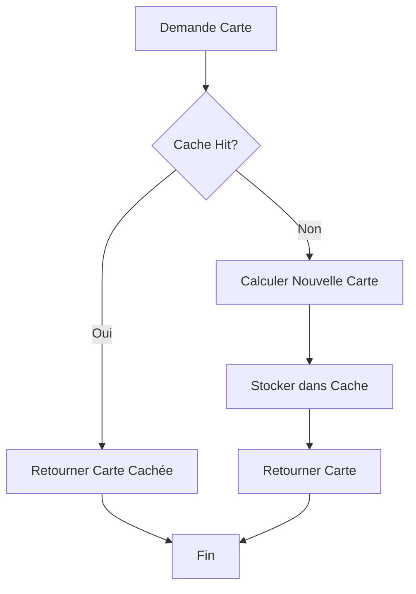

# Système de Reconstruction - Samurai

## Vue d'ensemble

Le système de reconstruction de Samurai est un composant fondamental pour les simulations numériques avec raffinement adaptatif de maillage (AMR). Il permet de reconstruire des valeurs de champs sur différents niveaux de raffinement en utilisant des opérateurs de projection et de prédiction.

## Architecture du Système



## Cartes de Prédiction (Prediction Maps)

### Définition et Structure

Les cartes de prédiction sont des objets mathématiques qui encapsulent les coefficients d'interpolation nécessaires pour reconstruire des valeurs sur différents niveaux de raffinement.

```cpp
template <std::size_t dim, class index_t = default_config::value_t>
class prediction_map
{
    std::map<std::array<index_t, dim>, double> coeff;
};
```

### Opérations sur les Cartes



### Exemple d'Utilisation

```cpp
// Création d'une carte de prédiction 1D
prediction_map<1> map1{{5}};  // Coefficient 1.0 à l'index 5
prediction_map<1> map2{{6}};  // Coefficient 1.0 à l'index 6

// Opérations
auto result = map1 + map2;           // Addition
auto scaled = 2.0 * map1;            // Multiplication
map1.remove_small_entries(1e-10);    // Nettoyage
```

## Fonctions de Prédiction

### Prédiction 1D

```cpp
template <std::size_t order = 1, class index_t = default_config::value_t>
auto prediction(std::size_t level, index_t i) -> prediction_map<1, index_t>
```

**Algorithme de Prédiction 1D :**

```mermaid
graph TD
    A[Level L, Index i] --> B{Level == 0?}
    B -->|Oui| C[Retourner Map avec coefficient 1.0]
    B -->|Non| D[Calculer ig = i >> 1]
    D --> E[Calculer sign = (i & 1) ? -1 : 1]
    E --> F[Récursion: prediction(level-1, ig)]
    F --> G[Calculer coefficients d'interpolation]
    G --> H[Appliquer interpolation]
    H --> I[Retourner Map résultante]
```

### Prédiction 2D et 3D

```cpp
// Prédiction 2D
auto pred_2d = prediction<1>(level, i, j);

// Prédiction 3D  
auto pred_3d = prediction<1>(level, i, j, k);
```

**Structure de Prédiction Multi-dimensionnelle :**



## Opérateur de Reconstruction

### Définition

```cpp
template <std::size_t dim, class TInterval>
class reconstruction_op_ : public field_operator_base<dim, TInterval>
```

### Workflow de Reconstruction



### Exemple d'Utilisation

```cpp
// Création d'un opérateur de reconstruction
auto reconstruct_level = 2;
auto reconstruct_field = make_field<double, 1>("reconstructed", mesh);
auto reconstruction_op = make_reconstruction(reconstruct_level, reconstruct_field, source_field);

// Application
reconstruction_op.apply();
```

## Fonctions Portion

### Concept

Les fonctions `portion` permettent d'extraire des portions de champs sur différents niveaux de raffinement en utilisant les cartes de prédiction.

### Signatures Principales

```cpp
// Portion 1D
template <class Field>
auto portion(const Field& f, std::size_t level, 
             const typename Field::interval_t& i, 
             std::size_t delta_l, 
             typename Field::interval_t::value_t ii)

// Portion 2D
template <class Field>
auto portion(const Field& f, std::size_t level,
             const typename Field::interval_t& i,
             typename Field::interval_t::value_t j,
             std::size_t delta_l,
             typename Field::interval_t::value_t ii,
             typename Field::interval_t::value_t jj)

// Portion 3D
template <class Field>
auto portion(const Field& f, std::size_t level,
             const typename Field::interval_t& i,
             typename Field::interval_t::value_t j,
             typename Field::interval_t::value_t k,
             std::size_t delta_l,
             typename Field::interval_t::value_t ii,
             typename Field::interval_t::value_t jj,
             typename Field::interval_t::value_t kk)
```

### Workflow des Fonctions Portion



### Exemples d'Utilisation

```cpp
// Extraction d'une portion 1D
auto portion_1d = portion(field, 2, interval_t{10, 20}, 1, 15);

// Extraction d'une portion 2D
auto portion_2d = portion(field, 2, interval_t{10, 20}, 5, 1, 15, 3);

// Extraction avec ordre de prédiction spécifique
auto portion_high_order = portion<2>(field, 2, interval_t{10, 20}, 1, 15);
```

## Transfert de Champs

### Fonction de Transfert

```cpp
template <class Field_src, class Field_dst>
void transfer(Field_src& field_src, Field_dst& field_dst)
```

### Workflow de Transfert



### Exemple de Transfert

```cpp
// Création des champs
auto source_field = make_field<double, 1>("source", source_mesh);
auto dest_field = make_field<double, 1>("destination", dest_mesh);

// Transfert
transfer(source_field, dest_field);
```

## Optimisations et Performance

### Cache des Cartes de Prédiction



### Optimisations Mémoire

```cpp
// Suppression des entrées faibles pour économiser la mémoire
prediction_map.remove_small_entries(1e-15);

// Utilisation de cache statique pour les cartes fréquentes
static std::map<std::tuple<std::size_t, std::size_t, index_t>, 
                prediction_map<1, index_t>> values;
```

## Cas d'Usage Avancés

### Reconstruction Multi-niveaux

```cpp
// Reconstruction sur plusieurs niveaux
for (std::size_t level = min_level; level <= max_level; ++level)
{
    auto reconstruction_op = make_reconstruction(level, dest_field, source_field);
    reconstruction_op.apply();
}
```

### Reconstruction avec Conditions aux Limites

```cpp
// Reconstruction avec gestion des conditions aux limites
auto reconstruction_op = make_reconstruction(level, dest_field, source_field);
reconstruction_op.set_bc(boundary_conditions);
reconstruction_op.apply();
```

### Reconstruction Parallèle

```cpp
#ifdef SAMURAI_WITH_MPI
// Reconstruction avec synchronisation MPI
auto reconstruction_op = make_reconstruction(level, dest_field, source_field);
reconstruction_op.apply();
mpi::synchronize_ghosts(dest_field);
#endif
```

## Monitoring et Debugging

### Affichage des Cartes de Prédiction

```cpp
// Affichage d'une carte de prédiction
std::cout << "Prediction map:" << std::endl;
prediction_map.to_stream(std::cout);

// Format: (index): coefficient
// Exemple: (5): 1.0
//         (6): 0.5
```

### Validation des Résultats

```cpp
// Validation de la reconstruction
auto error = compute_reconstruction_error(source_field, reconstructed_field);
std::cout << "Reconstruction error: " << error << std::endl;

// Vérification de la conservation
auto conservation_error = check_conservation(source_field, reconstructed_field);
```

## Intégration avec AMR

### Reconstruction dans le Cycle AMR


### Reconstruction avec Graduation

```cpp
// Reconstruction après graduation
graduation(mesh);
auto reconstruction_op = make_reconstruction(level, dest_field, source_field);
reconstruction_op.apply();
```

## Exemples Complets

### Exemple 1: Reconstruction Simple

```cpp
#include <samurai/reconstruction.hpp>

int main()
{
    // Création du maillage
    auto mesh = make_mesh();
    
    // Création du champ source
    auto source_field = make_field<double, 1>("source", mesh);
    
    // Initialisation
    samurai::for_each_cell(source_field, [&](auto& cell)
    {
        source_field[cell] = std::sin(cell.center(0));
    });
    
    // Reconstruction
    auto dest_field = make_field<double, 1>("destination", mesh);
    auto reconstruction_op = make_reconstruction(1, dest_field, source_field);
    reconstruction_op.apply();
    
    return 0;
}
```

### Exemple 2: Reconstruction Multi-niveaux

```cpp
#include <samurai/reconstruction.hpp>

int main()
{
    // Configuration
    auto mesh = make_amr_mesh();
    auto source_field = make_field<double, 1>("source", mesh);
    
    // Reconstruction sur tous les niveaux
    for (std::size_t level = mesh.min_level(); level <= mesh.max_level(); ++level)
    {
        auto dest_field = make_field<double, 1>("dest_" + std::to_string(level), mesh);
        auto reconstruction_op = make_reconstruction(level, dest_field, source_field);
        reconstruction_op.apply();
    }
    
    return 0;
}
```

### Exemple 3: Reconstruction avec Monitoring

```cpp
#include <samurai/reconstruction.hpp>
#include <samurai/timers.hpp>

int main()
{
    // Timer pour monitoring
    auto timer = samurai::Timer("reconstruction");
    
    // Reconstruction avec monitoring
    timer.start();
    auto reconstruction_op = make_reconstruction(level, dest_field, source_field);
    reconstruction_op.apply();
    timer.stop();
    
    std::cout << "Reconstruction time: " << timer.elapsed() << " ms" << std::endl;
    
    return 0;
}
```

## Conclusion

Le système de reconstruction de Samurai fournit un ensemble complet d'outils pour la reconstruction de champs sur des maillages multi-niveaux. Il combine efficacité numérique, flexibilité d'utilisation et intégration transparente avec le système AMR.

Les cartes de prédiction, les opérateurs de reconstruction et les fonctions portion constituent une base solide pour les simulations numériques avancées avec raffinement adaptatif de maillage. 