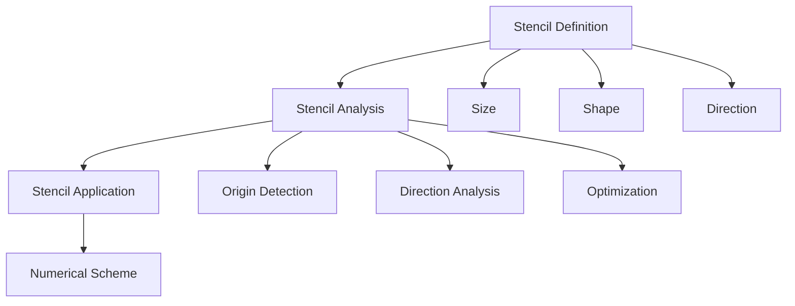
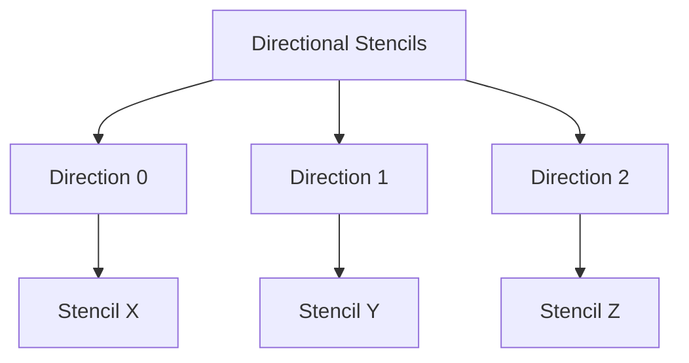
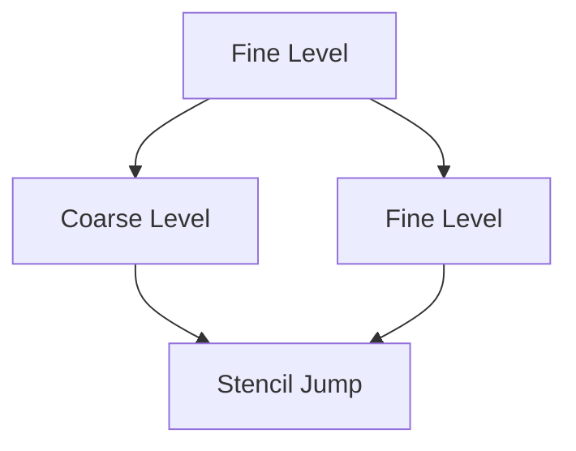
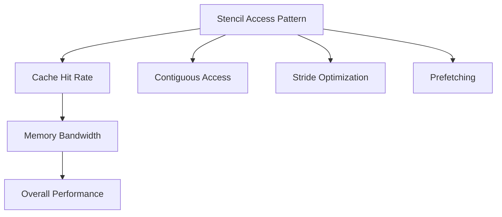

# Stencil System and Numerical Operators

## Introduction

The Samurai stencil system is a fundamental component for the discretization of differential operators. It provides a flexible and efficient interface to define and manipulate stencils of various sizes and shapes, essential for numerical schemes.

## System Overview

### Stencil Definition

A stencil is a set of grid points used to approximate derivatives or differential operators.



### Types of Stencils

#### 1. Star Stencil

```cpp
template <std::size_t dim, std::size_t neighbourhood_width = 1>
constexpr Stencil<1 + 2 * dim * neighbourhood_width, dim> star_stencil()
```

**Visual Schema 1D :**
```
Neighbourhood = 1:  [L][C][R]
Neighbourhood = 2: [L2][L][C][R][R2]

L = Left, C = Center, R = Right
```

**Visual Schema 2D :**
```
Neighbourhood = 1:
    [ ][T][ ]
    [L][C][R]
    [ ][B][ ]

Neighbourhood = 2:
[T2][ ][T2]
[ ][T][ ]
[L2][L][C][R][R2]
[ ][B][ ]
[B2][ ][B2]

T = Top, B = Bottom, L = Left, R = Right
```

**Visual Schema 3D :**
```
Neighbourhood = 1:
    [ ][T][ ]
    [L][C][R]
    [ ][B][ ]
    
    [ ][F][ ]
    [L][C][R]
    [ ][K][ ]

F = Front, K = Back
```

#### 2. Linear Stencil

```cpp
template <std::size_t dim, std::size_t d, class... Ints>
auto line_stencil(Ints... neighbours)
```

**Example :**
```cpp
// Linear stencil 1D with 5 points
auto stencil = line_stencil<1, 0>(-2, -1, 0, 1, 2);
```

**Visual Schema :**
```
[-2][-1][0][1][2]
```

#### 3. Cartesian Stencil

```cpp
template <std::size_t dim>
constexpr Stencil<2 * dim, dim> cartesian_directions()
```

**Visual Schema 2D :**
```
    [ ][T][ ]
    [L][C][R]
    [ ][B][ ]

Directions: {0,1}, {0,-1}, {1,0}, {-1,0}
```

## Stencil Analysis

### StencilAnalyzer

```cpp
template <std::size_t stencil_size, std::size_t dim>
struct StencilAnalyzer
{
    std::size_t origin_index = 0;
    bool has_origin = false;
    std::array<bool, stencil_size> same_row_as_origin;
    Stencil<stencil_size, dim> stencil;
};
```

**Features :**
- Automatic origin detection (central point)
- Cartesian direction analysis
- Optimization for vectorized operations

### Example Analysis

```cpp
auto stencil = star_stencil<2, 1>();
auto analyzer = make_stencil_analyzer(stencil);

// Check if the stencil has an origin
if (analyzer.has_origin) {
    std::cout << "Origin index: " << analyzer.origin_index << std::endl;
}
```

## Pre-defined Stencils

### 1. Central Stencil

```cpp
template <std::size_t dim>
constexpr Stencil<1, dim> center_only_stencil()
```

**Usage:** For local operations (no neighbors).

### 2. In/Out Stencil

```cpp
template <std::size_t dim, class Vector>
Stencil<2, dim> in_out_stencil(const Vector& towards_out_from_in)
```

**Usage:** For boundary conditions and fluxes.

### 3. Directional Stencils

```cpp
template <std::size_t dim, std::size_t neighbourhood_width = 1>
auto directional_stencils()
```

**Visual Schema:**


## Stencil Iterators

### IteratorStencil

```cpp
template <class Mesh, std::size_t stencil_size_>
class IteratorStencil
{
public:
    static constexpr std::size_t dim = Mesh::dim;
    static constexpr std::size_t stencil_size = stencil_size_;
    
private:
    const Mesh& m_mesh;
    StencilAnalyzer<stencil_size, dim> m_stencil_analyzer;
    std::array<cell_t, stencil_size> m_cells;
};
```

**Features:**
- Efficient iteration over stencils
- Automatic boundary handling
- Support for adaptive meshes

## Stencils for Numerical Schemes

### 1. Linear Convection (Upwind)

```cpp
template <class Field>
auto make_convection_upwind(const VelocityVector<Field::dim>& velocity)
{
    static constexpr std::size_t stencil_size = 2;
    // Stencil: [left, right]
}
```

**Visual Schema :**
```
Upwind positive: [C][R] → uses C
Upwind negative: [L][C] → uses C
```

### 2. WENO5 Convection

```cpp
template <class Field>
auto make_convection_weno5(const VelocityVector<Field::dim>& velocity)
{
    static constexpr std::size_t stencil_size = 6;
    // Stencil: [-2, -1, 0, 1, 2, 3]
}
```

**Visual Schema :**
```
WENO5 positive: [-2][-1][0][1][2][3] → uses [0,1,2,3,4]
WENO5 negative: [-2][-1][0][1][2][3] → uses [5,4,3,2,1]
```

## Performance Optimizations

### 1. Static Stencils

```cpp
// Compile-time stencil definition
static constexpr auto stencil = star_stencil<2, 1>();
```

**Advantages :**
- Compile-time optimization
- No dynamic allocation
- Automatic vectorization

### 2. Directional Stencils


### 3. Adaptive Stencils

```cpp
// Adaptive stencil based on direction
auto stencil = convert_for_direction(base_stencil, direction);
```

## Advanced Use Cases

### 1. Multi-level Stencils

```cpp
template <std::size_t index_coarse_cell, class Mesh, std::size_t stencil_size>
class LevelJumpIterator
{
    // Iterator for stencils spanning multiple levels
};
```

**Visual Schema :**


## Practical Examples

### Example 1: Simple Stencil

```cpp
#include <samurai/stencil.hpp>

int main() {
    // Create a 2D star stencil
    auto stencil = samurai::star_stencil<2, 1>();
    
    // Analyze the stencil
    auto analyzer = samurai::make_stencil_analyzer(stencil);
    
    // Display information
    std::cout << "Stencil size: " << stencil.shape()[0] << std::endl;
    std::cout << "Has origin: " << analyzer.has_origin << std::endl;
    
    return 0;
}
```

### Example 2: Stencil for Numerical Scheme

```cpp
#include <samurai/stencil.hpp>
#include <samurai/schemes/fv/operators/convection_lin.hpp>

int main() {
    // Create a field
    auto field = samurai::make_scalar_field<double>("u", mesh);
    
    // Define velocity
    samurai::VelocityVector<2> velocity{1.0, 0.0};
    
    // Create convection scheme
    auto scheme = samurai::make_convection_upwind(velocity);
    
    // Apply scheme
    auto result = scheme.apply(field);
    
    return 0;
}
```

### Example 3: Custom Stencil

```cpp
// Create a custom stencil
samurai::Stencil<5, 2> custom_stencil;
custom_stencil = {
    {-1, -1}, {0, -1}, {1, -1},
    {-1,  0}, {0,  0}, {1,  0},
    {-1,  1}, {0,  1}, {1,  1}
};

// Analyze the stencil
auto analyzer = samurai::make_stencil_analyzer(custom_stencil);

// Use in an operator
samurai::for_each_stencil(mesh, custom_stencil, [&](const auto& cells) {
    // Custom processing
});
```

## Monitoring and Validation

### Stencil Validation

```cpp
// Check if it's a linear stencil
bool is_line = samurai::is_line_stencil(stencil);
```

### Performance Analysis

```cpp
// Measure stencil performance
samurai::times::timers.start("stencil_application");
samurai::for_each_stencil(mesh, stencil, [&](const auto& cells) {
    // Stencil application
});
samurai::times::timers.stop("stencil_application");

auto stats = samurai::times::timers.get("stencil_application");
std::cout << "Stencil time: " << stats.total_time << "s" << std::endl;
```

## Advanced Considerations

### 1. Stencils and Cache



### 2. Stencils and Parallelism

```cpp
// Stencil with OpenMP
#pragma omp parallel for
samurai::for_each_stencil(mesh, stencil, [&](const auto& cells) {
    // Parallel processing
});
```

## Conclusion

The Samurai stencil system offers:

- **Flexibility** to define complex stencils
- **Performance** through compile-time optimizations
- **Simplicity** with pre-defined stencils
- **Extensibility** for advanced use cases

Stencils are at the heart of Samurai's numerical schemes, enabling precise and efficient discretization of differential operators on adaptive meshes. 