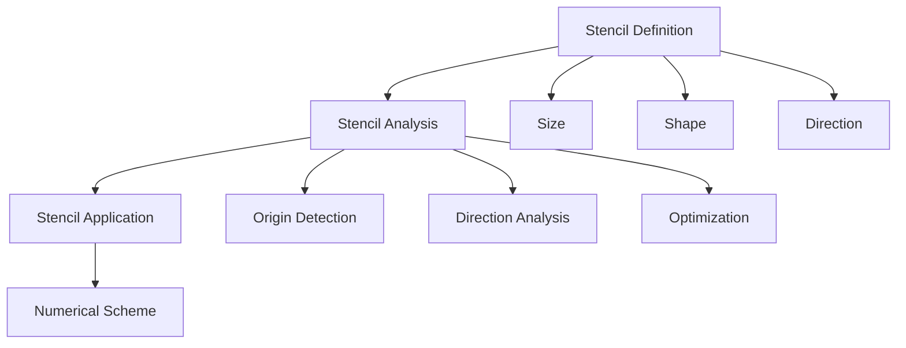
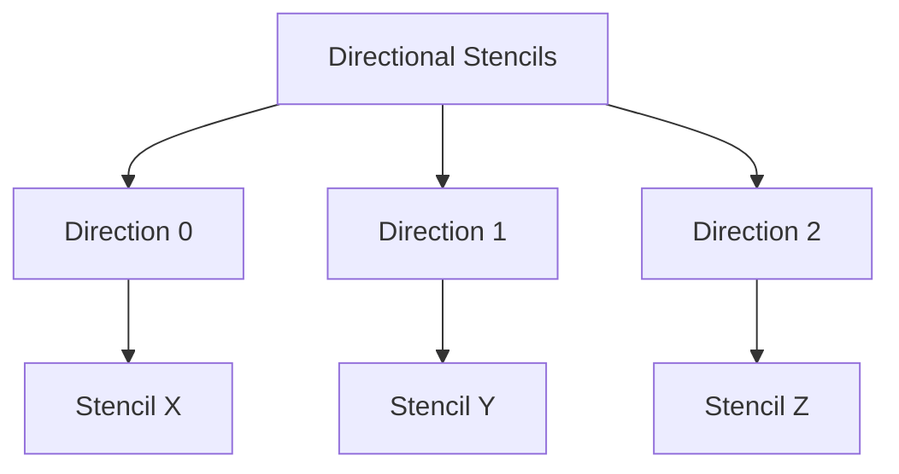
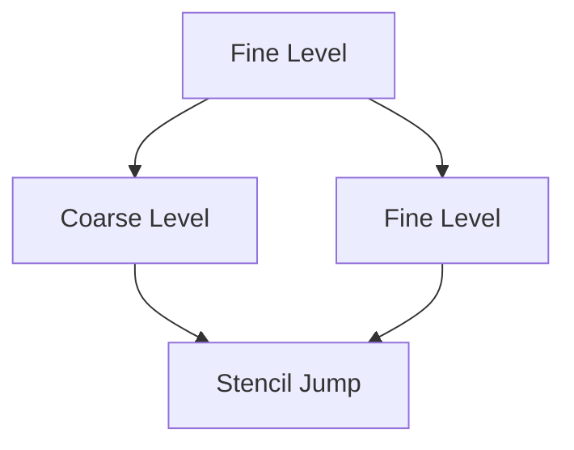
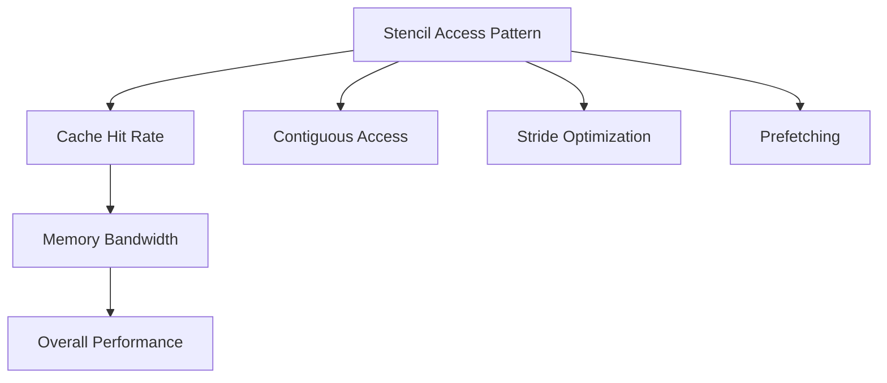

# Stencil System and Numerical Operators

## Introduction

Le système de stencils de Samurai est un composant fondamental pour la discrétisation des opérateurs différentiels. Il fournit une interface flexible et performante pour définir et manipuler des stencils de différentes tailles et formes, essentiels pour les schémas numériques.

## Vue d'Ensemble du Système

### Définition d'un Stencil

Un stencil est un ensemble de points de grille utilisés pour approximer des dérivées ou des opérateurs différentiels.



### Types de Stencils

#### 1. Stencil en Étoile (Star Stencil)

```cpp
template <std::size_t dim, std::size_t neighbourhood_width = 1>
constexpr Stencil<1 + 2 * dim * neighbourhood_width, dim> star_stencil()
```

**Schéma Visuel 1D :**
```
Neighbourhood = 1:  [L][C][R]
Neighbourhood = 2: [L2][L][C][R][R2]

L = Left, C = Center, R = Right
```

**Schéma Visuel 2D :**
```
Neighbourhood = 1:
    [ ][T][ ]
    [L][C][R]
    [ ][B][ ]

Neighbourhood = 2:
[T2][ ][T2]
[ ][T][ ]
[L2][L][C][R][R2]
[ ][B][ ]
[B2][ ][B2]

T = Top, B = Bottom, L = Left, R = Right
```

**Schéma Visuel 3D :**
```
Neighbourhood = 1:
    [ ][T][ ]
    [L][C][R]
    [ ][B][ ]
    
    [ ][F][ ]
    [L][C][R]
    [ ][K][ ]

F = Front, K = Back
```

#### 2. Stencil Linéaire (Line Stencil)

```cpp
template <std::size_t dim, std::size_t d, class... Ints>
auto line_stencil(Ints... neighbours)
```

**Exemple :**
```cpp
// Stencil linéaire 1D avec 5 points
auto stencil = line_stencil<1, 0>(-2, -1, 0, 1, 2);
```

**Schéma Visuel :**
```
[-2][-1][0][1][2]
```

#### 3. Stencil Cartésien

```cpp
template <std::size_t dim>
constexpr Stencil<2 * dim, dim> cartesian_directions()
```

**Schéma Visuel 2D :**
```
    [ ][T][ ]
    [L][C][R]
    [ ][B][ ]

Directions: {0,1}, {0,-1}, {1,0}, {-1,0}
```

## Analyse de Stencil

### StencilAnalyzer

```cpp
template <std::size_t stencil_size, std::size_t dim>
struct StencilAnalyzer
{
    std::size_t origin_index = 0;
    bool has_origin = false;
    std::array<bool, stencil_size> same_row_as_origin;
    Stencil<stencil_size, dim> stencil;
};
```

**Fonctionnalités :**
- Détection automatique de l'origine (point central)
- Analyse des directions cartésiennes
- Optimisation pour les opérations vectorisées

### Exemple d'Analyse

```cpp
auto stencil = star_stencil<2, 1>();
auto analyzer = make_stencil_analyzer(stencil);

// Vérifier si le stencil a une origine
if (analyzer.has_origin) {
    std::cout << "Origin index: " << analyzer.origin_index << std::endl;
}
```

## Stencils Prédéfinis

### 1. Stencil Central

```cpp
template <std::size_t dim>
constexpr Stencil<1, dim> center_only_stencil()
```

**Utilisation :** Pour les opérations locales (pas de voisins).

### 2. Stencil In/Out

```cpp
template <std::size_t dim, class Vector>
Stencil<2, dim> in_out_stencil(const Vector& towards_out_from_in)
```

**Utilisation :** Pour les conditions aux limites et les flux.

### 3. Stencils Directionnels

```cpp
template <std::size_t dim, std::size_t neighbourhood_width = 1>
auto directional_stencils()
```

**Schéma Visuel :**


## Itérateurs de Stencil

### IteratorStencil

```cpp
template <class Mesh, std::size_t stencil_size_>
class IteratorStencil
{
public:
    static constexpr std::size_t dim = Mesh::dim;
    static constexpr std::size_t stencil_size = stencil_size_;
    
private:
    const Mesh& m_mesh;
    StencilAnalyzer<stencil_size, dim> m_stencil_analyzer;
    std::array<cell_t, stencil_size> m_cells;
};
```

**Fonctionnalités :**
- Itération efficace sur les stencils
- Gestion automatique des frontières
- Support pour les maillages adaptatifs

### Exemple d'Utilisation

```cpp
auto stencil = star_stencil<2, 1>();
auto analyzer = make_stencil_analyzer(stencil);
auto iterator = make_stencil_iterator(mesh, analyzer);

for_each_stencil(mesh, iterator, [&](const auto& stencil_cells) {
    // Traitement du stencil
    auto center_value = field[stencil_cells[analyzer.origin_index]];
    // ...
});
```

## Stencils pour Schémas Numériques

### 1. Convection Linéaire (Upwind)

```cpp
template <class Field>
auto make_convection_upwind(const VelocityVector<Field::dim>& velocity)
{
    static constexpr std::size_t stencil_size = 2;
    // Stencil: [left, right]
}
```

**Schéma Visuel :**
```
Upwind positif: [C][R] → utilise C
Upwind négatif: [L][C] → utilise C
```

### 2. Convection WENO5

```cpp
template <class Field>
auto make_convection_weno5(const VelocityVector<Field::dim>& velocity)
{
    static constexpr std::size_t stencil_size = 6;
    // Stencil: [-2, -1, 0, 1, 2, 3]
}
```

**Schéma Visuel :**
```
WENO5 positif: [-2][-1][0][1][2][3] → utilise [0,1,2,3,4]
WENO5 négatif: [-2][-1][0][1][2][3] → utilise [5,4,3,2,1]
```

## Optimisations de Performance

### 1. Stencils Statiques

```cpp
// Compile-time stencil definition
static constexpr auto stencil = star_stencil<2, 1>();
```

**Avantages :**
- Optimisation compile-time
- Pas d'allocation dynamique
- Vectorisation automatique

### 2. Stencils Directionnels


### 3. Stencils Adaptatifs

```cpp
// Stencil adaptatif selon la direction
auto stencil = convert_for_direction(base_stencil, direction);
```

## Cas d'Usage Avancés

### 1. Stencils Multi-niveaux

```cpp
template <std::size_t index_coarse_cell, class Mesh, std::size_t stencil_size>
class LevelJumpIterator
{
    // Itérateur pour stencils traversant plusieurs niveaux
};
```

**Schéma Visuel :**


### 2. Stencils Non-Uniformes

```cpp
// Stencil avec espacement variable
auto non_uniform_stencil = create_non_uniform_stencil(spacing);
```

### 3. Stencils Anisotropes

```cpp
// Stencil avec résolution différente selon les directions
auto anisotropic_stencil = create_anisotropic_stencil(resolution);
```

## Exemples Pratiques

### Exemple 1: Stencil Simple

```cpp
#include <samurai/stencil.hpp>

int main() {
    // Créer un stencil en étoile 2D
    auto stencil = samurai::star_stencil<2, 1>();
    
    // Analyser le stencil
    auto analyzer = samurai::make_stencil_analyzer(stencil);
    
    // Afficher les informations
    std::cout << "Stencil size: " << stencil.shape()[0] << std::endl;
    std::cout << "Has origin: " << analyzer.has_origin << std::endl;
    
    return 0;
}
```

### Exemple 2: Stencil pour Schéma Numérique

```cpp
#include <samurai/stencil.hpp>
#include <samurai/schemes/fv/operators/convection_lin.hpp>

int main() {
    // Créer un champ
    auto field = samurai::make_scalar_field<double>("u", mesh);
    
    // Définir la vitesse
    samurai::VelocityVector<2> velocity{1.0, 0.0};
    
    // Créer le schéma de convection
    auto scheme = samurai::make_convection_upwind(velocity);
    
    // Appliquer le schéma
    auto result = scheme.apply(field);
    
    return 0;
}
```

### Exemple 3: Stencil Personnalisé

```cpp
// Créer un stencil personnalisé
samurai::Stencil<5, 2> custom_stencil;
custom_stencil = {
    {-1, -1}, {0, -1}, {1, -1},
    {-1,  0}, {0,  0}, {1,  0},
    {-1,  1}, {0,  1}, {1,  1}
};

// Analyser le stencil
auto analyzer = samurai::make_stencil_analyzer(custom_stencil);

// Utiliser dans un opérateur
samurai::for_each_stencil(mesh, custom_stencil, [&](const auto& cells) {
    // Traitement personnalisé
});
```

## Monitoring et Validation

### Vérification de Stencil

```cpp
// Vérifier si un stencil est valide
bool is_valid = samurai::is_valid_stencil(stencil);

// Vérifier si c'est un stencil linéaire
bool is_line = samurai::is_line_stencil(stencil);
```

### Analyse de Performance

```cpp
// Mesurer les performances d'un stencil
samurai::times::timers.start("stencil_application");
samurai::for_each_stencil(mesh, stencil, [&](const auto& cells) {
    // Application du stencil
});
samurai::times::timers.stop("stencil_application");

auto stats = samurai::times::timers.get("stencil_application");
std::cout << "Stencil time: " << stats.total_time << "s" << std::endl;
```

## Considérations Avancées

### 1. Stencils et Cache



### 2. Stencils et Parallélisme

```cpp
// Stencil avec OpenMP
#pragma omp parallel for
samurai::for_each_stencil(mesh, stencil, [&](const auto& cells) {
    // Traitement parallèle
});
```

### 3. Stencils et GPU

```cpp
// Stencil optimisé pour GPU
auto gpu_stencil = create_gpu_optimized_stencil(stencil);
```

## Conclusion

Le système de stencils de Samurai offre :

- **Flexibilité** pour définir des stencils complexes
- **Performance** grâce aux optimisations compile-time
- **Simplicité** d'utilisation avec les stencils prédéfinis
- **Extensibilité** pour les cas d'usage avancés

Les stencils sont au cœur des schémas numériques de Samurai, permettant une discrétisation précise et efficace des opérateurs différentiels sur maillages adaptatifs. 