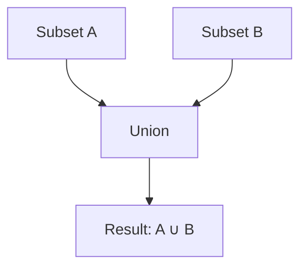
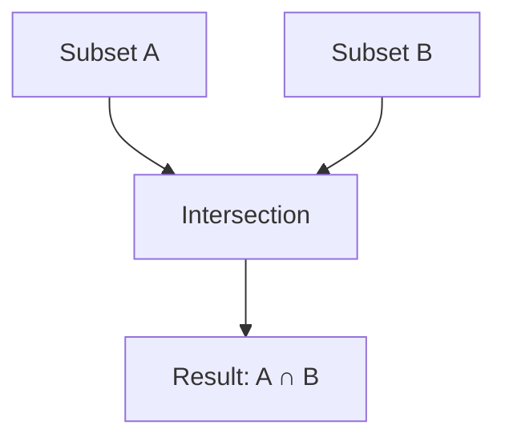
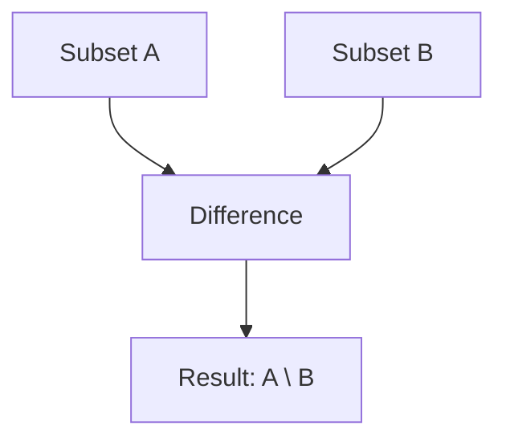
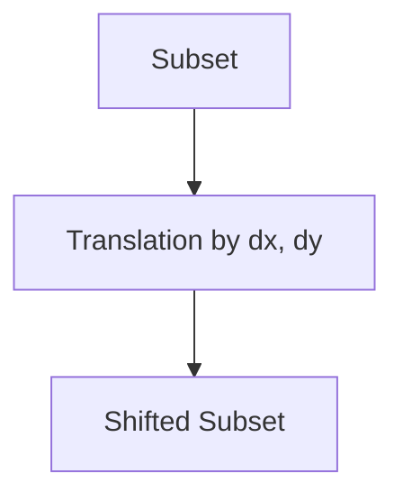

# Set Operations on Subsets

## Introduction

Samurai provides a powerful system for manipulating mesh subsets using set operations. These operations are essential for adaptive mesh refinement (AMR), boundary conditions, and localized computations.

## Supported Set Operations

- **Union**: Combine two subsets.
- **Intersection**: Find common cells between subsets.
- **Difference**: Subtract one subset from another.
- **Translation**: Shift a subset by a given offset (useful for stencils).

## Visual Schematics

### Union



### Intersection



### Difference



### Translation



## Example Code

```cpp
// Union
auto union_subset = subsetA | subsetB;

// Intersection
auto inter_subset = subsetA & subsetB;

// Difference
auto diff_subset = subsetA - subsetB;

// Translation
auto shifted = translate(subsetA, {1, 0});
```

## Use Cases in AMR

- Marking cells for refinement/coarsening.
- Defining ghost layers for boundary conditions.
- Localized application of operators.

## Performance Considerations

- Operations are implemented with efficient data structures.
- Translation is optimized for stencil-based algorithms.

## Conclusion

Set operations on subsets are a core feature for flexible and efficient AMR workflows in Samurai. 