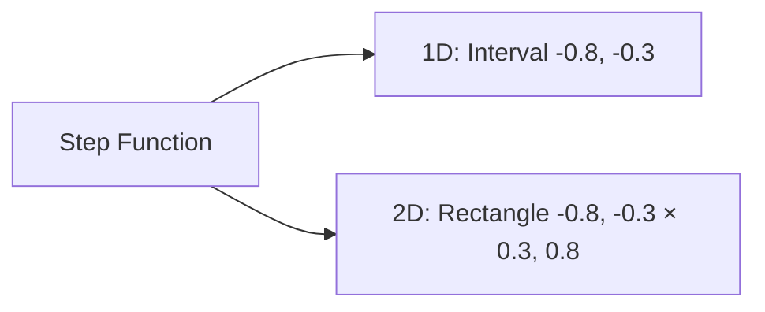
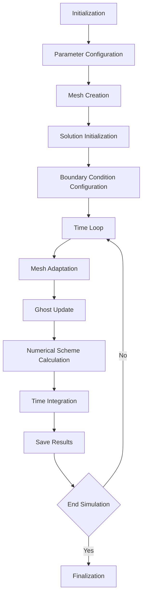

# Test Cases: 2D Advection, Linear Convection and Burgers - Samurai

## Overview

Samurai provides a comprehensive collection of test cases to validate numerical schemes on fundamental fluid mechanics equations: advection, linear convection, and the Burgers equation.

## 1. Test Case: 2D Advection

### Modeled Equation

The 2D advection equation is given by:

```
∂u/∂t + a₁∂u/∂x + a₂∂u/∂y = 0
```

where `u(x,y,t)` is the state variable and `a = (a₁, a₂)` is the constant velocity vector.

### Problem Configuration

```cpp
// Simulation parameters
constexpr std::size_t dim = 2;
xt::xtensor_fixed<double, xt::xshape<dim>> min_corner = {0., 0.};
xt::xtensor_fixed<double, xt::xshape<dim>> max_corner = {1., 1.};
std::array<double, dim> a = {1, 1};  // Diagonal velocity
double Tf = 0.1;                     // Final time
double cfl = 0.5;                    // Courant number
```

### Initial Condition


**Implementation:**

```cpp
template <class Field>
void init(Field& u)
{
    auto& mesh = u.mesh();
    u.resize();

    samurai::for_each_cell(mesh, [&](auto& cell)
    {
        auto center = cell.center();
        const double radius = 0.2;
        const double x_center = 0.3;
        const double y_center = 0.3;
        
        if (((center[0] - x_center) * (center[0] - x_center) + 
             (center[1] - y_center) * (center[1] - y_center)) <= radius * radius)
        {
            u[cell] = 1;
        }
        else
        {
            u[cell] = 0;
        }
    });
}
```

### Numerical Scheme

**Upwind Operator:**

```cpp
// Explicit upwind scheme
unp1 = u - dt * samurai::upwind(a, u);
```

**Multi-Level Flux Correction:**

```cpp
template <class Field>
void flux_correction(double dt, const std::array<double, 2>& a, 
                     const Field& u, Field& unp1)
{
    for (std::size_t level = mesh.min_level(); level < mesh.max_level(); ++level)
    {
        // X Direction
        auto subset_right = samurai::intersection(
            samurai::translate(mesh[mesh_id_t::cells][level + 1], {-1, 0}),
            mesh[mesh_id_t::cells][level]).on(level);
            
        subset_right([&](const auto& i, const auto& index)
        {
            auto j = index[0];
            const double dx = mesh.cell_length(level);
            unp1(level, i, j) = unp1(level, i, j) + dt/dx * 
                (samurai::upwind_op<dim, interval_t>(level, i, j).right_flux(a, u)
                 - 0.5 * samurai::upwind_op<dim, interval_t>(level + 1, 2*i+1, 2*j).right_flux(a, u)
                 - 0.5 * samurai::upwind_op<dim, interval_t>(level + 1, 2*i+1, 2*j+1).right_flux(a, u));
        });
    }
}
```

## 2. Test Case: Linear Convection

### Modeled Equation

The 2D linear convection equation:

```
∂u/∂t + v₁∂u/∂x + v₂∂u/∂y = 0
```

with `v = (v₁, v₂)` constant velocity vector.

### Problem Configuration

```cpp
// Simulation parameters
double left_box = -1;
double right_box = 1;
double Tf = 3;
double cfl = 0.95;

// Convection velocity
samurai::VelocityVector<dim> velocity;
velocity.fill(1);
if constexpr (dim == 2)
{
    velocity(1) = -1;  // Diagonal velocity
}
```

### Initial Condition



**Implementation:**

```cpp
// Initial condition
u = samurai::make_scalar_field<double>("u", mesh,
    [](const auto& coords)
    {
        if constexpr (dim == 1)
        {
            const auto& x = coords(0);
            return (x >= -0.8 && x <= -0.3) ? 1. : 0.;
        }
        else
        {
            const auto& x = coords(0);
            const auto& y = coords(1);
            return (x >= -0.8 && x <= -0.3 && 
                    y >= 0.3 && y <= 0.8) ? 1. : 0.;
        }
    });
```

### WENO5 Numerical Scheme

```cpp
// WENO5 convection operator
auto conv = samurai::make_convection_weno5<decltype(u)>(velocity);
```

**RK3 Time Integration:**

```cpp
// TVD-RK3 (SSPRK3)
u1 = u - dt * conv(u);
samurai::update_ghost_mr(u1);

u2 = 3./4 * u + 1./4 * (u1 - dt * conv(u1));
samurai::update_ghost_mr(u2);

unp1 = 1./3 * u + 2./3 * (u2 - dt * conv(u2));
```

### Periodic Boundary Conditions

```cpp
// Periodic conditions
std::array<bool, dim> periodic;
periodic.fill(true);
mesh = {box, min_level, max_level, periodic};
```

## 3. Test Case: Burgers Equation

### Modeled Equation

The vector Burgers equation:

```
∂u/∂t + ∇·(F(u)) = 0
```

where `F(u) = (1/2)u²` for the scalar equation and `F(u) = (1/2)u⊗u` for the vector equation.

### Problem Configuration

```cpp
// Simulation parameters
double left_box = -1;
double right_box = 1;
double Tf = 1.;
double cfl = 0.95;
std::string init_sol = "hat";  // hat/linear/bands

// Multiresolution configuration
std::size_t min_level = 0;
std::size_t max_level = dim == 1 ? 5 : 3;
double mr_epsilon = 1e-4;
double mr_regularity = 1.;
```

### Multiple Initial Conditions

#### 1. "Hat" Solution (Hat)

```cpp
if (init_sol == "hat")
{
    samurai::for_each_cell(mesh, [&](auto& cell)
    {
        const double max = 1;
        const double r = 0.5;
        
        double dist = 0;
        for (std::size_t d = 0; d < dim; ++d)
        {
            dist += std::pow(cell.center(d), 2);
        }
        dist = std::sqrt(dist);
        
        double value = (dist <= r) ? (-max/r * dist + max) : 0;
        u[cell] = value;
    });
}
```

#### 2. Linear Solution (Exact Solution)

```cpp
template <std::size_t n_comp, std::size_t dim>
auto exact_solution(xt::xtensor_fixed<double, xt::xshape<dim>> coords, double t)
{
    const double a = 1;
    const double b = 0;
    const double& x = coords(0);
    auto value = (a * x + b) / (a * t + 1);
    return samurai::CollapsArray<double, n_comp, false>(value);
}
```

#### 3. "Bands" Solution (Multi-Components)

```cpp
if (dim > 1 && n_comp > 1 && init_sol == "bands")
{
    samurai::for_each_cell(mesh, [&](auto& cell)
    {
        const double max = 2;
        for (std::size_t d = 0; d < dim; ++d)
        {
            if (cell.center(d) >= -0.5 && cell.center(d) <= 0)
            {
                u[cell][d] = 2 * max * cell.center(d) + max;
            }
            else if (cell.center(d) >= 0 && cell.center(d) <= 0.5)
            {
                u[cell][d] = -2 * max * cell.center(d) + max;
            }
            else
            {
                u[cell][d] = 0;
            }
        }
    });
}
```

### Numerical Scheme

**Non-Linear Convection Operator:**

```cpp
// Constant for Burgers equation
double cst = dim == 1 ? 0.5 : 1;  // f(u) = (1/2)*u² in 1D
auto conv = cst * samurai::make_convection_weno5<decltype(u)>();
```

**RK3 Time Integration:**

```cpp
// RK3 for Burgers
samurai::update_ghost_mr(u);
u1 = u - dt * conv(u);
samurai::update_ghost_mr(u1);

u2 = 3./4 * u + 1./4 * (u1 - dt * conv(u1));
samurai::update_ghost_mr(u2);

unp1 = 1./3 * u + 2./3 * (u2 - dt * conv(u2));
```

### Numerical Validation

**L2 Error Calculation:**

```cpp
if (init_sol == "linear")
{
    double error = samurai::L2_error(u,
        [&](const auto& coord)
        {
            return exact_solution<n_comp>(coord, t);
        });
    std::cout << ", L2-error: " << std::scientific << error;
    
    // Error with reconstruction
    if (mesh.min_level() != mesh.max_level())
    {
        samurai::update_ghost_mr(u);
        auto u_recons = samurai::reconstruction(u);
        error = samurai::L2_error(u_recons,
            [&](const auto& coord)
            {
                return exact_solution<n_comp>(coord, t);
            });
        std::cout << ", L2-error (recons): " << error;
    }
}
```

## 4. Test Case: Scalar Burgers 2D

### Specific Configuration

```cpp
// Specific parameters
constexpr size_t dim = 2;
std::array<double, 2> k = {sqrt(2.)/2., sqrt(2.)/2.};  // Diagonal direction
double Tf = 0.1;
double cfl = 0.05;  // More strict CFL for non-linearity
```

### Complex Initial Condition

```cpp
template <class Field>
void init(Field& u)
{
    auto mesh = u.mesh();
    u.resize();
    
    samurai::for_each_cell(mesh, [&](auto& cell)
    {
        auto center = cell.center();
        constexpr double radius = 0.1;
        
        // First disk (positive value)
        constexpr double x_center = 0.5;
        constexpr double y_center = 0.5;
        if (((center[0] - x_center) * (center[0] - x_center) + 
             (center[1] - y_center) * (center[1] - y_center)) <= radius * radius)
        {
            u[cell] = 1;
        }
        else
        {
            u[cell] = 0;
        }
        
        // Second disk (negative value)
        constexpr double x_center2 = 0.2;
        constexpr double y_center2 = 0.2;
        if (((center[0] - x_center2) * (center[0] - x_center2) + 
             (center[1] - y_center2) * (center[1] - y_center2)) <= radius * radius)
        {
            u[cell] = -1;
        }
    });
}
```

## 5. General Workflow for Test Cases

### Common Structure



### Typical Time Loop

```cpp
while (t != Tf)
{
    // Mesh adaptation
    MRadaptation(mr_epsilon, mr_regularity);
    
    // Update ghost cells
    samurai::update_ghost_mr(u);
    
    // Apply numerical scheme
    unp1 = u - dt * scheme(u);
    
    // Time integration (if necessary)
    // RK3, explicit Euler, etc.
    
    // Exchange fields
    std::swap(u.array(), unp1.array());
    
    // Periodic saving
    if (t >= save_time)
    {
        save(path, filename, u, suffix);
    }
}
```

## 6. Example Executions

### Compilation and Execution

```bash
# Compilation
mkdir build && cd build
cmake ..
make advection_2d linear_convection burgers scalar_burgers_2d

# Advection 2D Execution
./advection_2d --min-level 4 --max-level 8 --mr-eps 1e-4 --Tf 0.1

# Linear Convection Execution
./linear_convection --min-level 2 --max-level 6 --mr-eps 1e-4 --Tf 2.0

# Burgers Execution
./burgers --min-level 1 --max-level 5 --mr-eps 1e-4 --Tf 1.0 --init-sol hat

# Scalar Burgers 2D Execution
./scalar_burgers_2d --min-level 4 --max-level 8 --mr-eps 1e-4 --Tf 0.1
```

### Visualization with Python

```bash
# Visualization of results
python ../python/read_mesh.py burgers_ite_ --field u level --start 0 --end 50
```

## 7. Optimization Parameters

### Performance Parameters

```cpp
// Adaptation parameters
double mr_epsilon = 1e-4;     // Adaptation threshold (smaller = more precise)
double mr_regularity = 1.0;   // Estimated regularity

// Stability parameters
double cfl = 0.5;             // Courant number (0.5 for upwind, 0.95 for WENO)

// Output parameters
std::size_t nfiles = 50;      // Number of output files
```

## Conclusion

The test cases of 2D advection, linear convection, and Burgers in Samurai provide a complete validation of the implemented numerical schemes. They cover:

- **2D Advection** : Validation of upwind schemes and multi-level flux correction
- **Linear Convection** : Test of WENO5 schemes and RK3 time integration
- **Burgers Equation** : Validation of non-linear schemes and boundary conditions

These test cases serve as a reference for evaluating the accuracy, stability, and efficiency of numerical methods in Samurai on fundamental fluid mechanics problems. 