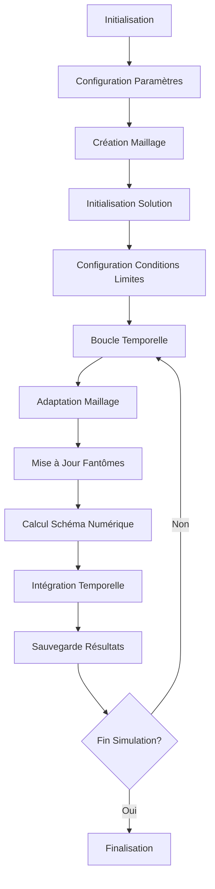

# Cas Tests : Advection 2D, Convection Linéaire et Burgers - Samurai

## Vue d'ensemble

Samurai propose une collection complète de cas tests pour valider les schémas numériques sur des équations fondamentales de la mécanique des fluides : l'advection, la convection linéaire et l'équation de Burgers.

## 1. Cas Test : Advection 2D

### Équation Modélisée

L'équation d'advection 2D est donnée par :

```
∂u/∂t + a₁∂u/∂x + a₂∂u/∂y = 0
```

où `u(x,y,t)` est la variable d'état et `a = (a₁, a₂)` est le vecteur vitesse constant.

### Configuration du Problème

```cpp
// Paramètres de simulation
constexpr std::size_t dim = 2;
xt::xtensor_fixed<double, xt::xshape<dim>> min_corner = {0., 0.};
xt::xtensor_fixed<double, xt::xshape<dim>> max_corner = {1., 1.};
std::array<double, dim> a = {1, 1};  // Vitesse diagonale
double Tf = 0.1;                     // Temps final
double cfl = 0.5;                    // Nombre de Courant
```

### Condition Initiale

```mermaid
graph LR
    A[Disque Centré] --> B[Rayon 0.2]
    B --> C[Centre (0.3, 0.3)]
    C --> D[Valeur 1.0 à l'intérieur]
    D --> E[Valeur 0.0 à l'extérieur]
```

**Implémentation :**

```cpp
template <class Field>
void init(Field& u)
{
    auto& mesh = u.mesh();
    u.resize();

    samurai::for_each_cell(mesh, [&](auto& cell)
    {
        auto center = cell.center();
        const double radius = 0.2;
        const double x_center = 0.3;
        const double y_center = 0.3;
        
        if (((center[0] - x_center) * (center[0] - x_center) + 
             (center[1] - y_center) * (center[1] - y_center)) <= radius * radius)
        {
            u[cell] = 1;
        }
        else
        {
            u[cell] = 0;
        }
    });
}
```

### Schéma Numérique

**Opérateur Upwind :**

```cpp
// Schéma upwind explicite
unp1 = u - dt * samurai::upwind(a, u);
```

**Correction de Flux Multi-Niveaux :**

```cpp
template <class Field>
void flux_correction(double dt, const std::array<double, 2>& a, 
                     const Field& u, Field& unp1)
{
    for (std::size_t level = mesh.min_level(); level < mesh.max_level(); ++level)
    {
        // Direction X
        auto subset_right = samurai::intersection(
            samurai::translate(mesh[mesh_id_t::cells][level + 1], {-1, 0}),
            mesh[mesh_id_t::cells][level]).on(level);
            
        subset_right([&](const auto& i, const auto& index)
        {
            const double dx = mesh.cell_length(level);
            unp1(level, i, j) = unp1(level, i, j) + dt/dx * 
                (samurai::upwind_op<dim, interval_t>(level, i, j).right_flux(a, u)
                 - 0.5 * samurai::upwind_op<dim, interval_t>(level + 1, 2*i+1, 2*j).right_flux(a, u)
                 - 0.5 * samurai::upwind_op<dim, interval_t>(level + 1, 2*i+1, 2*j+1).right_flux(a, u));
        });
    }
}
```

## 2. Cas Test : Convection Linéaire

### Équation Modélisée

L'équation de convection linéaire 2D :

```
∂u/∂t + v₁∂u/∂x + v₂∂u/∂y = 0
```

avec `v = (v₁, v₂)` vecteur vitesse constant.

### Configuration du Problème

```cpp
// Paramètres de simulation
double left_box = -1;
double right_box = 1;
double Tf = 3;
double cfl = 0.95;

// Vitesse de convection
samurai::VelocityVector<dim> velocity;
velocity.fill(1);
if constexpr (dim == 2)
{
    velocity(1) = -1;  // Vitesse diagonale
}
```

### Condition Initiale

```mermaid
graph LR
    A[Fonction Échelon] --> B[1D: Intervalle [-0.8, -0.3]]
    A --> C[2D: Rectangle [-0.8, -0.3] × [0.3, 0.8]]
```

**Implémentation :**

```cpp
// Condition initiale
u = samurai::make_scalar_field<double>("u", mesh,
    [](const auto& coords)
    {
        if constexpr (dim == 1)
        {
            const auto& x = coords(0);
            return (x >= -0.8 && x <= -0.3) ? 1. : 0.;
        }
        else
        {
            const auto& x = coords(0);
            const auto& y = coords(1);
            return (x >= -0.8 && x <= -0.3 && 
                    y >= 0.3 && y <= 0.8) ? 1. : 0.;
        }
    });
```

### Schéma Numérique WENO5

```cpp
// Opérateur de convection WENO5
auto conv = samurai::make_convection_weno5<decltype(u)>(velocity);
```

**Intégration Temporelle RK3 :**

```cpp
// TVD-RK3 (SSPRK3)
u1 = u - dt * conv(u);
samurai::update_ghost_mr(u1);

u2 = 3./4 * u + 1./4 * (u1 - dt * conv(u1));
samurai::update_ghost_mr(u2);

unp1 = 1./3 * u + 2./3 * (u2 - dt * conv(u2));
```

### Conditions aux Limites Périodiques

```cpp
// Conditions périodiques
std::array<bool, dim> periodic;
periodic.fill(true);
mesh = {box, min_level, max_level, periodic};
```

## 3. Cas Test : Équation de Burgers

### Équation Modélisée

L'équation de Burgers vectorielle :

```
∂u/∂t + ∇·(F(u)) = 0
```

où `F(u) = (1/2)u²` pour l'équation scalaire et `F(u) = (1/2)u⊗u` pour l'équation vectorielle.

### Configuration du Problème

```cpp
// Paramètres de simulation
double left_box = -1;
double right_box = 1;
double Tf = 1.;
double cfl = 0.95;
std::string init_sol = "hat";  // hat/linear/bands

// Configuration multirésolution
std::size_t min_level = 0;
std::size_t max_level = dim == 1 ? 5 : 3;
double mr_epsilon = 1e-4;
double mr_regularity = 1.;
```

### Conditions Initiales Multiples

#### 1. Solution "Hat" (Chapeau)

```cpp
if (init_sol == "hat")
{
    samurai::for_each_cell(mesh, [&](auto& cell)
    {
        const double max = 1;
        const double r = 0.5;
        
        double dist = 0;
        for (std::size_t d = 0; d < dim; ++d)
        {
            dist += std::pow(cell.center(d), 2);
        }
        dist = std::sqrt(dist);
        
        double value = (dist <= r) ? (-max/r * dist + max) : 0;
        u[cell] = value;
    });
}
```

#### 2. Solution Linéaire (Solution Exacte)

```cpp
template <std::size_t n_comp, std::size_t dim>
auto exact_solution(xt::xtensor_fixed<double, xt::xshape<dim>> coords, double t)
{
    const double a = 1;
    const double b = 0;
    const double& x = coords(0);
    auto value = (a * x + b) / (a * t + 1);
    return samurai::CollapsArray<double, n_comp, false>(value);
}
```

#### 3. Solution "Bands" (Multi-Composantes)

```cpp
if (dim > 1 && n_comp > 1 && init_sol == "bands")
{
    samurai::for_each_cell(mesh, [&](auto& cell)
    {
        const double max = 2;
        for (std::size_t d = 0; d < dim; ++d)
        {
            if (cell.center(d) >= -0.5 && cell.center(d) <= 0)
            {
                u[cell][d] = 2 * max * cell.center(d) + max;
            }
            else if (cell.center(d) >= 0 && cell.center(d) <= 0.5)
            {
                u[cell][d] = -2 * max * cell.center(d) + max;
            }
            else
            {
                u[cell][d] = 0;
            }
        }
    });
}
```

### Schéma Numérique

**Opérateur de Convection Non-Linéaire :**

```cpp
// Constante pour l'équation de Burgers
double cst = dim == 1 ? 0.5 : 1;  // f(u) = (1/2)*u² en 1D
auto conv = cst * samurai::make_convection_weno5<decltype(u)>();
```

**Intégration Temporelle RK3 :**

```cpp
// Schéma RK3 pour Burgers
samurai::update_ghost_mr(u);
u1 = u - dt * conv(u);
samurai::update_ghost_mr(u1);

u2 = 3./4 * u + 1./4 * (u1 - dt * conv(u1));
samurai::update_ghost_mr(u2);

unp1 = 1./3 * u + 2./3 * (u2 - dt * conv(u2));
```

### Validation Numérique

**Calcul d'Erreur L2 :**

```cpp
if (init_sol == "linear")
{
    double error = samurai::L2_error(u,
        [&](const auto& coord)
        {
            return exact_solution<n_comp>(coord, t);
        });
    std::cout << ", L2-error: " << std::scientific << error;
    
    // Erreur avec reconstruction
    if (mesh.min_level() != mesh.max_level())
    {
        samurai::update_ghost_mr(u);
        auto u_recons = samurai::reconstruction(u);
        error = samurai::L2_error(u_recons,
            [&](const auto& coord)
            {
                return exact_solution<n_comp>(coord, t);
            });
        std::cout << ", L2-error (recons): " << error;
    }
}
```

## 4. Cas Test : Burgers Scalaire 2D

### Configuration Spécifique

```cpp
// Paramètres spécifiques
constexpr size_t dim = 2;
std::array<double, 2> k = {sqrt(2.)/2., sqrt(2.)/2.};  // Direction diagonale
double Tf = 0.1;
double cfl = 0.05;  // CFL plus strict pour la non-linéarité
```

### Condition Initiale Complexe

```cpp
template <class Field>
void init(Field& u)
{
    auto mesh = u.mesh();
    u.resize();
    
    samurai::for_each_cell(mesh, [&](auto& cell)
    {
        auto center = cell.center();
        constexpr double radius = 0.1;
        
        // Premier disque (valeur positive)
        constexpr double x_center = 0.5;
        constexpr double y_center = 0.5;
        if (((center[0] - x_center) * (center[0] - x_center) + 
             (center[1] - y_center) * (center[1] - y_center)) <= radius * radius)
        {
            u[cell] = 1;
        }
        else
        {
            u[cell] = 0;
        }
        
        // Deuxième disque (valeur négative)
        constexpr double x_center2 = 0.2;
        constexpr double y_center2 = 0.2;
        if (((center[0] - x_center2) * (center[0] - x_center2) + 
             (center[1] - y_center2) * (center[1] - y_center2)) <= radius * radius)
        {
            u[cell] = -1;
        }
    });
}
```

## 5. Workflow Général des Cas Tests

### Structure Commune



### Boucle Temporelle Typique

```cpp
while (t != Tf)
{
    // Adaptation du maillage
    MRadaptation(mr_epsilon, mr_regularity);
    
    // Mise à jour des cellules fantômes
    samurai::update_ghost_mr(u);
    
    // Application du schéma numérique
    unp1 = u - dt * scheme(u);
    
    // Intégration temporelle (si nécessaire)
    // RK3, Euler explicite, etc.
    
    // Échange des champs
    std::swap(u.array(), unp1.array());
    
    // Sauvegarde périodique
    if (t >= save_time)
    {
        save(path, filename, u, suffix);
    }
}
```

## 6. Exemples d'Exécution

### Compilation et Exécution

```bash
# Compilation
mkdir build && cd build
cmake ..
make advection_2d linear_convection burgers scalar_burgers_2d

# Exécution Advection 2D
./advection_2d --min-level 4 --max-level 8 --mr-eps 1e-4 --Tf 0.1

# Exécution Convection Linéaire
./linear_convection --min-level 2 --max-level 6 --mr-eps 1e-4 --Tf 2.0

# Exécution Burgers
./burgers --min-level 1 --max-level 5 --mr-eps 1e-4 --Tf 1.0 --init-sol hat

# Exécution Burgers Scalaire 2D
./scalar_burgers_2d --min-level 4 --max-level 8 --mr-eps 1e-4 --Tf 0.1
```

### Visualisation avec Python

```bash
# Visualisation des résultats
python ../python/read_mesh.py burgers_ite_ --field u level --start 0 --end 50
```

## 7. Paramètres d'Optimisation

### Paramètres de Performance

```cpp
// Paramètres d'adaptation
double mr_epsilon = 1e-4;     // Seuil d'adaptation (plus petit = plus précis)
double mr_regularity = 1.0;   // Régularité estimée

// Paramètres de stabilité
double cfl = 0.5;             // Nombre de Courant (0.5 pour upwind, 0.95 pour WENO)

// Paramètres de sortie
std::size_t nfiles = 50;      // Nombre de fichiers de sortie
```

## Conclusion

Les cas tests d'advection 2D, convection linéaire et Burgers dans Samurai fournissent une validation complète des schémas numériques implémentés. Ils couvrent :

- **Advection 2D** : Validation des schémas upwind et de la correction de flux multi-niveaux
- **Convection Linéaire** : Test des schémas WENO5 et de l'intégration temporelle RK3
- **Équation de Burgers** : Validation des schémas non-linéaires et des conditions aux limites

Ces cas tests servent de référence pour évaluer la précision, la stabilité et l'efficacité des méthodes numériques de Samurai sur des problèmes fondamentaux de la mécanique des fluides. 