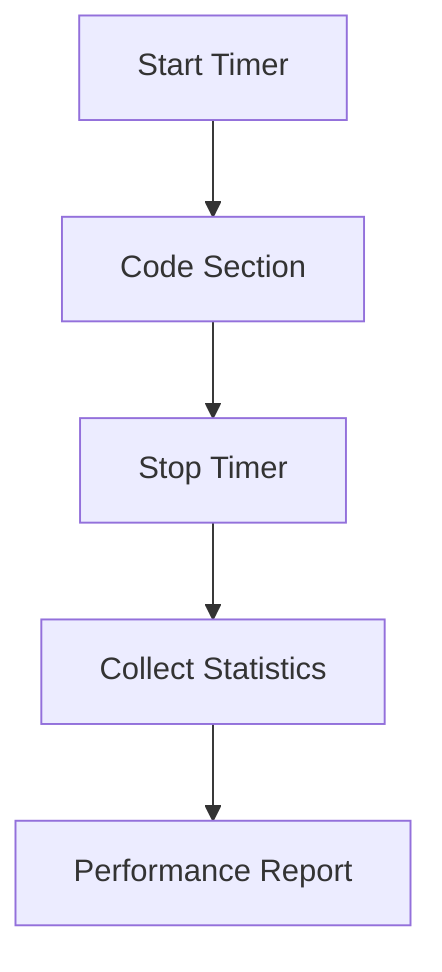

# Timers and Performance Monitoring

## Introduction

Performance monitoring is essential for optimizing numerical simulations. Samurai provides a built-in timer system to measure and analyze the execution time of various code sections.

## Timer System Overview



## Example Usage

```cpp
samurai::times::timers.start("assembly");
// ... code to time ...
samurai::times::timers.stop("assembly");

auto stats = samurai::times::timers.get("assembly");
std::cout << "Time: " << stats.total_time << "s" << std::endl;
```

## Visualizing Timer Data

- Timers can be nested for hierarchical profiling.
- Reports include total time, average, min/max, and call count.

### Example Timer Report

```
Timer: assembly
  Total time: 0.123 s
  Calls: 10
  Avg: 0.0123 s
```

## Advanced: Custom Timers and Profiling

- Users can define custom timers for any code section.
- Timer data can be exported for external analysis.

## Conclusion

The timer system in Samurai is a valuable tool for identifying bottlenecks and optimizing performance. 