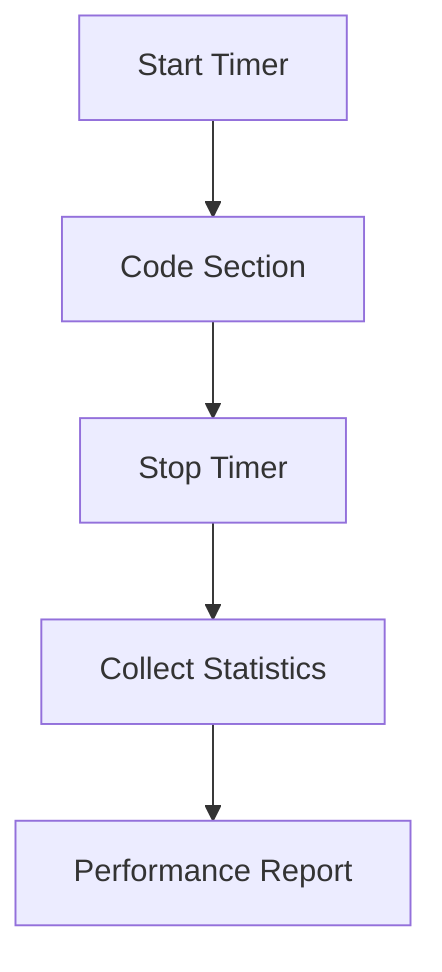

# Timers and Performance Monitoring

## Introduction

Performance monitoring is essential for optimizing numerical simulations. Samurai provides a built-in timer system to measure and analyze the execution time of various code sections.

## Timer System Overview



## Example Usage

```cpp
samurai::times::timers.start("assembly");
// ... code to time ...
samurai::times::timers.stop("assembly");

// Afficher les statistiques détaillées sur toutes les timers
samurai::times::timers.print();

// Récupérer la durée d'un timer en particulier (en micro-secondes)
#ifdef SAMURAI_WITH_MPI
// getElapsedTime retourne un double en secondes (MPI_Wtime)
double elapsed = samurai::times::timers.getElapsedTime("assembly");
#else
// getElapsedTime retourne std::chrono::microseconds
auto elapsed_us = samurai::times::timers.getElapsedTime("assembly");
double elapsed  = std::chrono::duration<double>(elapsed_us).count();
#endif
std::cout << "Elapsed time (assembly): " << elapsed << " s" << std::endl;
```

## Visualizing Timer Data

- Timers can be nested for hierarchical profiling.
- `print()` génère un tableau récapitulatif (par processus ou global MPI).
- `getElapsedTime(name)` permet de récupérer la durée d’un timer unique.

### Example Timer Report

```
Timer: assembly
  Total time: 0.123 s
  Calls: 10
  Avg: 0.0123 s
```

## Advanced: Custom Timers and Profiling

- Users can define custom timers for any code section.
- Timer data can be exported for external analysis.

## Conclusion

The timer system in Samurai is a valuable tool for identifying bottlenecks and optimizing performance. 